昨天阅读survey之后，今天继续阅读编译优化论文一篇。是MLSys会议上的论文。这个会上全是一些深度学习+系统的文章，好像国内知名度不是很高，甚至不再CCF推荐列表上 ……

说回本文，本文最后一个作者是陈天奇，TVM的作者，之前我看了他的经历，挺受鼓舞的，推荐大家都可以看一下~

> [陈天奇：机器学习科研的十年](https://www.jiqizhixin.com/articles/2019-07-20)

由于这个方向我了解甚少，这篇论文还是精度，笔记也做得详细一点。

## 摘要	

在计算密集的负载下得到高效率的计算是很难的问题。目前解决办法：

- vendor libraries：需要大量工程开发
- auto-schedulers：只支持确定形状。否则scheduler速度会变的非常慢。

作者观察到只支持确定形状的瓶颈在于：搜索空间是和形状有关的。作者提出新方法，可以构建一个形状无关的搜索空间，在同一空间中、用同样的cost model来同时搜索所有形状。

实验表明，新方法的速度和效果均大幅超越SOTA。

## Introduction

随着DL大规模应用，成本变得很高。$5\%$的性能提升可能要多花4000$。

然而，提升所有算子的效果很难，需要详细的实验、开发。很多研究者应用oneDNN，cuDNN等vendor library。后者的开发时间和更新周期都很长。（一年一更）

为了解决这个问题，多种auto-schedule负责进行High-level IR计算定义和Low-level IR实现之间的过程。然而，现有方法都需要在计算时知道所有位置的形状，这样才能正确地构建搜索空间，考虑所有情况。

然而，很多工作需要形状不确定。一个方法是对所有形状都遍历优化一遍：

- 慢，一个BERT层需要42h来优化

作者发现，如果把想同类型、不同形状的算子看成一个可变形状的workload，然后只规划一次，可以显著减少计算量。已有方法不能这么做，是因为他们要对不同形状开不用的搜索空间。本文提出一种新的方法DietCode：

构建一个由micro-kernel构成的shape-generic搜索空间，每个micro-kernel都是形状不固定的。这样就能让DietCode有一个统一的搜索空间。

DietCode构建的cost-model包括：

- 复杂的shape-generic 的部分。需要从micro-kernel中提取loop feature等信息，需要从硬件上获取参数
- 简单的依赖形状的部分。不需要额外信息

本文的贡献可以归纳为：

- 提出通过构建shape-generic的搜索空间解决动态形状的规划问题
- 提出DietCode，可以同时规划所有形状，用同样的shape-generic cost model
- 在BERT模型编译中，比SOTA快5.88倍，如果考虑所有形状，快100倍。效果上比auto-schedule好$69\%$,比库方法好$18.6\%$

## Background

### 现有auto-scheduler工作流

现有的vendor library成本很高，有很多auto-scheduler来替代。

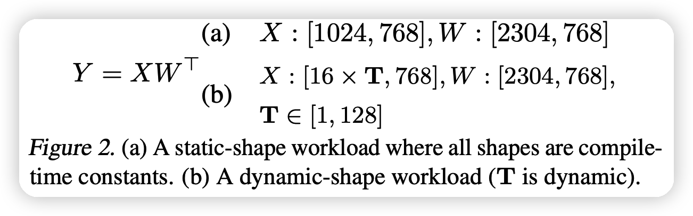

其输入如上图：包含一个tensor的表达式，同时对于tensor的形状有附加的说明。

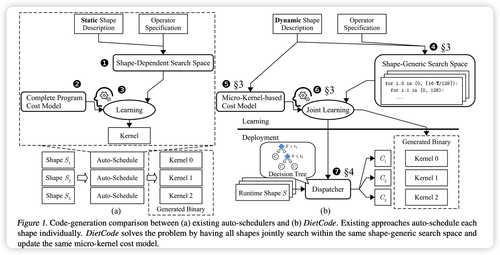

现有方法如上图左:

- 1.通过表达式和形状信息，与硬件的可能优化方式一起构建搜索空间
- 2.通过硬件信息构建一个cost model
- 3.用某种算法进行学习

最后搜出来的方法大约比vendor-library方法快3.88倍

### 动态形状tensor的程序

现有方法需要：在优化时知道所有的形状信息。因此不适用于以下需求：

- NAS中，需要搜索网络超参。每组超参的实现，网络的结构都不同(举例，12800种)
- 在NLP等序列任务中，输入的长度可能运行时才能确定，比如BERT就是长度1-128
- 统一模型，不同层的维度可能都不一样：比如BERT的hidden state在不同层可能是$(768,2304,3072)$

### 为什么需要新的auto-scheduler框架

现有方法加一些代码不行吗？

- 对于vendor-library：输入性状改变可能带来13倍的性能衰减。这是因为代码里有好多hard-code。改这些东西的代价很大，码量爆炸。
- 已有auto-scheduler：现有的工作流，上图左，形状信息都是焊死的。不改代码的话，只能对所有形状遍历，这个速度肯定不可行。

已有一些auto-scheduler的动态形状改进有一些问题：

- Selective tuning：把不同形状聚成一个个cluster，然后对每个cluster优化。需要额外的知识，不能完全自动化
- Nimble：在一个大形状上预计算，然后在别的动态形状应用。问题是在一个大形状上的最优不一定可以泛化到别的最优。
- Bucketing：把形状变化区间分成子区间，然后用每个子区间的最大值作为值来计算一次。
  - 需要额外计算形状信息，并且由于化简，带来计算不准确。
  - 由于padding，会出现不必要的计算开销。

综上，已有方法都不好。

## DietCode原理、关键因素

### Shape-Generic Search Space

观察下面这个图：

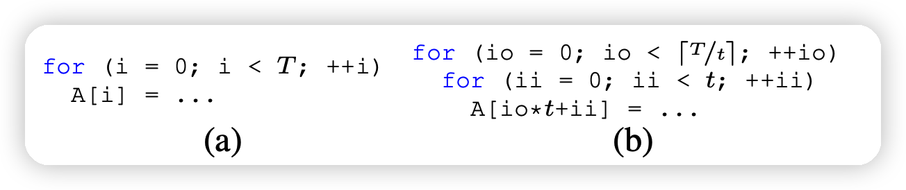

左边是一个含参数T的代码，右边是已有auto-scheduler的做法：

- 可见，他们只尝试了T的因子，比如$T=49,t \in[1,7,49]$,显然比如t=10时就不准确。

本文，则考虑硬件约束下，给出了一些micro-kernel。这是符合硬件条件的一些算子，可以一个动态形状的运算可以视为一些micro-kernel的组合，比如下列运算：
$$
Y = XW^T \\
X :[16*T,768] ,\quad W:[2304,768]
$$
其中T是可变的参数。如果我们有一个运算器可以运算$128*128$的矩阵micro-kernel：dense_128x128。

当T=64时，由于$16·T = 8×128, 2304 = 18×128$可以把他们视为$8*18$的kernel的排列在一起进行运算，如图：

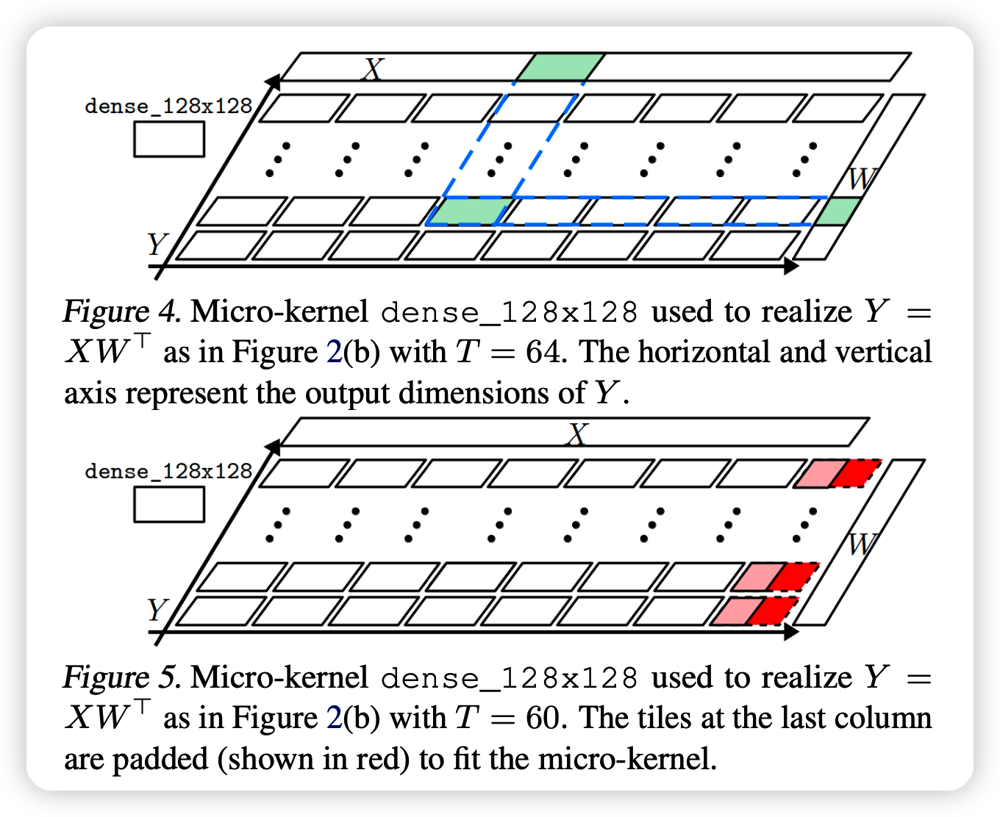

通过排布使用micro-kernel dense_128x128,我们对于$T=1,2,...128$都可以很方便的实现上面的运算。**也就是说，通过这种设计，我们只需要使用形状无关的micro-kernel，就可以实现任意形状输入的优化**

这种方法要解决几个问题：

- 如果T=60，那么就需要一个padding，如上图的下面。也就是说，会带来一些额外计算。要怎样高效利用所有micro-kernel？
- 怎样准确评判这种由micro-kernel构成的程序的效率？

### Micro-Kernel-based Cost Model

上面说的第一个问题通过padding可以一定程度上解决。对于后一个问题，需要构建一个新的cost model。

已有的cost-model需要输入整个程序，从中抽取一些特征：
$$
\text{Cost}(P ) = f (\text{FeatureExtractor}(P )) \\
f : \text{cost function (e.g., XGBoost)} \\
P : \text{complete program } \\
\text{Cost} :\text{ compute throughput}
$$
但是，由于micro-kernel是程序的一种切片，不是整个程序，因此不适用传统cost model。

设计新的cost model，发现如果一个动态形状程序P被切片成很多micro-kernel M，那么cost可以拆解成两部分：

- $f_{MK}$：这些micro-kernel的损失。和形状无关（多个micro-kernel可以并行，时间是常数）
- $f_{adapt}$ ：把P切片成M带来的损失。和形状有关，但是计算很简单(比如上图就是算padding的比例)

$$
\text{Cost}_M(P)=f_{MK}(\text{FeatureExtractor}(M))·f_{\text{adapt}}(P,M)
$$

式子的左边可以通过已有方法的公式计算，更重要的是，由于M和程序P无关，可以事先预计算。式子的右边计算速度很快。综上，新模型的计算效率很高。

### Joint Learning with DietCode

本文提出了DietCode，基于以下要素：

- 一个Shape-Generic Search Space
- 一个Micro-Kernel-based Cost Model
- 在运行时通过上面的cost公式对确定的输入形状派发一种micro-kernel排列

和已有方法对比如下图：

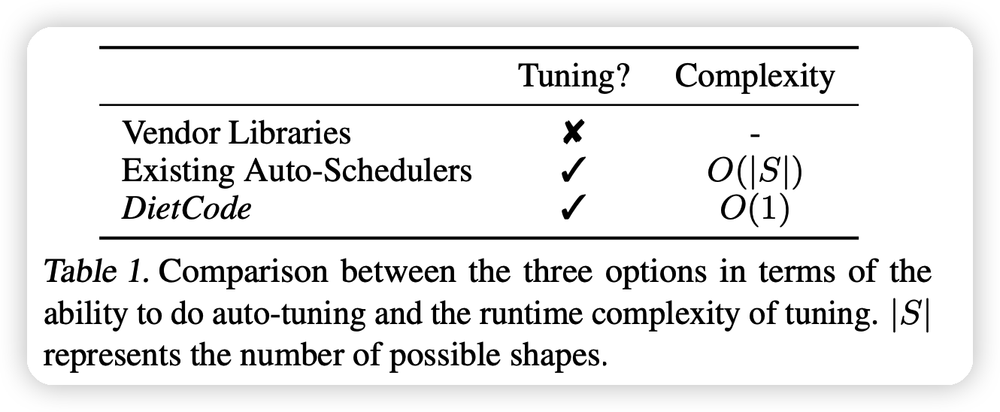

可以对所有categories同时学习，因为有统一的cost公式，复杂度是$O(1)$

## 实现细节

这种方法作为TVM的auto-scheduler方法

### local padding

上面提到的由于使用padding，可能会带来性能下降，高达17倍。这是因为引入了很多的branch指令，而且每个branch都要计算数据。

作者研究了三种已有解决方法，举例子如下图，这个例子有一个数据读取，一个数据修改，一个数据写回

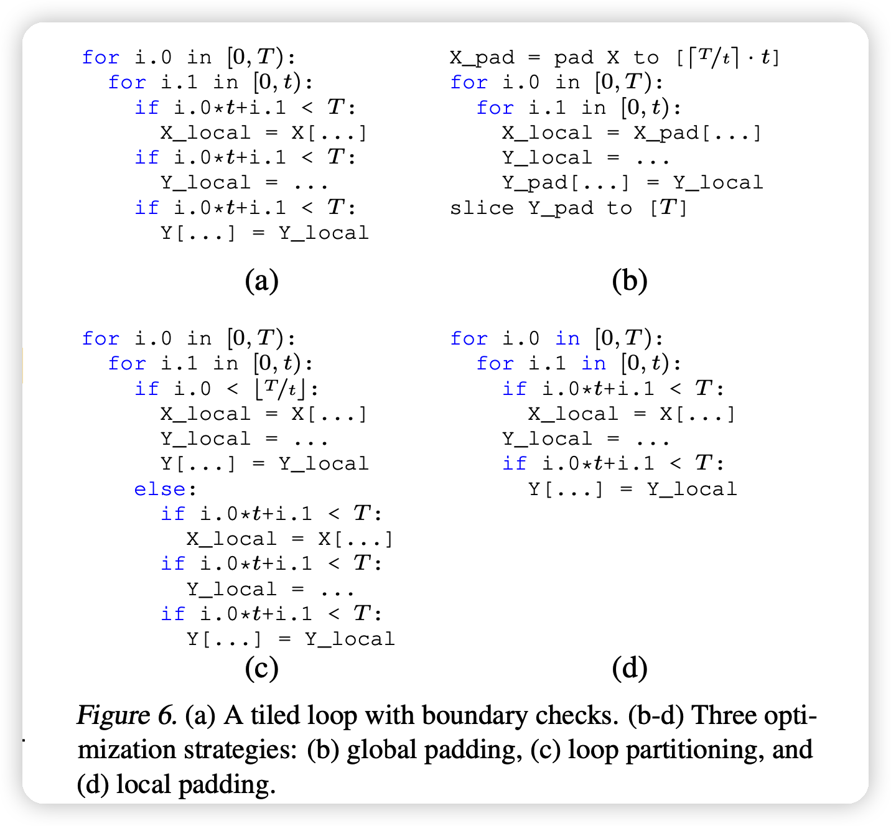

- global padding：如b。提前算好，不需要在里面做branch，但是需要引入额外的存储空间和padding结果的运算
- Loop partitioning：如c。把程序切成两片，其中上一片无论如何都不会爆。当$t \ll T$时效果不错，但这个条件很难保证。
- local padding: 在取数据和写回数据时保证正确性，但是在计算时不保证。这个有两个好处：
  - 只有计算阶段的branch会大幅影响表现。fetch和write back的时间可以被已有流水线技术优化掉
  - 如果计算阶段算了额外算了padding的部分，写回阶段会把它忽略，因此不怎么影响表现

本工作使用local padding方法

### Micro-Kernel-based Cost Model 具体实现

cost的计算应该考虑以下部分：

- 1、micro-kernel的表现
- 2、硬件占有率带来的惩罚，用的micro-kernel越多，瞬时的占有率高，吞吐量大，就是好。
- 3、padding带来的额外惩罚，padding的比例越低越好

这三部分可以这样理解：

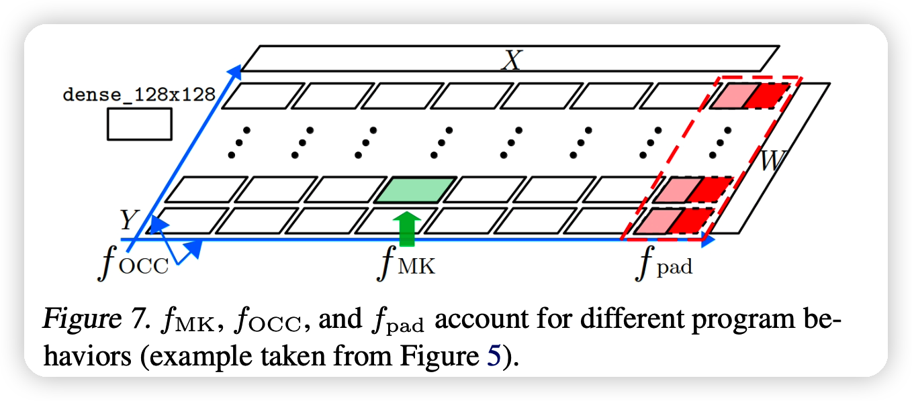

最终公式如下：

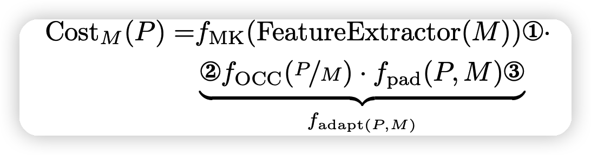

其中$f_{PAD}$和硬件无关，之和micro-kernel设计、程序P有关

其中$f_{OCC}$是占有率惩罚， 用一个回归模型预测

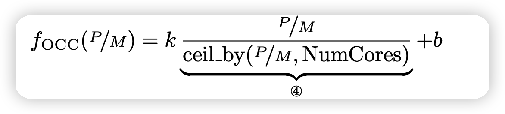

k，b是可学习的参数，由于每个micro-kernel被派发到不同的核，$f_{OCC}$也可以看做占了多少的核。如果做一个归一化的话：

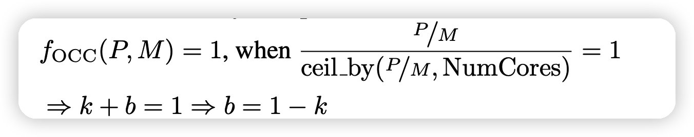

可以节省一个参数b

### Automatic Dispatching

在同时计算完所有的M以后，我们根据：
$$
vote(S) = argmax_M(CostM(P(S,M)))
$$
这个得分是和吞吐率成正比的，因此越高越好。用argmax	

来对与特定的形状S派发一组micro-kernel的排列M，这个可以遍历。结束以后，我们把$<S,vote(S)>$做成一颗决策树，在运行时通过决策树决定M即可。

​	

## EVALUATION

这一部分就不详细讲了。简单说一下，就是测试BERT模型的表现，baseline是：

- vendor: cuDNN
- Auto-scheduler: Ansor
- dynamic code generation: Nimble。进一步优化Ansor，计算最大形状，然后应用在所有形状上

评测指标，全都是越小越好：

- end-to-end latency on the entire model, measured as msec。
- the runtime cost of the generated tensor programs on a single operator, measured as μsec and averaged over 100 runs。
- the total auto-scheduling time used, measured as hours

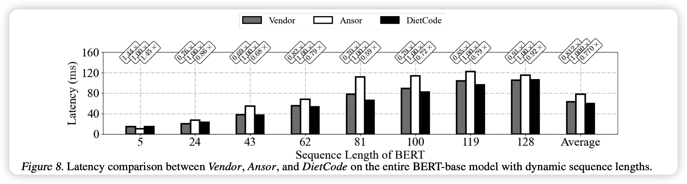

上面这个图可以看出，对于不同的输入维度，DietCode的效果基本最好。同时和vendor的差距小，但是vendor需要人工大码量、长时间的开发。

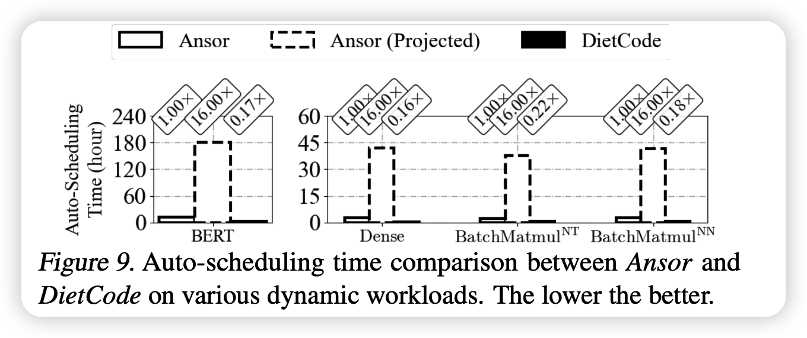

上面这个图是编译时间，虚线代表理论推导，实际根本不可行。可以看出，DietCode非常快。

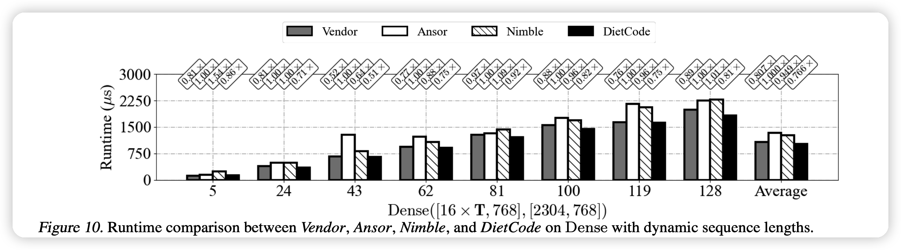

上面这个图是指选定某种结构以后，真正的跑的速度。更快。作者测试了dense层(一个动态量)，batchmatmul层(2个动态量)，效果都更好。

## 我的思考

- 其实我之前也不知道这种“动态形状”的输入是怎么规划的。但我确实感觉到动态形状的支持应该是必要的，基本所有的NLP问题都需要这个。
- 看作者的意思，这个功能现在已经上TVM了，我在想这个是不是和操作系统一样：

> 先有实现，后有理论

- 后续我可能会继续调研一些TVM的原理，感觉还是挺神奇的。
