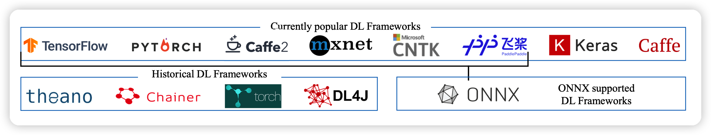
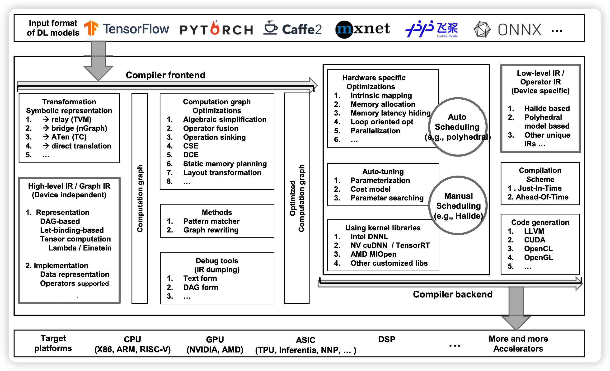
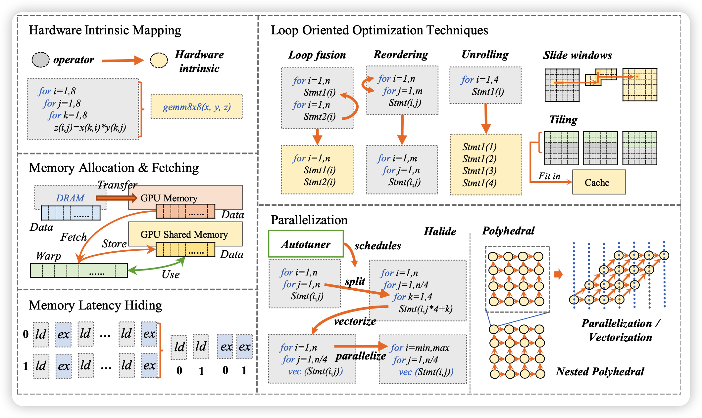
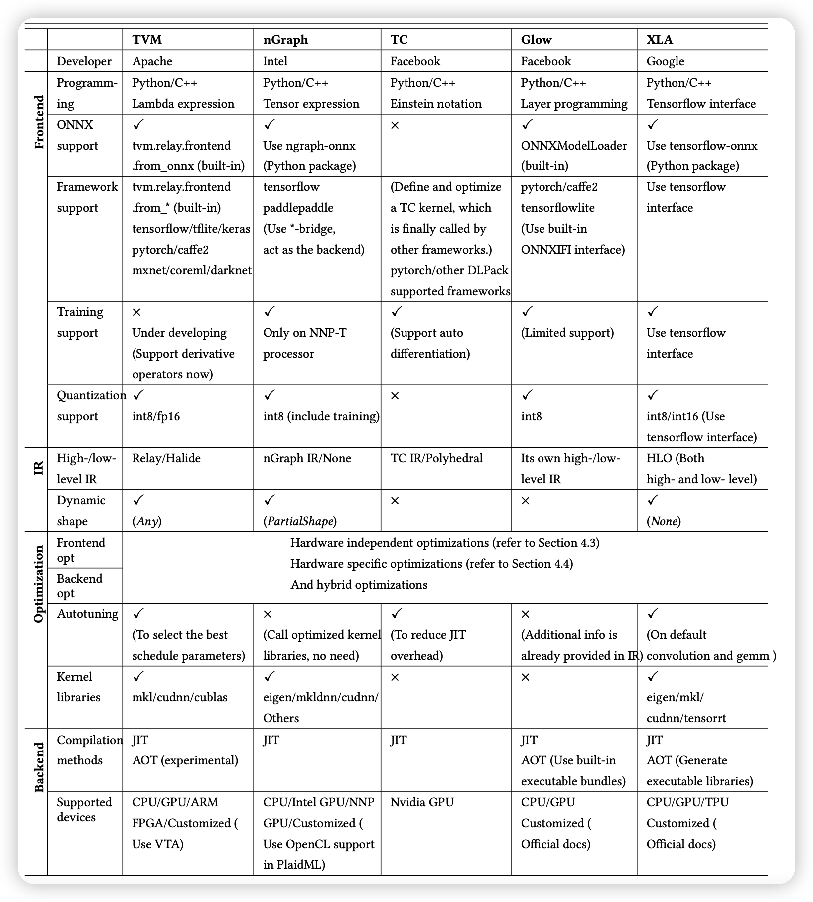

​	这是我读的第一篇深度学习编译方向的论文，是一篇survey工作。由于是第一篇，那基本上就得逐字逐句慢慢看了，又因为是survey，那二三十页是跑不了了。因此我为了加深印象，干脆就同步更新一下笔记，就当做”把论文翻成中文“了。

## 摘要

- 学术界提出了XLA, TVM等深度学习编译技术
- DL compiler输入模型，输出适用于不同平台的、优化后的代码
- 本篇工作聚焦于multi-level IR，前后端的优化技术。
- 提出了对这些技术的作者的点评，未来的改进方向
- 这是第一篇深度学习编译优化的综述文章

## Introduction

DL硬件分类：

- 软硬件联合设计的 general-prupose 硬件
  - 线性代数库BLAS支持DL运算
  - 还有MKL-DNN，cuDNN等专门的加速库
  - 还有TensorRT等加速库
- 专为DL设计的硬件
  - 类似的加速库
- 从生物脑科学获得灵感的神经元硬件

库的更新经常赶不上硬件更新的速度，因此很难利用好DL硬件的算力

DL编译器

- 优化 模型定义-> 实现代码 这一过程
- 算子合并、层合并等方法

- 是层次性的。

本篇工作的贡献：

- 归纳了前端、多层IR、后端级别的优化方法
- 分裂归纳了已有的DL编译器
- 定量对比了不同编译器在CNN的效率提升（end-to-end和单层粒度下）
- 提出了DL编译器的未来方向： dynamic shape and pre-/post-processing, advanced auto-tuning, polyhedral model, subgraph partitioning, quantization, unified optimizations, differentiable programming and privacy protection

## Background

### DL框架对比

- tensorflow：其他语言支持最广泛：C ++, Python, Java, Go, R, and Haskell。TensorFlow Lite为Android设计。Keria作为tensorflow的前端。eager-mode类似pytorch的动态计算图
- keria：高层神经网络库，快速构建model。兼容scikit-learn等库。由于过度封装，增加算子、获取底层信息很难。
- Pytorch：动态框架，按行执行。合并了Caffe2。FastAI 是pytorch的高层封装，借鉴了keria。
- Caffe/Caffe2,MXNet,CNTK,PaddlePaddle略过
- ONNX：别的框架模型可以转换成ONNX模型，以便于交互（使用pytorchAPI）。

### 深度学习硬件

- General-purpose Hardware：类似NVIDIA-GPU。同时上层有cuDNN等支持，软硬件联合开发。
- Dedicated Hardware：A100，cloud service provider（google TPU）等等
  - TPU包含：
    - Matrix Multiplier Unit (MXU), 
    - Unified Buffer (UB),
    -  and Activation Unit (AU)
  - TPU由host硬件 进行CISC指令集的驱动
  - TPU可以直接把矩阵视为单元，而不是vector或者标量集

- Neuromorphic Hardware：IBM’s TrueNorth and Intel’s Loihi.
  - 神经元可以同时存储和处理数据，存储区和运算区在一起，没有专门存储区。
  - 距离大规模应用很遥远
  - 探索rapid, life-long learning。

### FPGA

cpu/gpu泛用性强，但是费电；AISC省电，但是转为某任务设计。编程FPGA是一个折中，把模型部署在FPGA上。

High-Level Synthesis (HLS) programming model帮助用户编辑FPGA，不用写很多verilog。

FGPA应用的问题：

- AI模型用框架描述，而不是c/c++
- DL特有的优化方式很难推广到FPGA

hardware-specific code generator：输入DL模型，输出HLS/verilog/VHDL代码，再编译成bitstream烧录:

- The processor architecture:目标FPGA和正常处理器类似。
- The streaming architecture：目标FPGA是个流水线。快，瓶颈是FPGA内的memory不够

### DL编译器结构

正常编译器分为前端和后端。中间由IR联系起来，IR分为多个层次(multi-level IR)。

前端基于高层IR做硬件无关的优化；后端基于低层IR，做硬件专有的优化、代码生成、编译。

- High-level IR: 定义计算和控制流，硬件无关。目标是得到程序的控制流和数据依赖性，提供图级别的优化。

- Low-level IR:足够细粒度。需要支持后端的第三方工具链。

- 前端： 从node-level，block-level, dataflow-level优化模型，生成 graph-IR.
- 后端：输入high-level IR,输出 low-level IR。 可以直接把high-level IR转成LLVM IR等第三方工具链支持输入做优化，也可以通过已有的硬件结构、模型结构做自己的特殊优化

## DL编译器的关键因素

### High-level IR

#### High-level IR计算图的表示

图的表示法不同，优化方向也不同：

- DAG图：有向无环图，点表示算子，边表示tensor。可以快速分析数据依赖。优点是方便优化，缺点是图上的节点、边语义不明确
- Let-binding-based IR：对每一个变量”let“建立节点，语义明确。它对每一个let都算结果，建立一个map。每个表示通过查表找到结果

TVM等方法借鉴两种表示，博才两家之长。

tensor计算的表示法：

- Function-based：Glow, nGraph and XLA采用，提供一些封装的算子。tensor计算视为一种函数
- lambda expression: 用lambda函数表达，不需要声明新函数。TVM采用此方法，需要先计算输出的形状。
- Einstein notation：比lambda表达式更简单。算子需要相关联，可交换，方便并行化。

#### Graph-IR 的实现

数据(tensor)的表示:

- Placeholder:标记tensor的shape，有这个就有shape。

- Unknown (Dynamic) shape representation：允许某一维的大小未知
- Data layout：逻辑地址到内存分片的映射。
  - TVM and Glow把获取data layer作为一个专门的算子，这样不需要专门实现这个方法，更方便优化。
  - XLA把这个视为后端硬件的一个约束
  - Relay and MLIR要求tensor在type中描述layout
- Bound inference：推断迭代器的上下界。TVM中iterator建立一个dag图，点代表迭代器，边代表运算。根节点的shapes of placeholders被确定，就能递归处理。

graph-IR需要支持很多算子：代数算子、tensor算子、control flow算子。举例子：

- broadcast：放宽一般算子对形状的依赖性。
- control flow:if或者while
- Derivative：自动求导。
- Customized operators：自定义算符。
  - Glow中定义算符需要实现多层的封装
  - TVM、TC只需实现一个implementation

不同编译器有不同的 graph-IR 实现，但有一定的相似之处。需要注意，graph-IR一定要是硬件无关的。

### Low-level IR

#### 实现

不同的实现

- Halide-based IR：设计哲学是计算和规划分离。可以试多种规划，选一个最好的。原始方法需要形状确定，TVM改进了它：
  - 取消LLVM的依赖
  - 重构project module
  - 提高复用性，方便自定义算子
  - 保证每个变量只有一个定义位置
- Polyhedral-based IR：视为多面体。loop的大小更加灵活，方便采用polyhedral transformations优化方法。有多种优化器：isl,Omega,PIP,Polylib,PPL
- Other unique IR: 他们用一些自定义的优化方法，然后编译成LLVM IR
  - GLOW：包含declare和program两种操作。用@in,@out,@inout帮助分析内存优化的时机
  - MLIR：受到LLVM影响。用dialect提供对别的IR的抽象，包含：TensorFlow IR, XLA HLO IR, experimental polyhedral IR, LLVM IR, TensorFlow Lite。 自定义dialect很简单，方便开发者适配新硬件。
  - HLO IR of XLA：同时是high/low-level IR。足够细粒度，提供硬件级的优化，生成 LLVM IR

#### 代码生成

绝大多数都是生成LLVM IR，接下来通过LLVM进行多种优化。需要提供几种优化：

- 循环转换
- 提供目标硬件的额外信息

### 前端的优化

前端进行计算图的优化，和硬件实现无关。前端的优化称为pass，通过多次遍历图，每轮进行不同的操作。一旦模型被import、转换成graph，前端可以获取各个地方的shape。

#### Node-level optimizations

- 消除不必要的节点：比如sum（1,0），Nop Elimination
- Zero-dim-tensor elimination：消除0维向量，或者消除某个维度为0的向量

#### Block-level optimizations

- 消除单位运算+0,$*1$
- 用简单运算符替代复杂运算符
- 预计算常数

DL运算符也可以优化，比如：

- optimization of computation order：$A^T B^T = (BA)^T$
- optimization of node combination:比如把多个transpose消成一个
- optimization of ReduceMean nodes:用AVGPool代替ReduceMean

- Operator fusion：算子合并。难点是如何合并包含多个reshape,boardcast,reduce等节点的算子。
- Operator sink：消除可以消除的节点

#### Dataflow-level optimizations

- Common sub-expression elimination (CSE)：预计算可以计算的控制流。
- Dead code elimination (DCE)：如果结果不用，就是dead，不需要存中间结果。经常在上面的优化以后出现
- Static memory planning，对于内存受限的机器很重要：
  - in-place memory sharing：复用输入和输出的memory
  - Standard memory sharing：在不覆盖的情况下，复用前面用到的存储空间
- Layout transformation：
  - 计算出tensor最好的存储形式，然后在计算图增加layout transformation节点。
  - 最优方式随tensor计算公式不同，硬件不同而不同
  - 速度提升明显

### 后端的优化

#### Hardware-specific Optimization

一种方式是编译到 LLVM IR，另一种方式是定义自己的优化方式，用模型的信息。举5个例子：

- Hardware intrinsic mapping：编译成硬件已经优化过的一些kernel。
- Memory allocation and fetching：针对硬件上不同存储的延迟不同做优化
- Memory latency hiding：等内存延迟的时候干别的，好多硬件自己实现了，但TPU没有。TVM通过虚拟线程解决这事

- Loop oriented optimizations：Halide和LLVM实现过了。
  - Loop fusion: 把多个边界一样、没有依赖的循环放到一起
  - Sliding windows：直到需要数据时再计算
  - Tiling：把一个循环拆成多重循环，更好的局部性
  - Loop reordering：重新排列循环顺序。让空间局部的循环们放在一起
  - Loop unrolling：循环展开，更好地做指令级并行。

- Parallelization：更好的支持线程级并行等，提高硬件利用率。需要额外的、模型的知识，更难开发。

#### Auto-tuning

由于各种优化很多，搜索空间很大，需要自动搜索优化方式。TVM, TC,XLA都支持这个。包含四个要素：

- Parameterization：搜索参数时需要知道的一些已有参数
  - Data and target：tensor的形状，GPU上各个memory的延迟、大小
  - Optimization options：优化方法有什么，对应什么超参。TC，XLA支持把超参参数化，比如batch_size。
- Cost model：评价优化方法的模型
  - Black-box model：只关心运行时间，对内部情况不关心。TC采用
  - ML-based cost model:  用ML模型衡量现在情况有多好。TVM，XLA采用
  - Pre-defined cost model:预先定义好。搜索更快，但是定义很难，和DL model有关。
- Searching technique：如何搜索
  - Initialization and searching space determination：随机/特定初始化。TVM允许用户决定搜索空间
  - Genetic algorithm (GA) ：类似蚁群算法，TC采用
  - Simulated annealing algorithm (SA)：模拟退火。TVM采用
  - Reinforcement learning (RL): Chameleon采用（基于TVM开发）
- Acceleration：如何加速搜索过程
  - Parallelization：
  - Configuration reuse：复用上次的结果，如果某些局部的参数和上次一样。

	#### Optimized Kernel Libraries

硬件预定义好了一些快速的计算库(比如cuDNN)。后端可以调用这些库

- 调用库带来巨大的性能提升
- 但调用库需要符合库的调用约定，可能破坏最佳控制流
- 库函数对编译器是黑盒，可能影响优化，不能做operator fusion等。

## 已有编译器的分类

通过上面已经讲过的不同方面的优化方法，可以梳理、归纳、分类一下现在比较火的DL编译器。总体结果如下图：

## 评测

这一部分评测了一下已有的一些编译器的性能，具体实验就略过了，对学习DL编译优化知识没什么帮助。

## 结论和未来方向

这一部分归纳梳理了一下DL编译未来的发展空间：

- Dynamic shape and pre/post processing：
  - 一方面类似NLP，只有运行时才能知道输入的形状。另一方面，模型结构本身可能也会变化。
  - 随着模型增大，模型的加载时间可能成为瓶颈。已有还没有触及
- Advanced auto-tuning：受限于时间，现有优化都是在找一些局部最优。但局部最优的组合大概率不是全局最优
  - 目前ML方法还有潜力，可以考虑在auto-tuning中进一步应用，而不只是cost model。
- Polyhedral model：在auto-tuning中引入多面体模型
  - 可以复用之前结果
  - 可以减少搜索空间
  - 挑战是如何在稀疏情况下应用之。
- Subgraph partitioning：把计算图拆分成不同子图。可以把不同子图分布并行到异质的设备上。
- Quantization：增强量子化可以在编译时进一步提升优化的空间，挑战是：
  - 如何简单的增量开发
  - 量子化操作如何和其他的优化步骤交互。
- Unified optimizations：如何同时采用不同编译器的优化，已由编译器大多聚焦于一些方面的优化。MLIR通过dialect某种程度上可以复用不同编译器的优化。

- Differentiable programming：让编译器支持可微程序
- Privacy protection：能不能在中间输出层加噪音，保护隐私。
- Training support：已有编译方法专注于部署。
