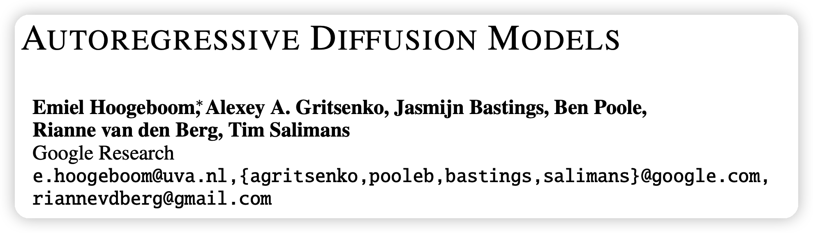
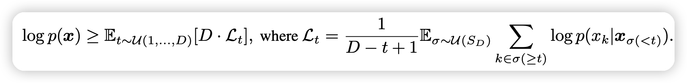
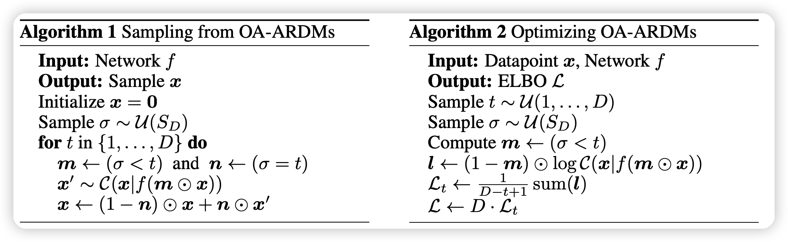
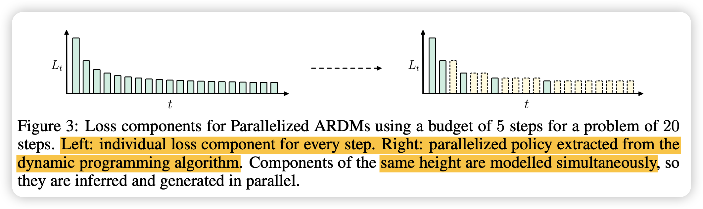
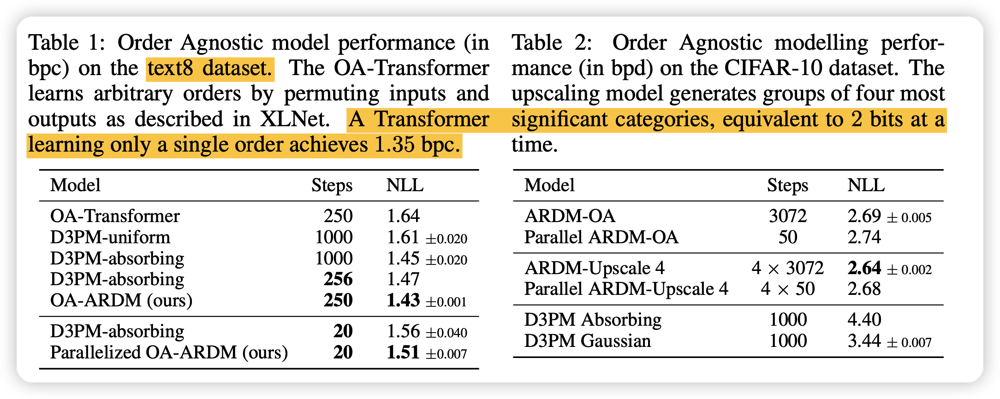
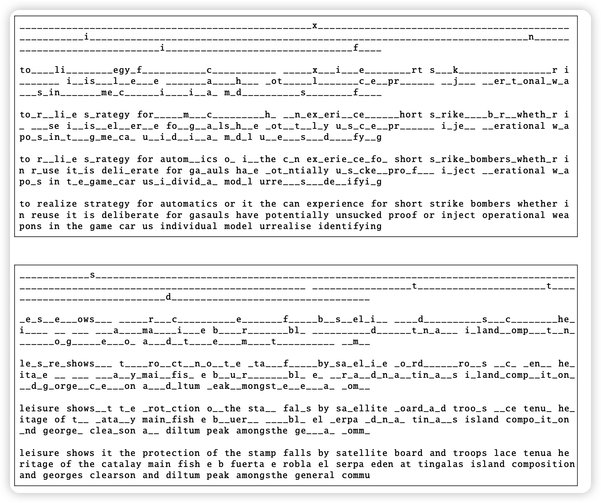

这篇讲了一种借鉴Discrete Diffusion model来建模一个order-agnostic autoregressive模型的方法，在text8数据集取得不错的效果。

<!-- more -->

这篇论文发表在ICLR22上，作者来自google brain。

## background

首先梳理几个概念

### ARM

自回归数据集里的每句话:
$$
\log p(x) = \sum_{t=1}^D \log p(x_t | x_{<t})
$$
用一个上三角矩阵把每句话mask住做D次predict就能算出模型对本次数据的loss

### Order Agnostic ARMs

XLNet采用这个结构，就是说模型不是从左到右预测的，而是按照任何一个顺序都可以:
$$
\begin{aligned}
\log p(x)  & = \log \mathbb{E}_{\sigma \sim \mathcal{U}(S_D)} \sum_{t=1}^D p(x_{\sigma(t)} | x_{\sigma(<t)})\\
& \geq \mathbb{E}_{\sigma \sim \mathcal{U}(S_D)} \sum_{t=1}^D \log p(x_{\sigma(t)} | x_{\sigma(<t)})
\end{aligned}
$$
这个公式里，$\sigma$是对$1,2,...D$的一个重排。大概就是给定一个重排，按照这个重排的前一部分信息，生成剩下的每一个位置$\sigma(t)$的量。

式子中的不等式来自杰森不等式

> 从左到右可以看做一种特定的重排。上面式子相当于对所有重排的总的loss的期望，训练时任选一个重排就行

### Discrete Diffusion

这里引用的是21年的论文,大概就是把MLM视为某种diffusion model，是文本领域diffusion model的一种解法

## AUTOREGRESSIVE DIFFUSION MODELS

### method

这一部分讲本文的方法

上来就是loss的公式计算，作者用了不同的推导方式：
$$
\begin{aligned}
\log p(x)  & \geq \mathbb{E}_{\sigma \sim \mathcal{U}(S_D)} \sum_{t=1}^D \log p(x_{\sigma(t)} | x_{\sigma(<t)}) \\
& = \mathbb{E}_{\sigma \sim \mathcal{U}(S_D)} D \times \mathbb{E}_{t \sim \mathcal{U}(1,2,..D)} \log p(x_{\sigma(t)} | x_{\sigma(<t)}) \\
& = D \times \mathbb{E}_{t \sim \mathcal{U}(1,2,..D)} \mathbb{E}_{\sigma \sim \mathcal{U}(S_D)} \frac{1}{D-t+1} \sum_{k\in \sigma(> t)} \log p(x_{k} | x_{\sigma(<t)})
\end{aligned}
$$
这个公式有几个特点：

- 他进一步考虑了XLNet中没有考虑的时间t
- 他把”重排中剩下位置“当成了”很多个原子的生成过程的并行“的形式

具体而言他定义了：

上面的式子就比较好理解了：$\mathcal{L}_t$的计算只和$t,\sigma$有关，可以视为把句子mask住一些位置，然后预测剩下的每一个位置的loss之和(BERT loss之和)，再加上一个正则量

具体训练中，作者直接使用transformer结构，然后就直接用下面的算法进行训练和预测：

其中：

- m是一个布尔向量，代表重排$\sigma$的前t-1个位置是1
- m是一个布尔向量，代表重排$\sigma$的第t个位置是1
- $\bigodot$是指和布尔向量乘，布尔0位置置为0
- $\mathcal{C}$是一个cat分布，代表以$f(m\bigodot n)$的概率分别取K(词表大小)个值中的一个

对于NLP而言，可以直接设定一个词表K外的词K+1代表MASK，word embedding为a,然后就能在代码上比较统一:
$$
\text{mask}(x,m) = m \bigodot x + (1-m)\bigodot a
$$

### PARALLELIZED ARDMS

这一部分，作者分析了上面公式中的并行性的特点带来更快的解码速度。因为如果有t个位置的结果以后，解码剩下的位置都是并行的，

如果假设$L_{t,t+k} = \sum_{i=1}^k\mathcal{L}_{t+i} \approx k \mathcal{L}_t$,视为解码所需要的代价

那么用一个动态规划算法，就能算出使得代价最小的并行化解码方法(固定解码步骤$c$)。下图就是把一个20步的解码只用5步来完成

## Experiment

这一部分作者，用bpc的NLL loss来对比了作者的方法OA-ARDM,和之前的离散diffusion方法$D3PM-*$，所有模型用的结构是一样的，只有训练方法和采样方法不一样

- 可以看到主试验的结果基本完胜 Austin 21的方法。
- 值得一题的是，效果没有从左到右的auto-regressive好(一个普通transformer baseline结果是1.35)
- 另一方面就是新的结果由于比较好的并行性，只用20步的解码就可以达到之前大概250步的结果
- 实验用的数据集是text8，解码的例子如下：

