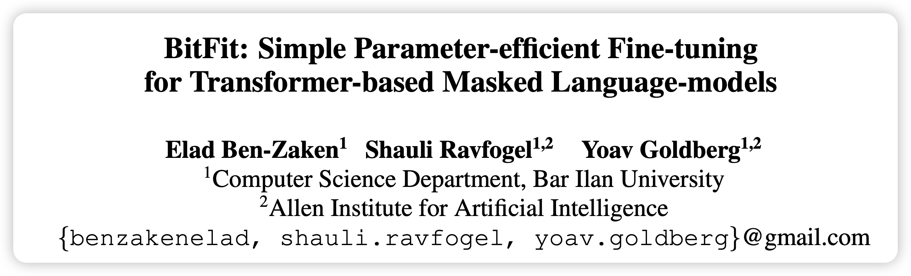
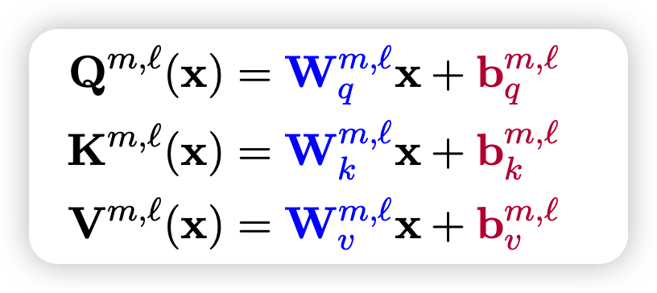
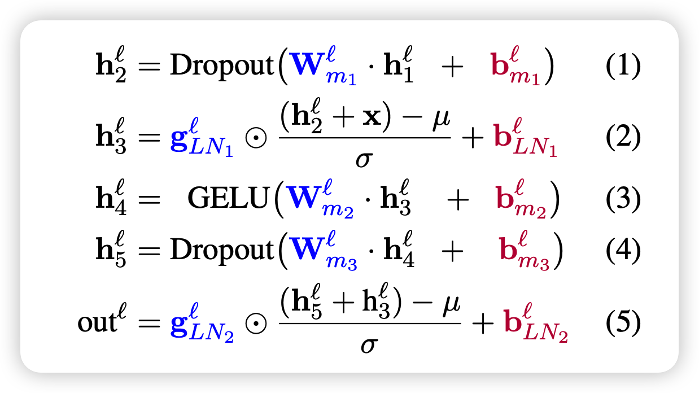
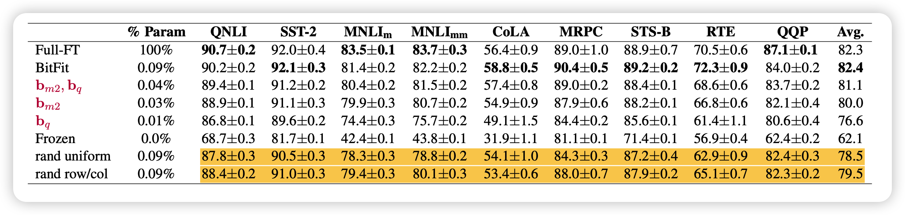
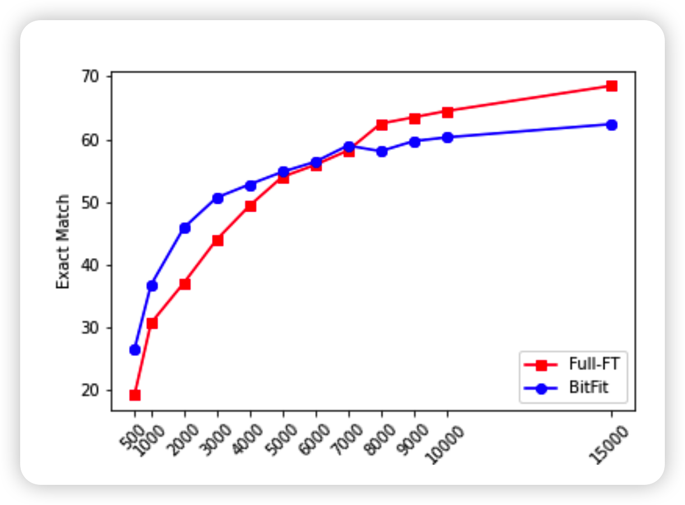

这一篇工作和前两篇是另一种思路，对模型结构不做任何改变，只是在fine-tune时改变一点点参数:bias

<!-- more -->

ACL 2022的短文，方法其实就没啥，但揭示出来的道理不少。

## 方法

作者把BERT模型中所有的bias进行训练

- attention中的qkv矩阵里的bias
- feed-forward层中的bias

同时剩下的参数全部锁定，在下游任务上做fine-tune

## 实验

可以看出，在下游任务上BitFit和正常Fine-tune比并不差

有意思的是，作者又做了几个实验

### 所有bias的重要性对比

作者观察了不同的bias类型的训练后改变的差值，发现：

- key bias基本不变
- query bias和intermediate bias改变很多

> 感觉这一点还有很多可挖掘的地方？但作者并没有进一步分析原因

### 随机

作者试着随机选择模型的一些参数，和bias数量一致，结果发现

- 随机选其实效果也还行
- 如果选择连着的行或者列的元素，表现会更好。但是选bias是最特殊的

### 少数据

类似的，作者也发现BitFit在少数据中表现更好

## 我的思考

这个文章就更简单，但相比于方法，我对文章中提到的一个观点更感兴趣：

> fine-tune的过程不是让模型适应另外的数据分布，而是让模型更好的应用出本身的表征能力

另外，作者没有提到的小细节我觉得可以引发很多思考：

- 随机选模型的0.01%的参数进行fine-tune，也能达到全参数fine-tune的大概99%的效果
