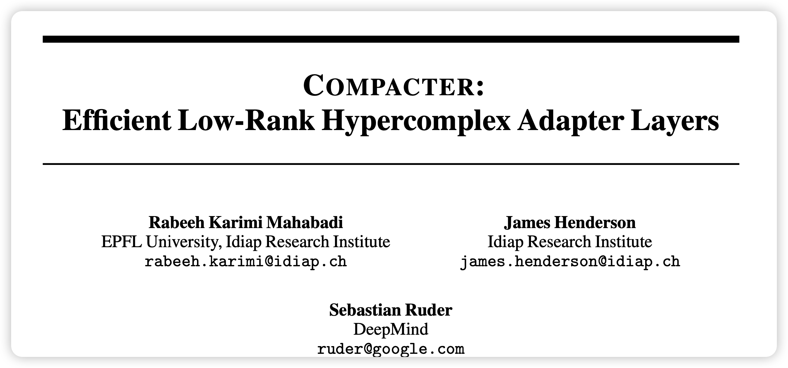
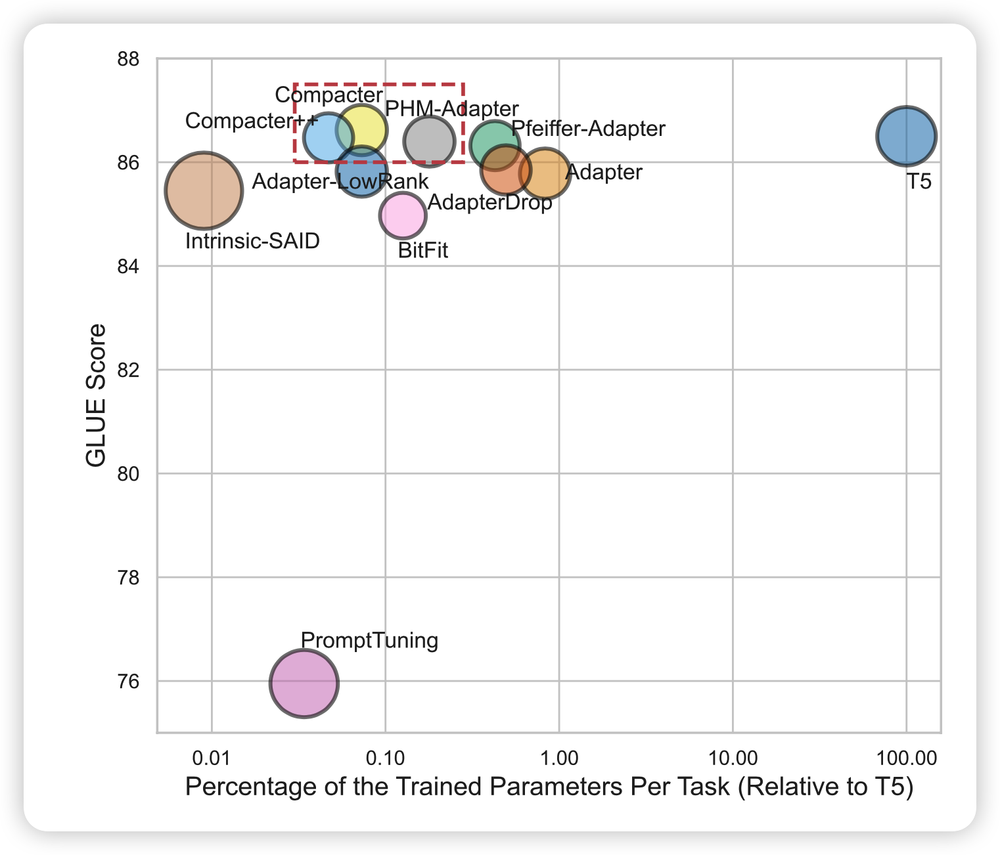
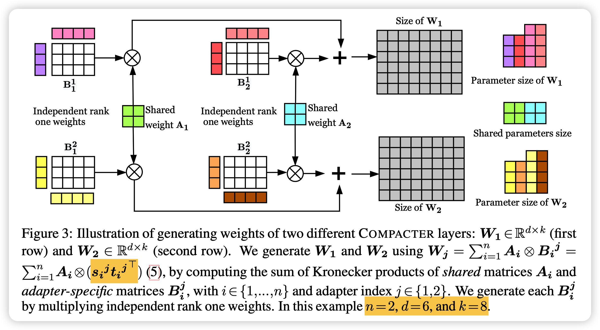
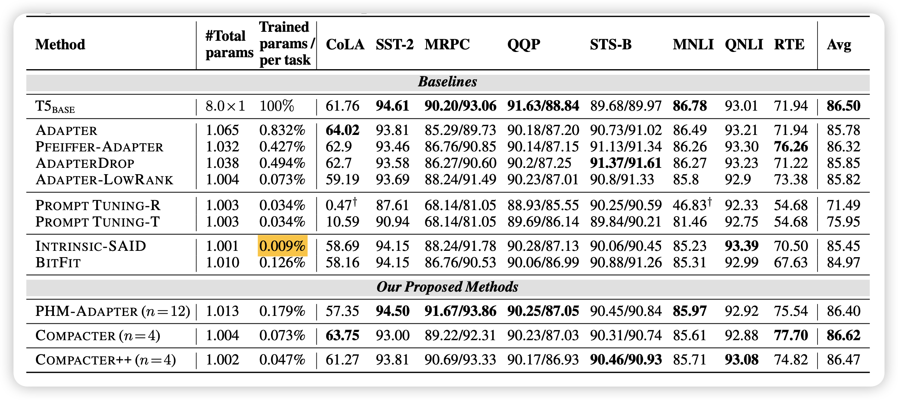
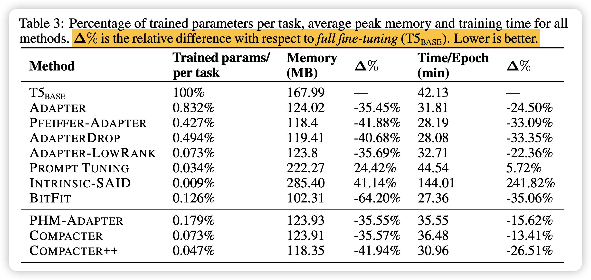
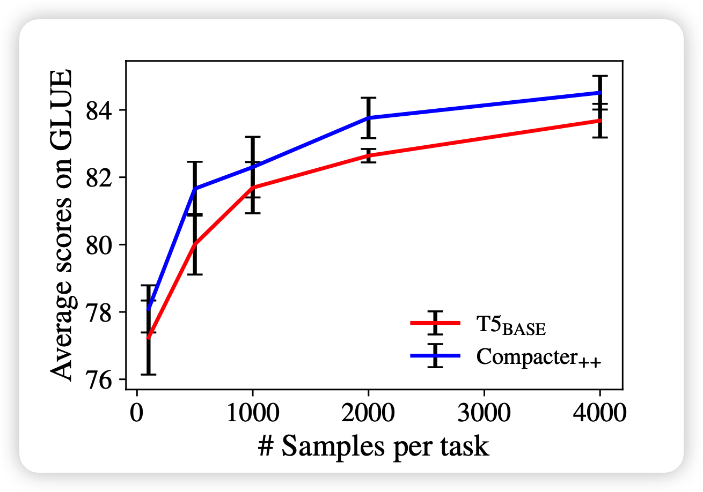

今天分享一篇上次adpter tuning的后文，进一步提升了效果、减小了参数量，发表在NeurlPS 2021上。了解这篇工作，需要先了解 

<!-- more -->

本来以为作者是之前adpter的作者团队，结果发现竟然一个重合的都没有……

作者分析了一下已有的一些delta tuning方法和fine-tune。发现大多不如fine-tune好，作者想对adpter做一些改进，提升一下效果，减少一些参数。

## 方法

### Kronecker Product

首先普及一下矩阵的Kronecker Product
$$
A \otimes B = 
\left(
\begin{array}{lll}
 a_{11}B & ... & a_{1f}B \\
  & ... & \\
 a_{m1}B & ... & a_{mf}B \\
\end{array}
\right)
$$
相当于把A的每一个元素都和B乘一下，然后$A^{m\times f},B^{p\times q}$就会变成$mp \times fq$的矩阵。注意，相当于用更少的参数表达了更大的矩阵

接下来，就是通过上面的方法来进行矩阵乘的优化

###  parameterized hypercomplex multiplication layers (PHM)

首先，作者想要达到全连接层的效果
$$
y^d = W^{d\times k}x^k + b
$$
然后主要就是优化$W$

如果找到一个d,k的公约数n的话，$W$形状的矩阵可以视为
$$
W_j = \sum_{i=1}^n A_i \otimes B_i^j,\quad A\in \mathbb{R}^{n\times n},\quad B\in \mathbb{R}^{\frac{d}{n}\times \frac{k}{n}}
$$
之所以要变成n个加在一起，好喜爱那个是为了增加自由度，让这个矩阵的表达能力和一个真正的大矩阵w的表达能力一样？

### 应用于adpter(LPHM)

为了用于实际的adpter tuning，其实就是就是把全连接层换了。同时作者还做了几个重要的修改:

- 所有的adpter层中，对于子矩阵A是共享参数的，这是为了更好的捕捉所谓的通用知识
- 然后每个adpter有单独的B，为了简化B的大小，可以把B变成秩更小的形式

$$
B^{m\times n} = s \times t^{T},
$$

s和t都是r个列向量，这样B的参数总共需要$r\times(m+n)$。这里的简化是基于上次adpter的实验中 *单独的adpter层的影响很小* 的结论，总而言之,最终的公式化简成了
$$
A^l(x)=\text{LPHM}^{U^l} (\text{GeLU}(\text{LPHM}^{D^l} (x)))+x,
$$
作者对比了一下复杂度，发现和正常的adpter相比，可以把参数减少到大约$\frac{1}{n}$

## 实验

几个行的解释：

- compacter++:正常的adpter在每个transformer block加两次，这里探索只在最后的feedforward层后面加一次，就是比正常的参数更好
- PHM-Adapter：正常PHM矩阵乘的adpter，没有做A的共享参数，没有对B进行矩阵分解
- Intrinsic-SAID: 这个方式是想把模型的参数进行重参数化，然后需要用的额外参数非常少$0.009\%$。这个方法我后面可能也会做分享 
- BitFit：和adpter另外的路子，只训练一些额外的bias，锁定正常参数

可以发现，作者对比了2021常见的几个方法，compacter方法最好：

- 发现共享A信息的compacter效果更好，这也说明了在不同adpter层间确实需要有一些共通的知识在
- 作者在实现中实际上用的B的分解秩r=1，这个好像并没有真的影响模型的效果

有一个好玩的点：

> Intrinsic-SAID的效果甚至挺好的，参数还非常少，代价是什么呢？代价是训练时间长，以及对模型结构非常Aware

后面，作者直接显式地做了关于效率的附实验，有一些点就是:

- Intrinsic-ASID虽然参数少，但训练过程并不高效
- BitFit方法虽然效果稍差，但其实训练过程是很高效的

作者还额外提了一下，在少数据情况下，compacter比传统fine-tune的效果更好

## 我的思考

这个文章其实主要的idea还是沿用了adpter，但是思考通过优化矩阵乘的效率来减少参数很精妙，尤其是利用上了PHM共享A参数学习通用知识这个点，更是很妙。

我其实有几点好奇，文中没有说：

- B的分解秩r的大小对模型结果的影响。因为小的r显然会使得B的表征能力下降，但如果模型效果不下滑，是不是说明模型其实在下游中用到的知识真的是很少的？
- 模型高层和低层对应的B的影响的实验，参考正常adpter，因为这个实验的backbone模型是T5，之前是BERT。adpter提到的特性可以应用于其他的pre-train model吗？
- 单纯是否共享A参数的对模型效果影响的对比实验。如果这种层间通用知识真的有用，能不能在预训练阶段把模型结构就有所改进呢？
- compacter在少数据表现好的特性，是delta tuning共有的吗？因为我觉得其实delta tuning的上限就是fine-tune，所以超越fine-tune是不是代表，在这个下游任务上，现有数据集其实还没碰触到数据的边际效应递减
