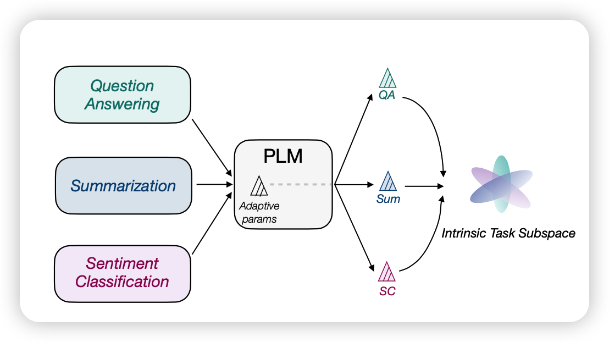
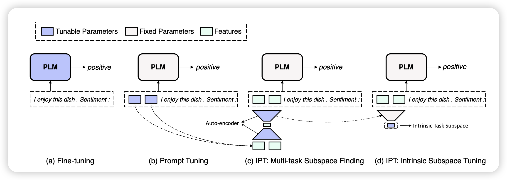
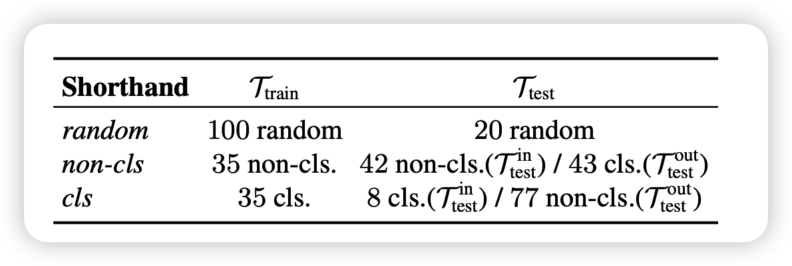
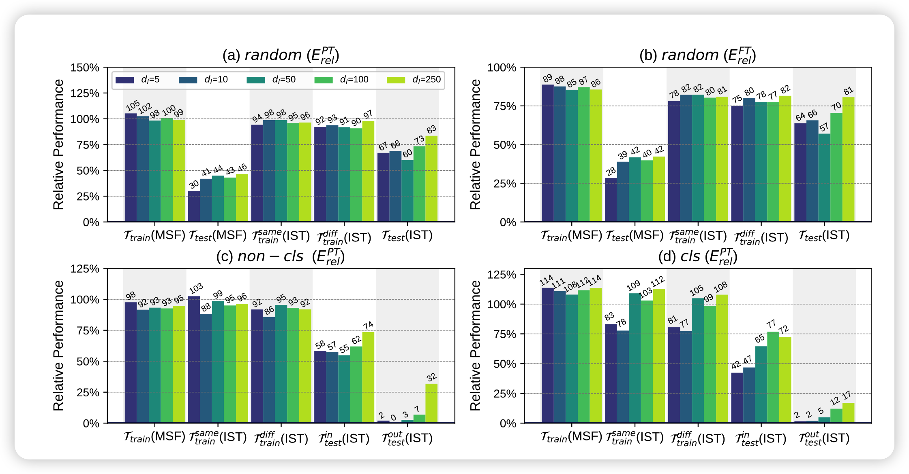
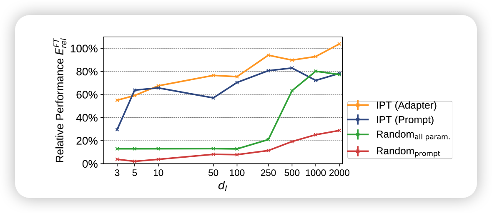
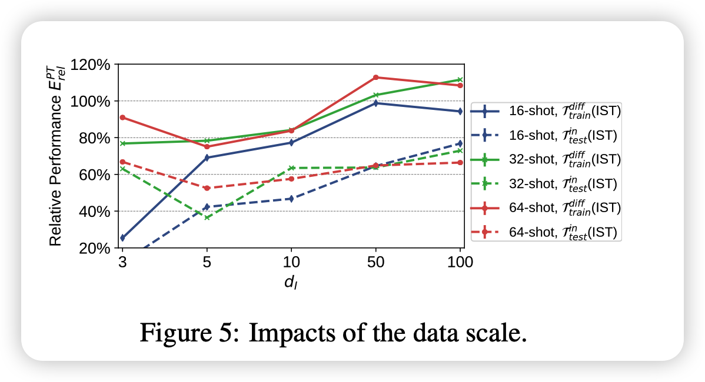
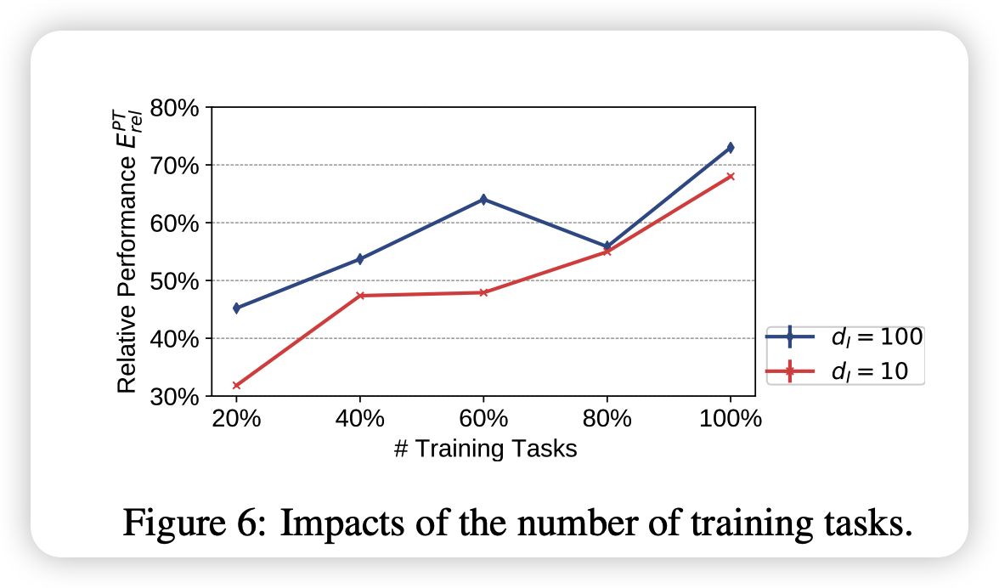
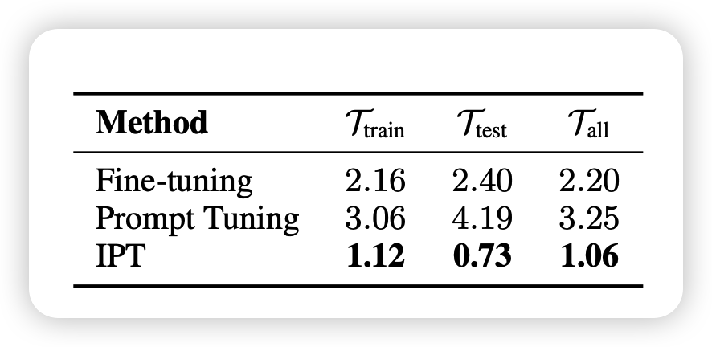

这一篇文章可以看做对Intrinsic Dimension的又一个推广，用了比LoRA更强的假设。通过在多任务间找到统一的子空间表示，证明了任务间的相关性，提升了prompt tuning的稳定性和效果

<!-- more -->

作者是THUNLP实验室

## 介绍

这篇文章主要是探讨这个问题：

> 已有研究发现预训练可以降低下游任务的Intrinsic Dimension，也就是模型可以压缩下游任务的表征
>
> 那么不同的下游任务需要的空间是否是关联或者统一的呢？

由此作者进行了一系列的探索，发现竟然可以只用250个参数统一子空间上就能在100个可见任务和250个不可见任务上达到FT的97%和83%的效果

全文的实验设计很复杂，对比也很多，我感觉文章的组织形式和结论更像是一种探索、分析性的文章

## 方法

具体怎么实现统一的子空间呢？作者分为了两个步骤：

- Multi-task Subspace Finding (MSF) 
- Intrinsic Subspace Tuning (IST)

### Multi-task Subspace Finding (MSF) 

这个过程实际上就是在寻找任务统一的子空间，首先要确定“任务”是什么意思：

> 对于一个任务而言，就是一个$<X,Y>$的集合，其中X是输入语句，Y是一个类别(分类任务)或者一些句子(生成任务)。

所谓的PT就是在任务输入X前面加上一个可学习的prompt，实际模型是这样的:
$$
\mathcal{L}_{PT} = -\frac{1}{|\mathcal{Y}|} \prod_{j=1}^{|\mathcal{Y}|} P(y_j | p_1,p_2,...,p_n,x_1,x_2,...,x_{|\mathcal{X}|}, y_1,...,y_{j-1})
$$
保持只有$p_1,...,p_n$是可学习的，别的参数都锁定，然后参数p是从某个分布采样来进行初始化的

作者首先找到了120个已有任务，把他们随机分成了100个可见任务和20个不可见任务

由此可见，PT正常的搜索空间是$D = n\times d(\text{model dimension})$的，对于不同的任务，模型可以加上不同的prompt来进行表示。对于100个任务，一共有100组prompt（在每个任务的训练集上训练得来的）

那么怎么找到统一的表示空间呢？

可以先把D维降到d维，再来一个反向变换变换回D维。如果锁定矩阵的话，中间的d维就是所谓的统一表示空间，矩阵就是空间的变换矩阵。在具体执行中，使用重建loss进行学习:
$$
\begin{aligned}
P_i^* & = \text{Proj}_b(\text{Proj}(P_i)) \\
\mathcal{L}^i_{AE} & = || P_i^* - P_i ||^2_2 \\
\mathcal{L}^{MSF}_{\theta_{proj}} & = \frac{1}{|\mathcal{T}_{train}|} \sum_{i=1}^{|\mathcal{T}_{train}|} (\mathcal{L}_{PT}(P_i^*) + \alpha \mathcal{L}^i_{AE})
\end{aligned}
$$
通过这公式，可以学习到前后的变换模型的参数。实验中，变换模型就是简单的MLP

### Intrinsic Subspace Tuning (IST)

一旦学习好变换矩阵$Proj,Proj_b$以后，对于新的任务，我们就可以只保留$Proj_b$矩阵，然后从统一的子空间采样prompt
$$
\mathcal{L}^{IST}_{\theta_{d}} = \mathcal{L}_{PT} (\text{Proj}_b(V_i))
$$
其中，只有d维变量$V_i \in \mathbb{R}^d$是可学习的

## 实验

这一部分作者做了各种实验来佐证文章的观点

作者找到了120个任务，随机分成100个可见任务和20个不可见任务；也可以按是否生成任务来分

> 可见任务是指训练proj时用到的prompt的任务

首先所有实验是用BART执行，然后所有任务都报告了相比于直接prompt tuning/fine tuning的结果的相对值，分类任务用F1，生成任务用BLEU。

所有任务都是few-shot场景下的：

- 生成任务用32条数据
- 分类任务用16条数据

其中模型用到的指标的解释如下：

- $\mathcal{T}_{\text{train}}(\text{MSF})$： 在100个任务上训完$Proj,Proj_b$，然后直接报告重建的prompt的表现
- $\mathcal{T}_{\text{test}}(\text{MSF})$: 在20个不可见的任务上直接报告重建的prompt的表现(用不可见任务的训练集先做PT训练，把出来的prompt跑一遍重建)
- $\mathcal{T}^{\text{same}}_{\text{train}}(\text{IST})$:拿训好的$Proj_b$，在可见任务上从零开始做d维的 IST PT
- $\mathcal{T}^{\text{diff}}_{\text{train}}(\text{IST})$：unseen-data challenge，对于可见任务在保持测试集不变的情况下，换用另外的训练集(和之前训正常prompt不一样的训练集)做IST PT
- $\mathcal{T}_{\text{test}}(\text{IST})$：在20个不可见任务上做 IST PT
- $\mathcal{T}^{in}_{\text{test}}(\text{MSF}),\mathcal{T}^{out}_{\text{test}}(\text{MSF})$：如果用是否用CLS划分任务的话，测试loss分为两组（就是生成和非生成任务）

实验结果如下:

这个结果其实能说明很多问题，作者用了两页来讲这个结果，大致有以下几个关键点：

### Do PLMs really reparameterize various task adaptations into a universal task subspace?

首先就是主试验的结果，发现$\mathcal{T}^{\text{diff}}_{\text{train}}(\text{IST})$和$\mathcal{T}_{\text{test}}(\text{IST})$效果都很好，这说明用一个统一的subspace确实可以得到很不错的效果，有力佐证了共同子空间假说

### What limits IPT?

作者进一步分析IPT效果的提升空间

- $\mathcal{T}_{\text{train}}(\text{MSF})$和$\mathcal{T}_{\text{test}}(\text{MSF})$之间的差距不小，说明模型对于不可见任务的泛化能力弱小，这可能和变换模型的结构有关系
- $\mathcal{T}_{\text{train}}(\text{MSF})$和$\mathcal{T}^{\text{same}}_{\text{train}}(\text{IST})$的差距，说明模型从统一子空间学习的能力没有在高位空间学习强
- 受限于prompt tuning方法本身的限制。这一点作者做了用adpter找统一子空间的实验IST Adapter和用随机参数找子空间的实验(fine-tune相当于这个的d推广到所有参数)，发现adpter的方法确实比pt更好

### How is the influence of task types?

对比$\mathcal{T}^{in}_{\text{test}}(\text{MSF}),\mathcal{T}^{out}_{\text{test}}(\text{MSF})$可以说是惨不忍睹，说明生成任务和理解任务的差距还是非常远的

## 附实验

作者尝试增加训练集中的数据量，发现基本上就是数据越多，效果越好。当d小的时候增长更为明显

也探索了选用的可见任务多少带来的影响，说明可见任务越多，统一子空间的表征能力越强，或者说变换矩阵越准确

最后作者对比了稳定性，就是连续跑10次不可见任务每次score的方差：

- fine-tune的方差还行
- 直接做PT结果不稳定，或者说训练不好训
- IPT是指先用IPT PT跑出来一个soft prompt，然后作为起始点来进行真正的PT，这样结果最稳定。同时效果比单纯PT更强(103.4% $E_{rel}^{PT}$)

因此从统一子空间出发更有利于PT训练的稳定性

## 我的思考

- 实验设计很精妙，想想作者的几个观点和对应的实验方法
- 所谓的统一子空间，有没有可能就是token空间？不知道是不是up sample出来的结果更接近于模型本身的某个word embedding
- 能不能结合预训练任务？比如说用预训练任务做proj, proj_b的训练，看看在下游任务能不能更好的进行低维表征
