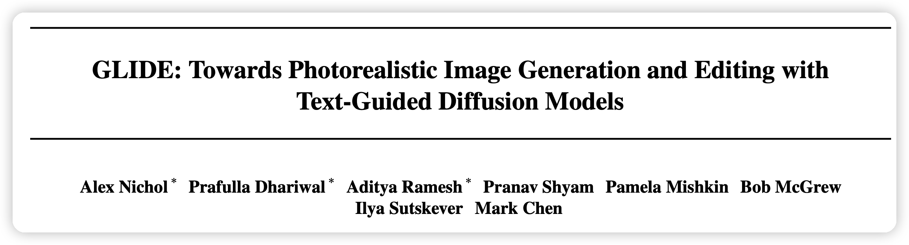
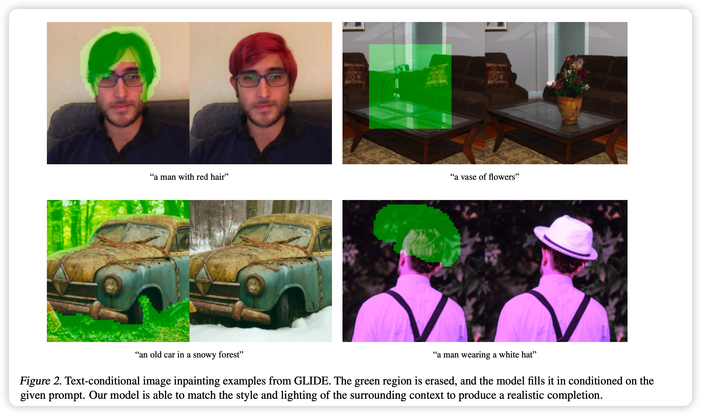

这篇工作其实就是有名的DALL.E 2的模型结构，只是规模是3.5B(DALL.E是12B)。本篇工作是第一个用diffusion model来做text2image任务的。

<!-- more -->

作者是财大气粗的OpenAI，这几个联合一作都是重量级：

- Alex Nichol：DALL.E 2(unCLIP)作者
- Prafulla Dhariwal：GPT3作者，ADM作者
- Aditya Ramesh：DALL.E作者

这篇工作中关于Diffusion model的原理就不写了，但里面提到了两种有趣的guidance方法我想写一下：

所有的所谓guidance都是说想要生成包含条件y的结果x，即$P_\theta(x|y)$

## Guided Diffusion

这种原理始见于

> Diffusion models beat gans on image synthesis.



这里用的原理公式是：
$$
\hat{\mu}_\theta(x_t | y) = \mu_\theta(x_t | y) + s \times \Sigma_{\theta} (x_ | y) \times \bigtriangledown_{x_t}\log p_\phi(y|x_t)
$$
意思是说，我们需要训练一个分类器$p_\phi(y|x_t)$可以对任何一个样本分类出对应的分类y。有了这个分类器的导数之后，下一次的去早就可以看成均值拟合器$\mu_\theta(x_t | y)$(这个可以看是一个不含y的模型)结果加上一个偏向于y分类器出y的方差。

s是系数，当s变大时，diversity会下降，但是生成的结果更偏向于y。

## Classifier-free guidance

这个方法更有意思了，始见于

> Classifier-free diffusion guidance

它建立的逻辑是：不想训练classifier(因为需要给每一个分类都训练分类器，泛化能力不强).观察分类器做的事情，由贝叶斯公式进行化简 ：
$$
p(y | x_t) \propto \frac{p(x_t| y)}{p(x_t)}
$$

$$
\bigtriangledown_{x_t}\log p(y | x_t) \propto (\bigtriangledown_{x_t}\log p(x_t | y) -\bigtriangledown_{x_t}\log p(x_t))
$$

我们可以把生成器直接做成condition的形式：$p_\theta(x_t | y)$,y可以是比如说文本信号，如果y输入空就是无条件的生成。因此上面正常guidance公式就可以修改成：
$$
\hat{\epsilon}_\theta(x_t | y) = \epsilon_\theta(x_t | \phi) + s \times (\epsilon_\theta(x_t | y) - \epsilon_\theta(x_t | \phi))
$$
这里的log和$\bigtriangledown$消失了是因为在DDPM如果看做socre based model的话将会有$\epsilon_\theta = \bigtriangledown_{x_t} \log p(x_t)$

s是一个scale量，某种意义上抵消贝叶斯公式的偏差

上面的公式很有意思：

- 只需要一个模型就能完成guidance，不需要额外训练classifier，更加稳定

- 这个方法的表征能力更强，可以获取很多无法被classifier感知到的“类别”(文本等)

  

## CLIP Guidance

这个是上面classifier guidance 的一种特例，就是把$\cos <clip(\hat{y}),clip(x)>$当做分类器的结果，因此clip的特点，也可以表征抽象的文本“类别”

## GLIDE

下面说说GLIDE模型。由于这部分对NLP不重要，就不重点写。大概有几个特征：

- 主体Diffusion model采用 ADM结构
- 训练集和DALL.E保持一致
- pretrain时直接用<x,y>对进行$p_\theta(x_t | y)$生成
- 在pretrain结束以后进行classifier-free guidance，用上面的公式来一个指导生成
  - 训练时20%部分文本被mask，把任务变成无条件生成，保证模型本身的生成能力不被破坏
- 在RGB外多加了一个channel代表被mask的部分，可以进行Inpainting的需求

结论是：

- 对比classifier-free guidance和CLIP guidance，前者的效果更好(人工评测)
- 用了Diffusion model的GUIDE比不用的DALL.E 好很多

inpainting任务就是上图这个，相当于"P图"，绿色部分就是额外的mask channel中置为1的地方

上图是文本控制的图片生成，对比下来好像GLIDE确实是最好的

