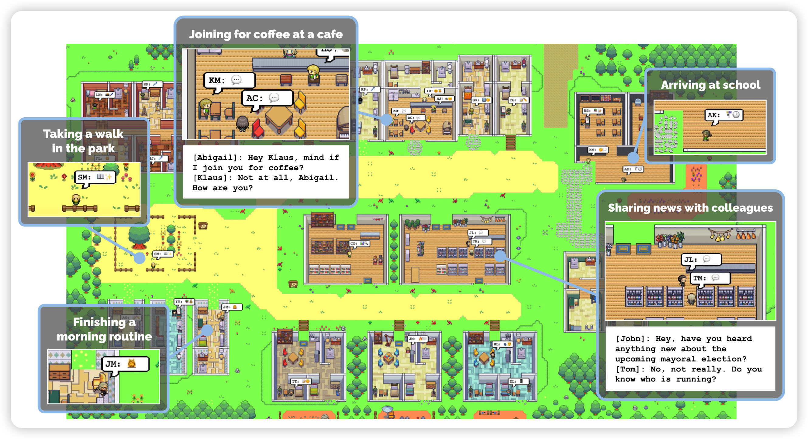
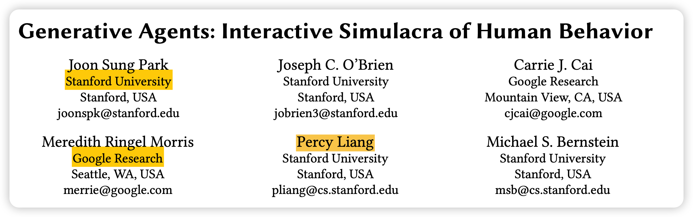
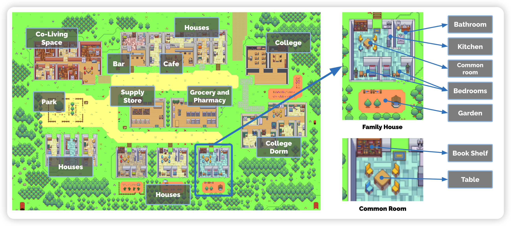
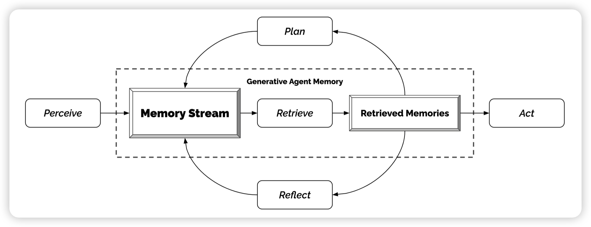
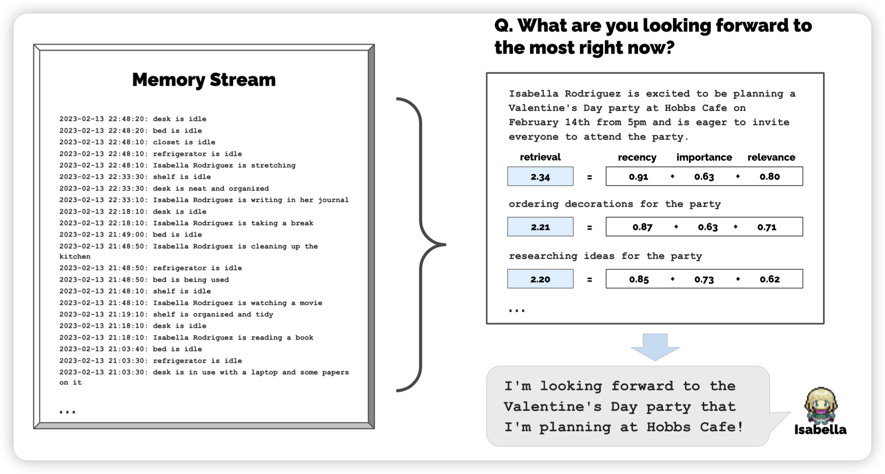
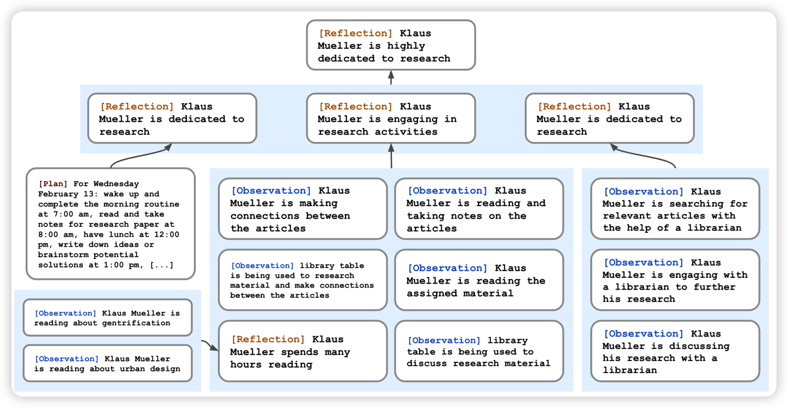
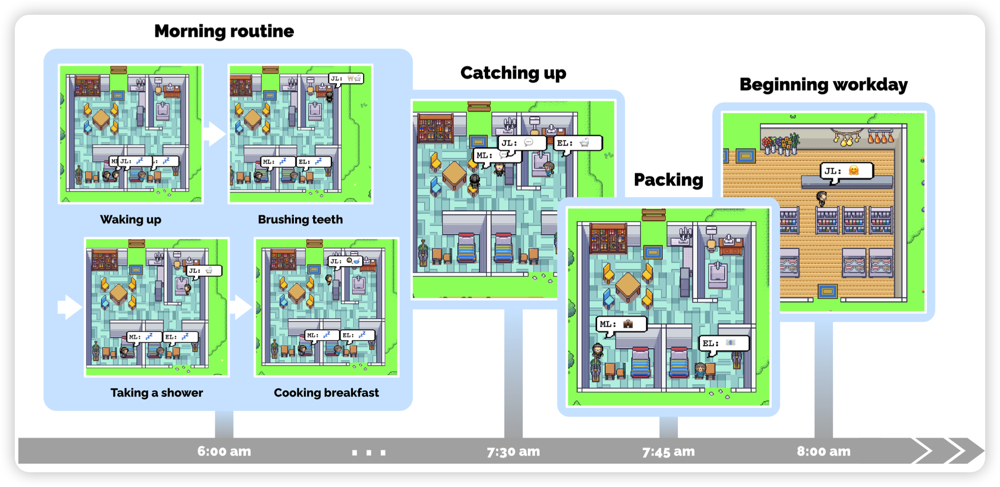
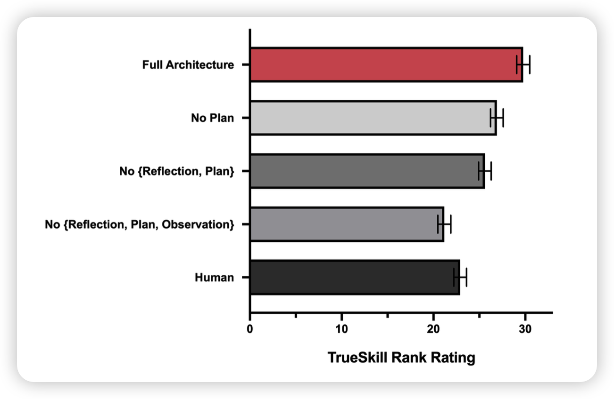
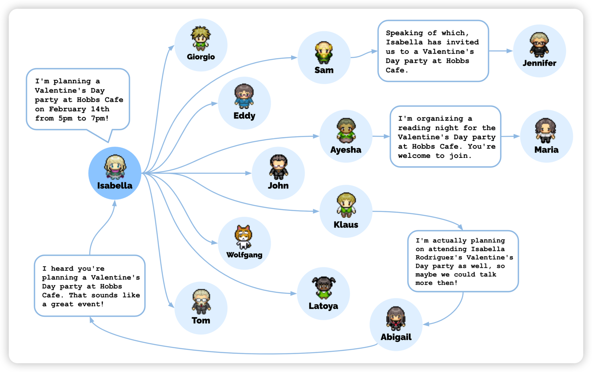

今天讲一篇很有意思的论文，如果让25个GPT假装NPC在游戏里自由生活、交流、发展会怎么样呢？

<!-- more -->

作者团队来自斯坦福和google research。其中percy liang是stanford AI的代表人物，他挂名的论文一般质量都很高。

## Introduction

整个introduction的写法大概相当于一个简单版的论文原文，这种写作手法其实是比较少见的，可能是这篇论文的格式瞄准的是nature子刊类，需要让外行也能看懂论文的内容。

introduction中，作者谈到想要真实地模拟出NPC的行为，大概需要有一个比较好的记忆模块，可以去进行长期的记忆。在此基础之上，作者额外设计了三个模块：记忆模块、反思模块、交互模块。

作者进行了对比实验，发现任何一个模块都对于结果非常重要。同时作者也做了一个社会实验，告诉其中一个模型要举行情人节派对，最后所有NPC都通过交谈得知了这件事情，每个人都决定自己要不要参加、或者因为什么事情不会出席。NPC社会衍生出了非常类似于人类社会的关系。

另外，我想额外说几件事情：

- 搭建这样一个平台框架是一个很复杂的工程问题，作者其实为了这件事情应该是写了非常多的代码
- prompt设计估计也比想象中麻烦
- 作者没有开源代码
- 作者在后文提到，即使这样一个平台，没有训练只是做实验，在ChatGPT现在打1折的情况下，仍然花了几千刀来完成实验。可见money is all you need

## method

下面我们来看看具体作者怎么创造了这么一个GPT的世界呢？

### world

作者首先设定了一个世界，里面有各种各样的场所，还有各种各样的对象可以交互，交互方式就是自然语言。

同时世界中有各种各样的人，每个人由一段prompt定义，比如说John：

> John Lin is a pharmacy shopkeeper at the Willow Market and Pharmacy who loves to help people. He is always looking for ways to make the process of getting medication easier for his customers; John Lin is living with his wife, Mei Lin, who is a college professor, and son, Eddy Lin, who is a student studying music theory; John Lin loves his family very much; John Lin has known the old couple next-door, Sam Moore and Jennifer Moore, for a few years; John Lin thinks Sam Moore is a kind and nice man; John Lin knows his neighbor, Yuriko Yamamoto, well; John Lin knows of his neighbors, Tamara Taylor and Carmen Ortiz, but has not met them before; John Lin and Tom Moreno are colleagues at The Willows Market and Pharmacy; John Lin and Tom Moreno are friends and like to discuss local politics together; John Lin knows the Moreno family somewhat well — the husband Tom Moreno and the wife Jane Moreno.

GPT接受这个prompt作为人设开始活动

### memory

仅仅是GPT的32768的seqlength显然是不够的，作者需要一个记忆模块。记忆模块存储了过去智能体经历的所有事件。事件包括时间地点人物内容对话等等。每当模型发生一个新的事件，就把事件记录到记忆模块里。

### retrieve

为了让模型可以想起过去发生的事件，作者定义了一个专门搜索模块retrieve模块。

对于一个搜索的输入，对所有记忆中的事件都有三个部分的得分：

- 时间得分：发生在最近的事件分数高。作者提到是一个底数为0.99的指数衰减算法
- 重要性得分：重要的事件分数高。这一部分是在事件发生时让模型自己打分。作者提到模型自己打的分挺好的，比如没啥意义的吃早饭就打1分，找暗恋对象去约会就打8分。

> On the scale of 1 to 10, where 1 is purely mundane (e.g., brushing teeth, making bed) and 10 is extremely poignant (e.g., a break up, college acceptance), rate the likely poignancy of the following piece of memory.
>
> Memory: buying groceries at The Willows Market and Pharmacy
>  Rating: <fill in>

- 相关性得分：和query相关的分数高。这里作者直接找了另一个LLM去编码句子向量，然后算cosine相似度。

最终得分是三个得分的加权平均。模型每次遇到不知道的问题或者需要查看记忆的时候就调用这个retrieve模块。

### reflection

仅仅是记忆和搜索，并不能让模型自己总结世界知识。作者希望模型可以在生活中自己总结出一些结论，这就是reflection模块。

这一部分作者采用自顶向下的模式，每天进行一到两次reflection。每次reflection时输入最近的100个事件，然后通过prompt询问我们可以通过这些时间发现什么问题。要发现三个问题。

接下来，对于发现的问题，作者用retrieve模块搜索相关事件，然后让模型通过结果来回答问题。

> Statements about Klaus Mueller
>
> 1. Klaus Mueller is writing a research paper
> 2. Klaus Mueller enjoys reading a book
>
>  on gentrification
>
> 3. Klaus Mueller is conversing with Ayesha Khan about exercising [...]
>
>  What 5 high-level insights can you infer from the above statements? (example format: insight (because of 1, 5, 3))

最终整体的reflection过程会当做一个事件存储到memory系统里。也就是说，随着生活的进行，模型会对于世界有更多的了解，比如说自己的邻居沉迷科研，或者xxx每天要花很长时间浇花之类的。最后NPC的对话会越来越精确，也能发现趣味相投的朋友。

### plan和交互

有了记忆模块，模型最后是怎么和世界交互的呢？

作者定义了一个自顶向下的plan过程。每天先通过prompt生成当天的计划，大概分为5-8个部分。

> Name: Eddy Lin (age: 19)
>  Innate traits: friendly, outgoing, hospitable
>  Eddy Lin is a student at Oak Hill College studying music theory and composition. He loves to explore different musical styles and is always looking for ways to expand his knowledge. Eddy Lin is working on a composition project for his college class. He is also taking classes to learn more about music
>  theory. Eddy Lin is excited about the new composition he is working on but he wants to dedicate more hours in the day to work on it in the coming days On Tuesday February 12, Eddy 
>
> 1) woke up and completed the morning routine at 7:00 am,
> 2)  [. . . ]
>
> 6. got ready to sleep around 10 pm.
>
>  Today is Wednesday February 13. Here is Eddy’s plan today in broad strokes: 1)

接下来对于生成的每个部分，再生成更详细的计划。

>  4:00 pm: grab a light snack, such as a piece of fruit, a granola bar, or some nuts. 
>
> 4:05 pm: take a short walk around his workspace
>
>  [...] 
>
> 4:50 pm: take a few minutes to clean up his workspace. 

接下来作者就会让模型真的去开始这一天，通过生成的今日计划。随着计划的进行，模型会遇到别的人，比如说都在餐厅吃饭之类的。或者遇到某些世界事件，比如在修路走不了。

对于这种，作者定义为observation，是一段自然语言描述，比如下面这样：

> [Agent’s Summary Description]
>  It is February 13, 2023, 4:56 pm.
>  John Lin’s status: John is back home early from work.
>  Observation: John saw Eddy taking a short walk around his workplace.
> Summary of relevant context from John’s memory: Eddy Lin is John’s Lin’s son. Eddy Lin has been working on a music composition for his class. Eddy Lin likes to walk around the garden when he is thinking about or listening to music.
>  Should John react to the observation, and if so, what would be an appropriate reaction?

接下来作者让模型自己决定要不要去和别的NPC交互一下，比如下文就是选择去说话。

> [Agent’s Summary Description]
>  It is February 13, 2023, 4:56 pm.
>  John Lin’s status: John is back home early from work.
>  Observation: John saw Eddy taking a short walk around his workplace.
>  Summary of relevant context from John’s memory: Eddy Lin is John’s Lin’s son. Eddy Lin has been working on a music composition for his class. Eddy Lin likes to walk around the garden when he is thinking about or listening to music.
>  John is asking Eddy about his music composition project. 
>
> What would he say to Eddy?

另外的模型也用同样的方式回答：

> [Agent’s Summary Description]
>  It is February 13, 2023, 4:56 pm.
>  Eddy Lin’s status: Eddy is taking a short walk around his workplace.
>  Observation: John is initiating a conversation with Eddy.
>  Summary of relevant context from Eddy’s memory: Jonn Lin is Eddy Lin’s father. John Lin is caring and is interested to learn more about Eddy Lin’s school work. John Lin knows that Eddy Lin is working on a music composition.
>  Here is the dialogue history:
>  John: Hey Eddy, how’s the music composition project for your class coming along?
>  How would Eddy respond to John?

同时，作者也允许模型在通过交互以后修改自己本来做好的plan:

> [Agent’s Summary Description]
>  Eddy Lin is currently in The Lin family’s house:
>
> Eddy Lin’s bedroom: desk) that has Mei and John Lin’s
>  bedroom, Eddy Lin’s bedroom, common room, kitchen, bathroom, and garden.
>
> Eddy Lin knows of the following areas: The Lin family’s house, Johnson Park, Harvey Oak Supply Store, The Willows Market and Pharmacy, Hobbs Cafe, The Rose and Crown Pub.
>
> \* Prefer to stay in the current area if the activity can be done there.
>  Eddy Lin is planning to take a short walk around his workspace. Which area should Eddy Lin go to?

通过上述的所有模块，作者最终让智能体可以在小世界自由的生活、交谈、理解、反思。

## experiment

这一部分作者做了两个实验。

首先是相似性实验，作者让human在模型同样的处境下选response。和模型自己的response掺杂在一起，然后让别的human打分看看局的哪个好(打分人不知道哪个是human写的)。

最后发现，其实模型自己生成的response比human写的还要好，尤其是在有所有模块的情况下。

另外，作者还做了个社会实验：通过修改某个NPC的行为，让它想要开个情人节派对。最后通过NPC的对话传播，最终12个人得知了情况，决定来参加。模型们自己讨论了派对时间地点，最终成功举办了派对。细思恐极呀。

## 我的思考

- 现在模型都能无监督自己生活了，这会不会有伦理问题呀w

- 期待一手未来的游戏，难道GTA6里面的NPC要变成真正的智能NPC、决定自己的行程和发展了吗？

- 25个ChatGPT跑了2天的模拟人生，就花了几千刀的token钱，还是在打1折的情况下。哎

- 作者说还有很多的改进空间，感觉提到的改进空间大多数都是需要少更多钱才能做的。

- 我自己挺看好这个方向的，而且我觉得肯定很多做心理学、社会学的人会对这个很感兴趣，比如说

  - 真正的human和24个ChatGPT生活会怎么样？
  - 10个人和15个ChatGPT生活两天后投票谁是AI，能不能选出真正的人？

  
