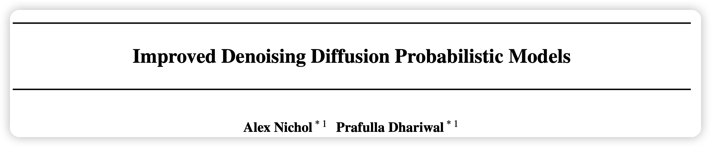
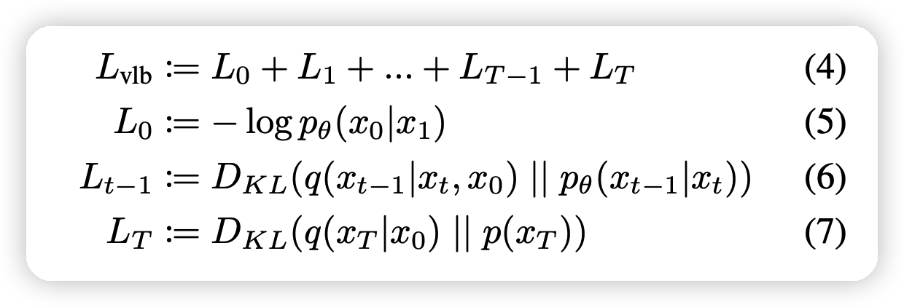
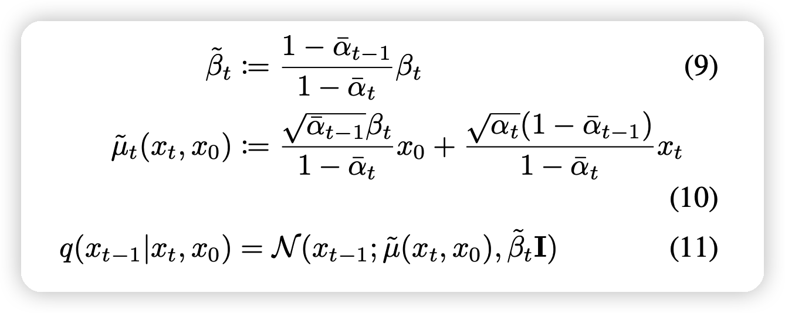
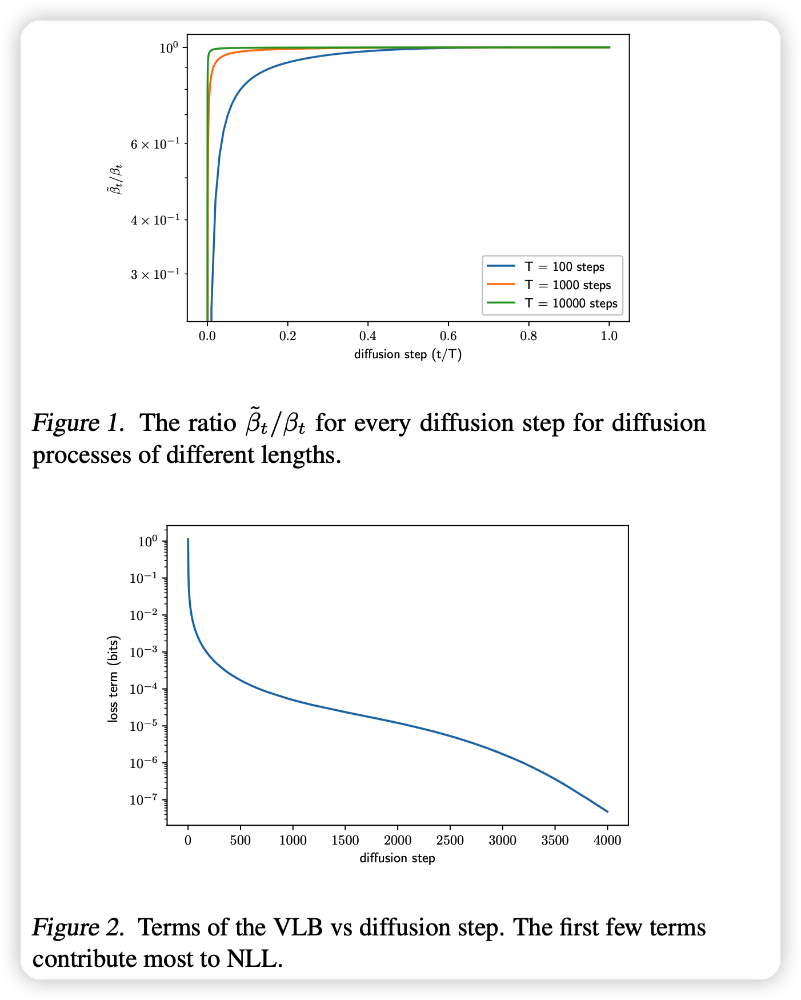
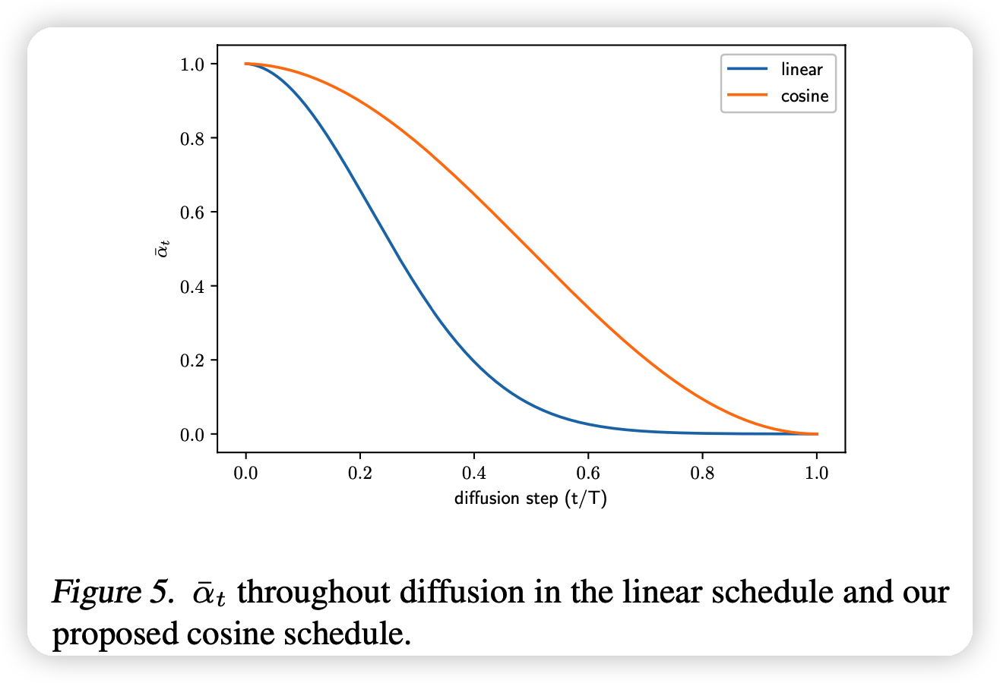
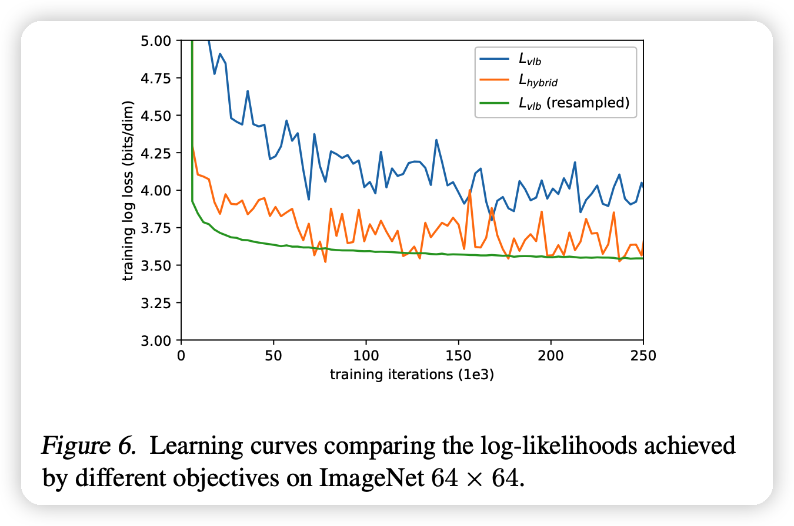
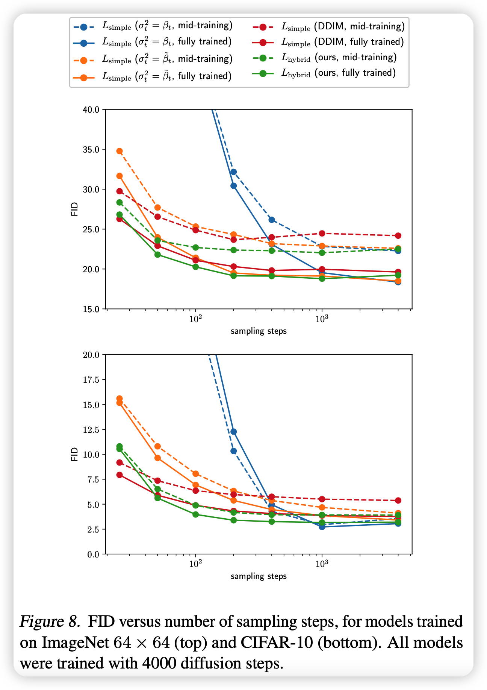
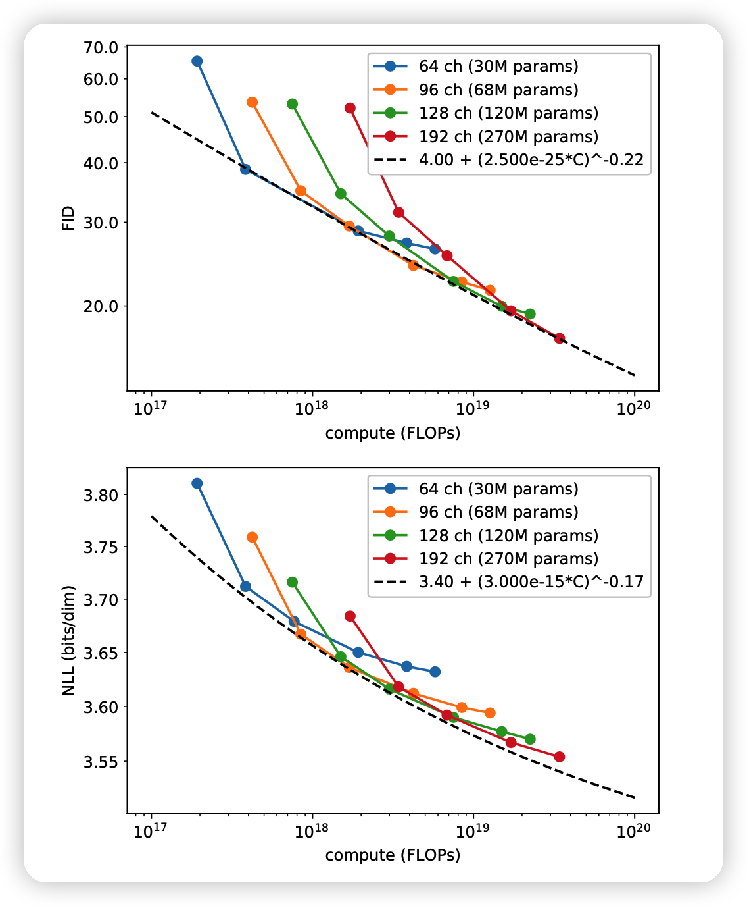

这篇论文探索了DDPM对于NLL指标效果不好的原因，并且从实际训练的角度给出了很多可行的改进。

<!-- more -->

这篇论文是21年的NIPS，作者来自OpenAI，其实就是后面GLIDE的作者。我理解大概是OpenAI看到了DDPM的论文，然后用”财大气粗“的方式来了一波复现和改进。这篇论文其实更偏向于分析性文章。另外，这篇论文的方法的代码和复现性很好。
> 发现一个讲IDDPM代码的是[视频](https://www.bilibili.com/video/BV1sG411s7vV)

本文大概探索了这个几个问题：

- DDPM的训练object
- $\beta_t$的选取
- 训练的采样方法
- DDPM模型的可扩展性

## Denoising Diffusion Probabilistic Models

这里重新梳理了一遍DDPM，我就说几个新颖的地方

### Definition

作者写出了$L_{VLB}$的形式

可以看出中间的项都是KL散度，可以通过前后两个高斯分布的均值和方差直接计算出来:

- 正常的DDPM模型$p_\theta$模型的均值由模型得出，而方差是确定性的
- $q(x_{t-1} | x_t, x_0)$的均值方差均可以被代数表示

### Training in Practice

这一部分，作者说到了三种模型目标：

- 生成 $\mu_\theta(x_t,t)$，预测$x_{t-1}$的均值
- 预测$x_0$,采样时根据公式10线性拟合出$x_{t-1}$进行去噪
- 预测加噪时的噪声$\epsilon$,去噪根据下式和公式10拟合出$x_{t-1}$

$$
x_0 = \frac{1}{\sqrt{\alpha_t}}\left( x_t - \frac{\beta_t}{\sqrt{1 - \overline{\alpha}_t}} \epsilon \right)
$$

DDPM在训练过程中使用最后一种，表现最好

作者把$L_{VLB}$进行了一波reweight，得出下式作为训练loss进行训练
$$
L_{\text{simple}} = \mathbb{E}_{t,x_0,\epsilon} || \epsilon - \epsilon_\theta(x_t,t)||^2
$$

同时，作者说到在predict阶段，使用下面两种方差效果很接近

- $\sigma_t^2 = \beta_t$
- $\sigma_t^2 = \tilde\beta_t$

## Improving the Log-likelihood

这里作者提到Log-likelihood这个指标在图像生成也很重要，但DDPM在这个指标的效果不好(虽然FID不错)。

### learning $\Sigma_\theta(x_t,t)$

作者思考为什么DDPM的两个方差效果接近

- 图一可以发现两种方差只在$t$很小的时候有差距，别的时候基本一致

- 图二可以发现$t$小的时候对NLL的影响是最大的

综合上面观点，作者觉得NLL效果差的重要原因就是对方差的估计有偏差(上面两种$\sigma$都是估计的形式)。因此作者想要找到更好的方差，作者希望通过网络拟合它，看做两种$\sigma$的拟合
$$
\Sigma_\theta(x_t,t) = \exp (v \log \beta_t + (1-v)\log \tilde\beta_t)
$$
其中v是可学习的参数。作者在这里没有对v的范围做限制，但实际训练还是控制在0-1内。说明DDPM作者选取的两个估计还是很靠谱的

想要学习这个v，就只能把loss直接表示成$L_{VLB}$,才能反向传播到v，因此作者选择了最终的loss函数
$$
L_{\text{hybird}} =  L_{\text{simple}} + \lambda·L_{VLB}
$$
其中$\lambda=0.001$

###  Improving the Noise Schedule

这一部分，作者探索了$\beta$的选取

DDPM使用linear来选取，作者采用新的cosine的公式选取
$$
\overline\alpha_t = \frac{f(t)}{f(0)},\quad f(t) = \cos \left(\frac{t/T + s}{1+s}·\frac{\pi}{2} \right)^2 \\
\beta_t = \min(0.999,1 - \frac{\overline\alpha_t}{\overline\alpha_{t-1}})
$$
这中选取方式比linear更稳定。同时作者指出，类似cosine的这种形状的，最后效果都差不多

### Reducing Gradient Noise

第三个改进是让训练更稳定

作者发现直接优化$L_{VLB}$的训练非常不稳定，比起优化$L_{simple}$。作者发现这是由于$L_{VLB}$参数对梯度更分散。

进一步分析，发现是在训练时平均的选取t导致训练额外的噪声，实际上的选取应该是：
$$
L_{VLB} = \mathbb{E}_{t \sim p(t)} \left[ \frac{L_t}{p_t}  \right], \text{where}\quad 
p_t \propto \sqrt{\mathbb{E}[L_t^2]}, \quad \sum p_t = 1
$$
对于每个t，在训练过程中都可以维护$L_t$，只要训练开始一段时间以后。

- 先平均选取t，直到每个t都有10个$L_t$的历史数据为止
- 接下来，按照前10个历史数据的平均作为目前$L_t$情况的估计，进而带入公式来采样下一个t的选取

最终的训练变得很稳定，如上图的绿线

## Improving Sampling Speed

这一部分提到了可以加速采样

这里主要对比的是DDIM，方法也差不多：采样一个$1,2,...T$的长度为K子序列进行sample

可以发现，DDIM的没有IDDPM好：

- DDIM没有做IDDPM里这些改进。
- 作者提到没法做改进，这是因为DDIM的公式里的方差项没了

 ## Scaling Model Size

这一部分是分析DDPM模型在加大size以后会不会变得更好，因此作者直接加参数

- FID得分和模型的参数(计算量)基本呈线性关系。满足power law，因此扩大规模是个好选择
- NLL得分不满足线性关系，扩大规模效果不好，可能原因有：
  - 很快过拟合
  - loss不稳定
  - 作者没有直接优化降低NLL用的$L_{VLB}$，而是一个$L_{\text{hybrid}}$

## 我的思考

- 总体而言，这篇文章更像是分析性文章，复习笔记。主要方法还是DDPM。
- OpenAI研究员解决问题的眼光真的很高明呀，尤其是关于改变t选取和分析scale能力这一部分。
