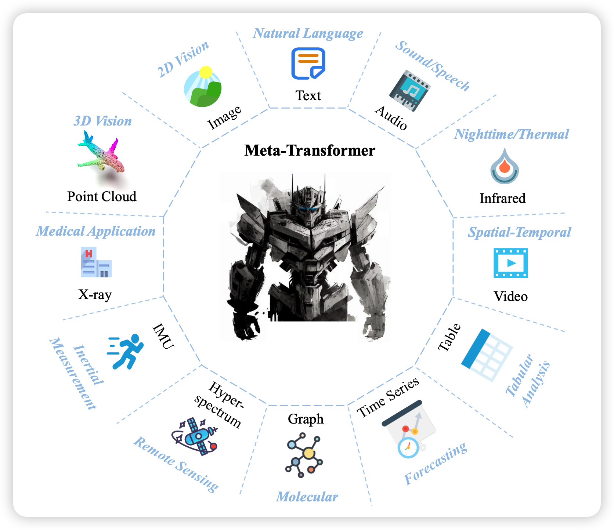
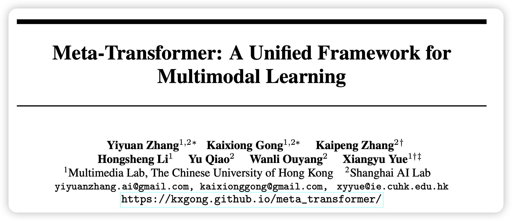
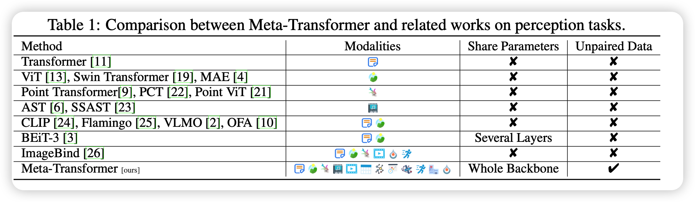
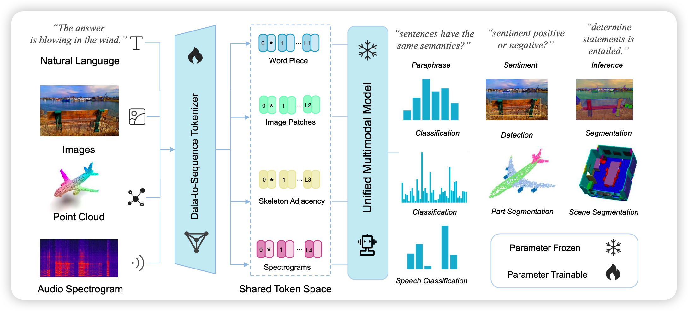
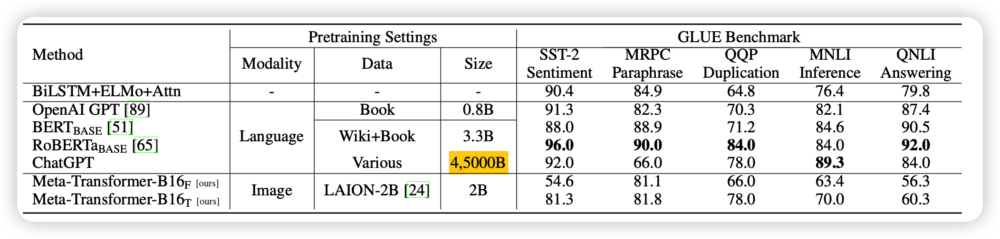
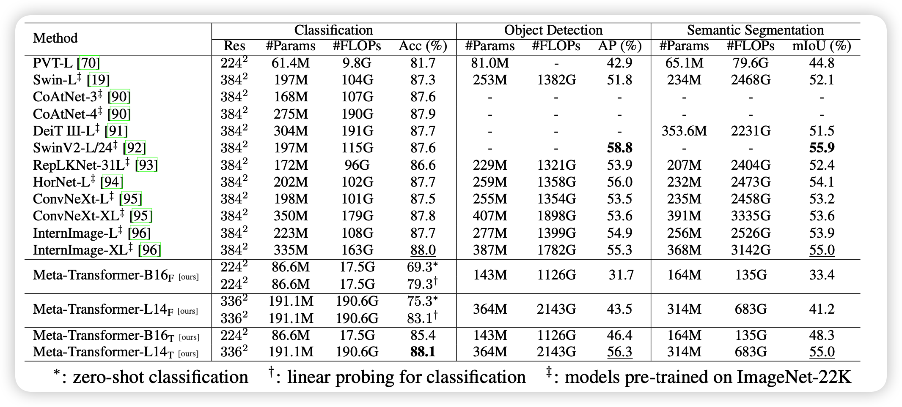

今天来看一篇的新作，如何在不用模态对数据的情况下，炼多模态模型？甚至效果还行？

<!-- more -->

论文作者来自香港中文大学，笑死，一看题目我还以为Meta AI的新作。论文的一作我搜了搜，好像没有什么我见过的文章

## Introduction

作者在文章里讲到，多模态领域的一个重要问题是如何把模态对齐。而transformer架构其实是对模态不敏感的，只要进来embedding就能跑。那么作者就想到，能不能把各种模态的数据都扔进一个embedding空间，来做实现多模态编码呢？

其实，这个思路和CLIP是一样的，但是他们的解决方式不一样。CLIP是要找到很多image-text pair数据来做对比学习。但本文，是想要对齐多达12个模态，肯定找不到pair数据了。

另一个解决办法是像之前的imageBind一样，把所有模态的数据都对齐到一个模态(图像)，化简数据难度。

作者和上面的思路都不一样，他这里想要不用模态数据，但是没讲为什么？

大家肯定要问：不用pair数据，怎么做模态对齐任务？你说得对，这就是本文的一个故布迷阵，他只做了单模态任务，没做模态对齐任务。

总之，本文的贡献就是：尝试用统一的encoder，不用pair数据来做多模态表示。

## method

这一部分，作者首先假设所有模态都应该享有一个公共的语义空间(这里的语义是泛指，不是指语言模态)。因此作者就想要找到一个多模态的编码方式
$$
\hat{y} = F(x,\theta^*), \theta^* = \arg \min[\mathcal{L}(y,\hat{y})]
$$
其中x是原始输入，$\hat{y}$是模型输出，y是真实标签。总体而言就是传统finetune的方式

作者设计了一个三阶段的流程
$$
F = h◦g◦f(x)
$$
第一阶段是embedding函数f，这一部分是对于不同模态分开设计的

- text模态就是wordpiece+wordembedding
- 图片模态是ViT那套patch划分，再过一个conv层
- 视频模态是变成多个图片
- ……

总之，最后所有输入都能变成二位的embedding，注意：作者压平了维度，所有模态都和text一样了

接下来是encoder，作者想要用一个encoder接收所有：meta_transformer

最后是一个任务独立的head，每个任务都不一样，和BERT迁移到下游任务的方式一样

总体架构如下所示

## experiment

首先作者的encoder是在LAION-2B上训练的ViT(并不是abstract提到的没用pair数据)，然后text模态用CLIP text word embedding初始化

接下来，作者在各个模态的任务上都做了些实验

这里放上text和image模态的结果。模型名字里最右下角的T和F分别是指encoder是Tune还是Freeze

- 总体而言，结果不是很好，尤其是encoder freeze的情况下。可以理解，encoder freeze就相当于只有embedding和linear
- 话说是不是应该放个没有encoder的bias study

最后，这篇文章没有analysis，放上所有实验的结果就跑路了

## 我的思考

- 我其实不太喜欢这篇文章的思路，我认为：如果方法中设计了什么变化，就需要说出来为什么要这么设计，同时实验中要有结果支撑"这个设计的优势是什么"。否则的话按照奥卡姆剃刀原则，就不应该有这个设计。但是本文似乎没讲清楚"不用pair数据"、"要freeze encoder"的意义和目的是什么

- 当然，本文探索的这个问题很有意思，结果也挺有意思：当你在一个模态训了一个大encoder，锁住以后在另一个模态上加一个encoder强行对齐，竟然也能做？

> 我觉得这里面藏着更深的道理：另外之前image bind所有模态对齐到一个模态的结果也挺好，以及最开始类似flamingo的思路就用一个crossattention就能很轻松的连接多个模态，以及versitle Diffusion也是做到了类似的事情。
>
> 这是否说明transformer结构天然地将信息分解为了模态相关的和模态独立的两个部分，所以两个模态的transformer拼接时就会很容易呢？
>
> 我们是不是有机会让GPT4甚至不调参就能接到各个模态上去？

- 多模态领域发展真快呀，大家似乎都在试图剔除之前方法里的很多数据依赖和模型依赖，不知道最终能剔除到什么地步？
- 最后，模态间生成任务大家做的似乎都不是很好、要不就是干脆没做。我觉得多模态的终点就是把模型对齐到"脑波"模态，让我们和模型可以互相理解对方在想什么，是不是可解释性就来了？

>脑机接口，但是没有脑机？
