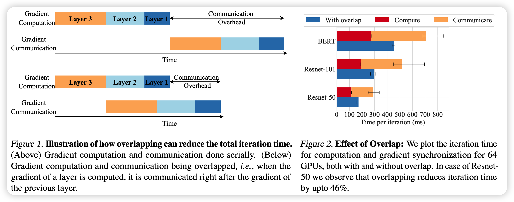
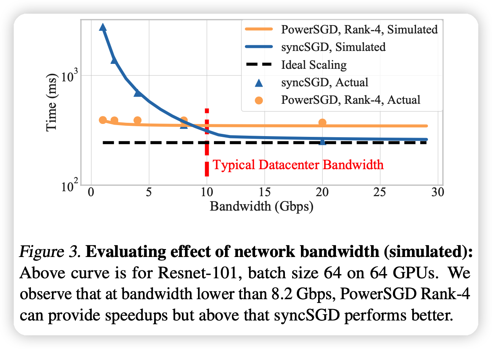
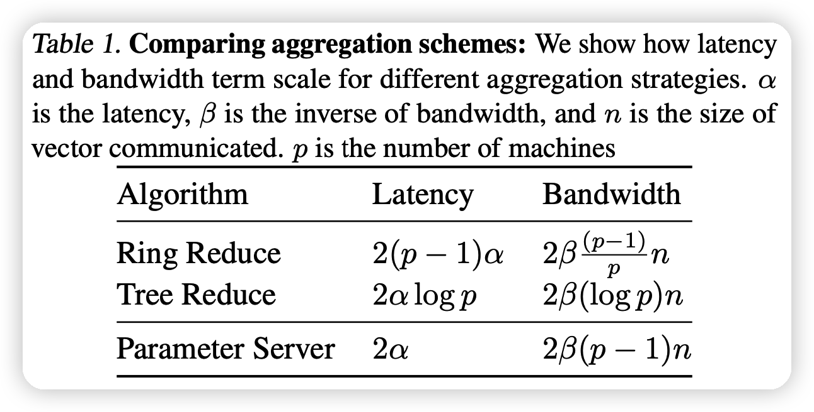
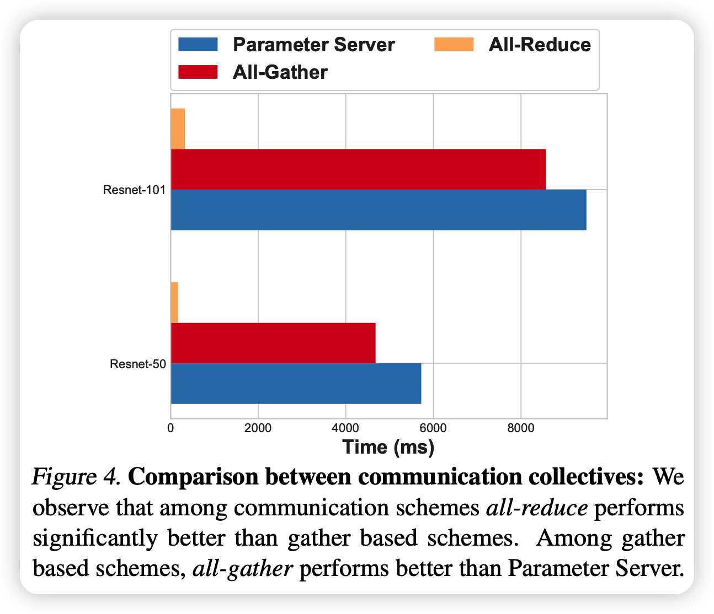
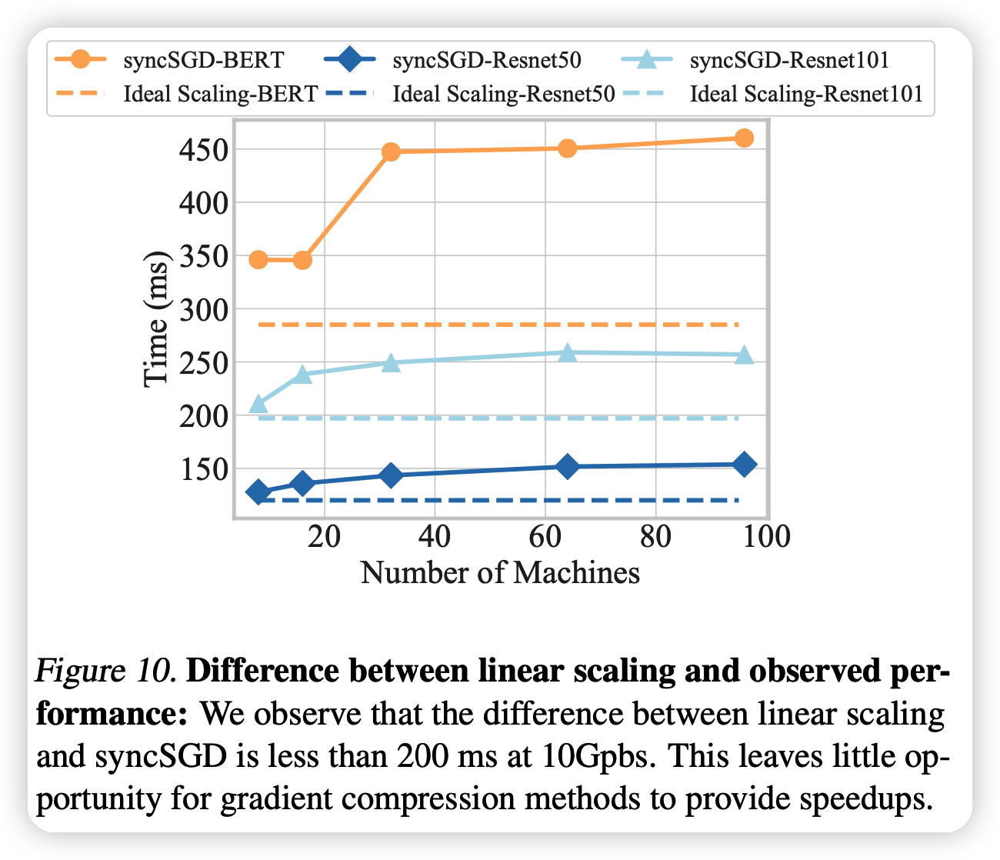

MLSys 22中编译优化方向的论文都看完了，今天看一个别的主题，分布式训练。这篇文章是一篇分析性文章，讲了分布式训练中梯度压缩算法在实际场景中的效果不好，分析原因，并且提出了一个和真实场景效果接近的performance model。

<!-- more -->

作者来自华盛顿大学和CMU。

## INTRODUCTION

这个introduction很长，足足三页，分析性文章是这样的。

首先作者讲了Synchronous data parallel stochastic gradient descent (SGD)方法，简称sync-SGD，是分布式训练中的一个方法，分为两个部分：

- gradient computation：梯度的计算，不同node的时间是串联的。
- gradient aggregation：这一部分需要收集不同的node算出的梯度，需要node间的通信。目前的瓶颈在这，通信带宽。

针对上面的瓶颈有几种解决办法：

- lossy gradient compression：把loss传输前先压缩一下。需要和深度学习框架交互，会带来额外的一些超参数

- system-level optimizations：是说把梯度组织成tree之类的优化，和深度学习库非常耦合，时间复杂度和node数成$\mathcal{O}(n),\mathcal{O}(\log n)$的关系

-  *overlap* the gradient computation and communication phases：这是说把上面sync-SGD的两个阶段并行的计算。第一个node计算完就可以开始第一个node的梯度汇总。这个方法效果很好，并且对用户完全透明，不需要用户加超参。如下图：

  

本篇工作重点在于评估上面的不同方法的效果：在96个GPU的集群上，对上面的方法进行超过200种setting的测试。

作者发现了下面几个结论：

- *limited opportunity for gradient compression*：梯度压缩效果不好。
  - 一方面，这压缩、解压缩时间太长。正常的通信要200ms，压缩解压缩要50ms，能力有一个比较差的上界。
  - 另一方面，不能真正利用硬件的并行性。因为梯度计算，梯度压缩都要GPU，有竞争关系。大batch size效果好，是因为某种意义上隐藏了这个竞争消耗的时间。
- all-reduce compression方法在扩大规模时表现更好。all-reduce定义见后文

同时，为了研究者可以在理论上分析算法的好坏，作者设计了一个performance model，和实际效果很接近。

- 一个结论是：比起提高压缩率，压缩总体时间更重要。因为带宽也没有很低，即使对于大模型，4x压缩率就够了。

## BACKGROUND AND RELATED WORK

### Gradient Compression

这一部分说了很多压缩算法，作者指出用来评测几个算法是：

- quantization based SIGNSGD
- low-rank decomposition based POWERSGD
- sparsification based MSTOP-K

### System Advances

这里作者梳理了几个概念

#### All-reduce

题外话，先说一下分布式训练的几个概念。分布式训练是把模型或者batch分布到不同节点上，因此每batch跑完后需要通讯

- broadcast：是说将根服务器的是所有数据发给所有服务器

- scatter：是说一次发太大，带宽瓶颈。把自己的数据分成几个批，每批分别发给一个服务器
- gather：每个服务器都获得了其他服务器上的一个数据块，直接拼接到一起。
- allgather：所有服务器都做gather，都获得了全部服务器的数据。
- reduce：和gather相对。是说一个服务器收到数据时，不是去拼接原来的，而是做一个操作(比如相加)
- AllReduce：每个服务器都做reduce。

分布式训练大概就是每个node持有一个mini-batch，算出自己部分的梯度后broadcast给其他节点，其他节点收到以后做reduce。最后通过一个allreduce让所有节点都有整个batch的总的梯度，并且不需要额外的存储(显存、内存)

作者提到，现有的这些allreduce算法都是在latency和bandwidth间做权衡。如下图：

值得一体的是，ring reduce方法的bandwidth花费时间和节点数p基本没关系

后面，作者提到了all-reduce算法的几种优化，比如前面提到的overlapping和bucket gradient。后者是缩减all-reduce的函数调用时间，用一些cache优化。

## EVALUATING GRADIENT COMPRESSION

后面四页都是在说做了什么实验，由于比较多，就不一个一个讲了，就说说结论。

所有的实验都是在一个64块V100的集群上进行的

上面的图说明all-reduce效果显著好于其他方法

上面这个图是说对比之下，随着node的上升，压缩算法的优化逐渐变得稳定(不随node的增加而增加)。其原因就是在上面提到的

## IDENTIFYING REGIMES OF HIGH GRADIENT COMPRESSION UTILITY

### Performance Model for Distributed Data Parallel

这一部分就是在讲作者的performance model，公式如下：
$$
T_{obs} \approx \max \left[\lambda T_{comp}, (k-1) T_{comm}(b,p,BW) + T_{comm}(\hat{b},p,BW)\right]
$$

- 模型可以分为k个bucket，每个前k-1个的大小是b，最后余出来的大小是$
- $T_{obs}$ 实际需要时间
- $T_{comp}$单个node的backward计算时间
- $BW$带宽
- $T_{comm}$，通讯时间
- $\lambda$,由于通讯和计算之间的延迟，带来的固有的下界，观测值大约是1.04-1.1

举例来说，比如ring-reduce的话，$T_{comm}$可以具体化为
$$
T_{comm}(b,p,BW) = 2\alpha \times(p-1) + 2\times b\times \frac{p-1}{p\times BW}
$$
剩下的算法可以根据上面提到的复杂度进行计算

接下来，作者分析了上面的模型和实际观测时间的准确性，发现基本一致

作者提到了现有performance模型的缺陷：

- 没有考虑model太大导致必须分布到不同node的情况
- 没考虑异步。假设同步只发生在每个iteration之后

### Insights from the Performance Model

从上面的 performance model，我们可以看出

- 压缩率不一定要很高，基本上4x就已经很足够了
- 压缩算法只有在带宽很低(<8Gbps)效果好

## 思考

- 我在想，这篇文章之所以能成功，是不是因为只有他们拿出了64张v100，别人没这么多，所以分析不了”node大的情况下压缩算法的表现“……
- 作者提到的这个trade-off的现象，很有道理：探索在目前带宽逐渐增大的情况下压缩算法的未来演进方向确实很有意义

