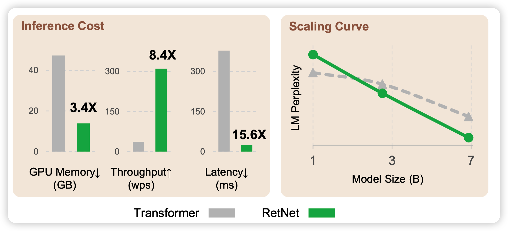
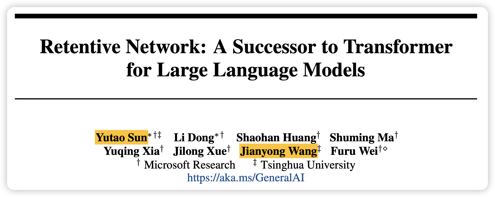
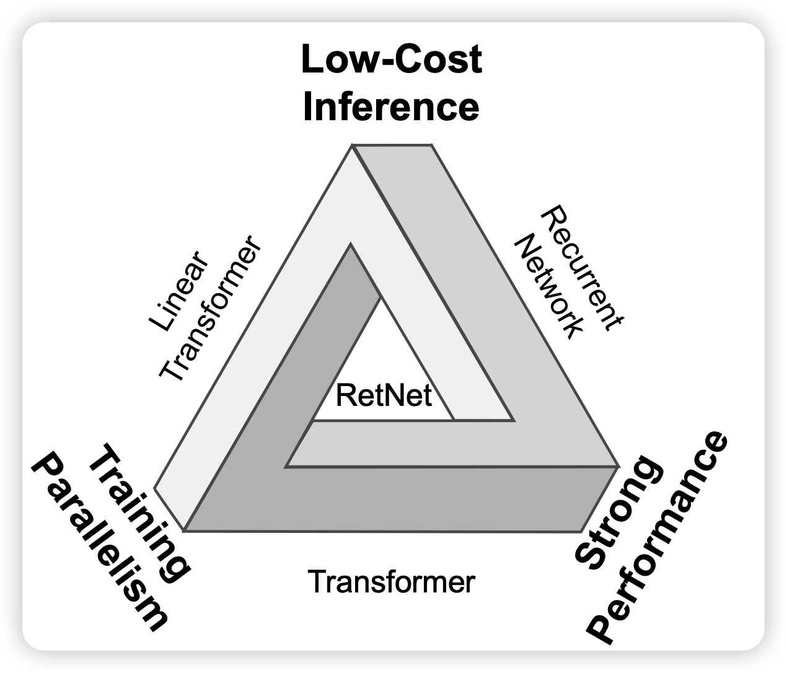
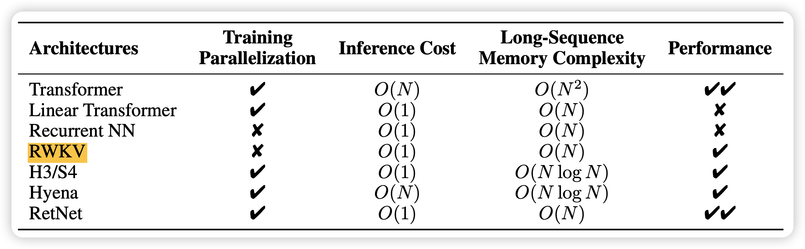
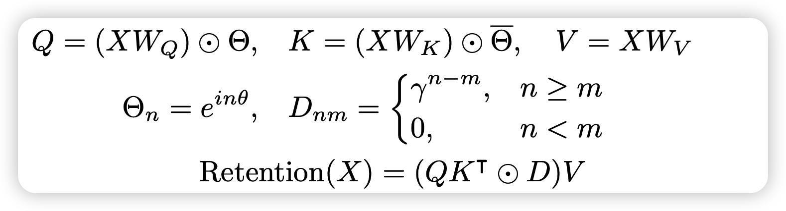
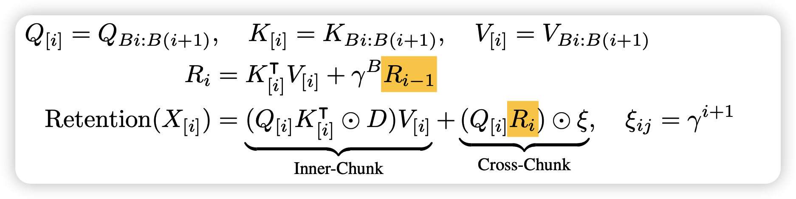
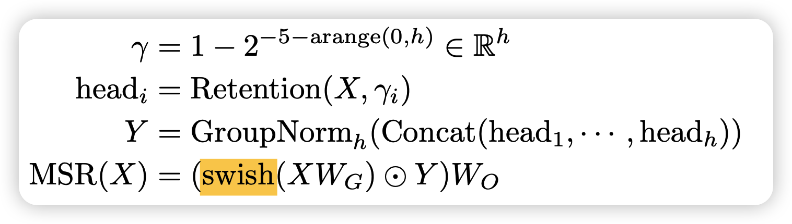
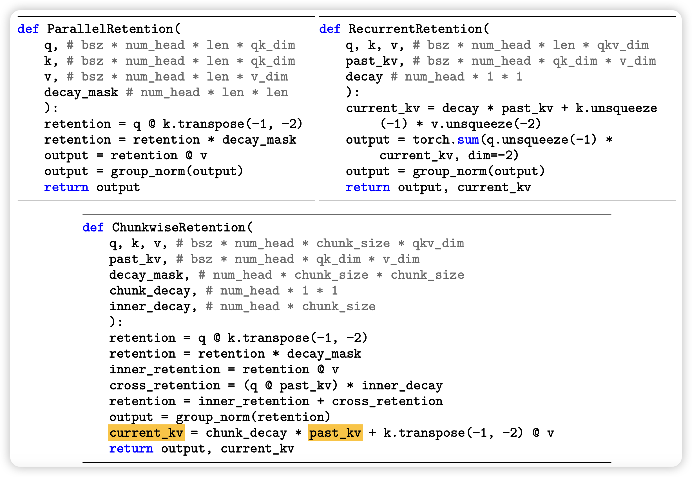
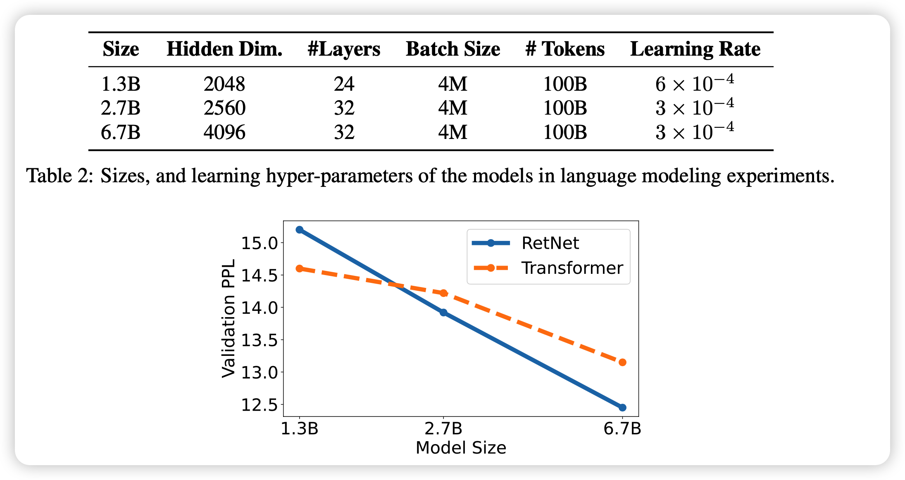
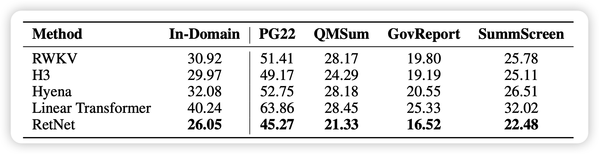

今天来讲讲被称为transformer "后继有模"的retentive network网络：速度更快、占用更少、效果更好。

<!-- more -->

## Introduction

作者团队来自清华，竟然是同学

作者在这个地方主要讲到了一个"不可能三角"：性能、训练并行性、低的inference成本

性能比较好理解。

训练并行性主要分两种：数据并行和训练并行，RNN当然可以数据并行，就是开一个很大的batch size。主要问题RNN的下一个状态依赖于上一个状态，因此算第i个位置时，必须把前面<i的位置全算完。相比之下，auto-regressive transformer按照causal mask的形式，只需要一次前向，就能把所有位置的hidden state算出来，因此比如seq_length是2048时，就要快2000倍

推理成本主要是针对时间说的，

- 正常的transformer做矩阵运算，n->d的映射需要复杂度$O(n^2d)$做矩阵运算, 因此一次前向总体复杂度大概是$n^2d+nd^2$算上multi-head attention的版本，平均一个token是$O(n)$
- 而对于RNN来说，$h_t = f(Ux_t + Wh_{t-1})$其中由于x和h都是一维的，因此最后的复杂度是$O(nd^2)$就比transformer，平均一个token需要占$O(1)$

## method

> 这一部分默认读者对tranformer的计算方式很了解

那么作者是怎么在持有transformer特性的基础上，利用起RNN的推理成本的特性呢？作者也想要用一个RNN的形式

### retention算子

$$
s_n = A s_{n-1} + K^T_n v_n \\
o_n = Q_ns_n = \sum_{m=1}^n (Q_n A^{n-m}K_m^Tv_m)
$$

其中$A \in \mathcal{R}^{d*d},K_n,v_n,s_n,Q_n \in \mathcal{R}^{1*d}$。V就是每个单词的词向量，s就相当于RNN里面的中间向量，而o就是RNN里面的输出向量。上面的下面那行是说最后总体o计算可以变换成一个累加的形式

Q、K可以类比transformer里的query、key的作用，计算也是一致的
$$
Q = XW_Q, K = XW_K
$$

这里看起来就是一个传统的RNN，但是如果我们假设计算时使用的A矩阵可以满足
$$
A = \Lambda (\lambda e^{i\theta}) \Lambda^{-1}
$$
另外，我们假设$\lambda$是标量
$$
\begin{aligned}
o_n & = \sum_{m=1}^n (Q_n A^{n-m}K_m^Tv_m) \\
& = \sum_{m=1}^n (Q_n  \Lambda^{n-m} (\lambda e^{i\theta}) \Lambda^{-(n-m)}  K_m^Tv_m) \\
& = \sum_{m=1}^n \lambda^{n-m} (Q_n e^{in\theta}) (K_m e^{im\theta}) V_m
\end{aligned}
$$
这样一下这个加和的形式看起来变成了矩阵乘的形式，而且如果把$\lambda$看做一个类似mask矩阵的东西，其实用类似transformer的大号的矩阵乘就能把所有位置都算出来，具体算法的形式类似这样

上面的和下面的两种算法的结果是完全相等的

接下来作者讲了几个优化

### chunk

首先是，如果seq length很长，上面的化简算法里的矩阵维度就太高了，想要把里面的分块计算(chunk)，之前有爆料GPT4之类的模型也大概是这个思路化简的。

所以块内inner-chunk就是直接按上面的算法，块间需要按照RNN的形式Autoregressive计算。换句话说，这里节省占用空间，但是需要每块先后的算，算是一个权衡吧

### multi-head

其次，作者类比multihead attention，搞了一个multihead retention

其实本质上也是在化简矩阵维度，先分成多个head，每个head使用不同的衰减系数$\lambda$，然后在每个head算完以后都给这个head做一个linear变换

之所以用group_norm，是因为每个head的衰减系数不一样，也就是说绝对值会有点区别

### retentive network

在retention算子说完以后，整体的网络就和transformer一致，只是attention算子变成了retention算子
$$
Y^l = MSR(LN(X^l)) + X^l \\
X^{l+1} = FFN(LN(Y^l)) + Y^l
$$
总体而言

- 他训练时使用矩阵化简的形式，可以一次算出来所有位置

- 推理时使用矩阵化简前那个RNN的形式，因此推理的时间和空间复杂度都很低

> 神奇的数学

## Experiment

实验部分很详尽，基本都是在证明RetNet性能强、速度快、占用低。

作者做了scale实验，发现RetNet的scale增长更快。感觉还挺有意思的，难道说运用了Recurrent的方式，真的能进一步增强模型的表征能力？

另外作者还和一些最近的改进transformer工作做了PPL对比，说明他的效果是真的好，而不是只比"香草"好

这些实验应该不是本篇工作主要focus的点，这里就跳过了。做的还是很好的，大家可以自己读一读原文。

## 我的思考

- 其实我们可以想想，这个方法在生活第n个token时，前面所有的状态仅由一个hidden dim维的向量决定，用来生成下一个hidden state。这个学习任务比起Autoregressive transformer需要同时看到前面所有位置的hidden state信息，学习任务可以说是更简单。

- 从这个角度出发，估计训练效率更高，但其实表示能力应该更弱才对。然后，传统的RNN其实都是类似这个形式，所以我其实比较好奇两个问题：

  - 经典的RNN结构在相同的训练量下，和RetNet比是不是效果基本相同呢？
  - 不知道后面有没有人尝试训一下30B、70B的版本？另外，这个6.7B的版本应该过的总token数是100B token，LLaMA 6.7B的训练量是1.0T，差一个数量级。不知道能不能和LLaMA比，因为LLaMA也是带了各种transformer变体。我理解这种看到flatten former state的形式，在更难得任务上可能会撞到瓶颈

- 最后，作者没有提到两个优势

  - 那就是按照现在这个chunk训练、RNN推理的模式，其实是不受到最大seq length影响的，因此天生就能搞到巨长的最大长度

  > 听说Claude 2那个100k的版本就是 低层优化+硬训 的，不知道anthropic看到这篇会不会直接出手

  - 再就是，这套方法不需要position embedding，我一直觉得transformer引入各种position embedding变体不够优雅，这个看起来舒服多了

- 最后吐槽一句，现在的论文名字真得起的大一点，昨天看到一个：copy is all you need，今天看到一个 a sucessor to transformer。还是得这样的才能显眼
