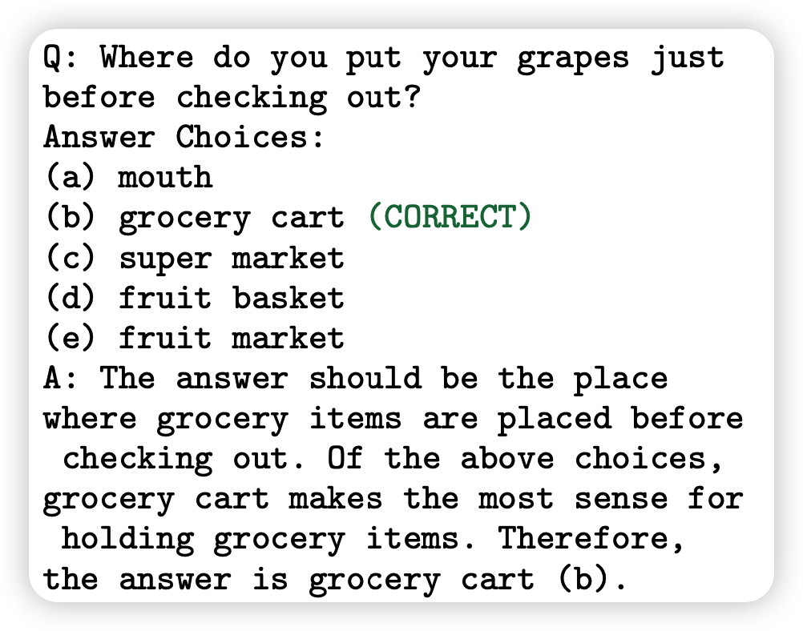
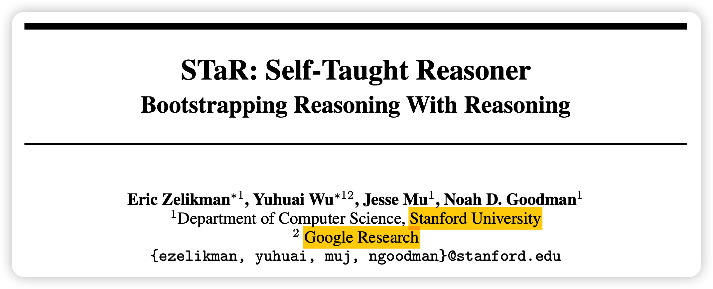
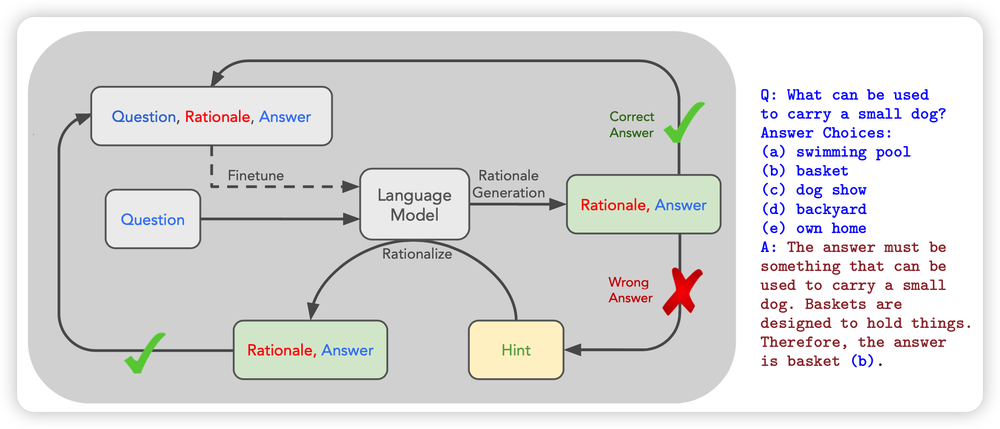
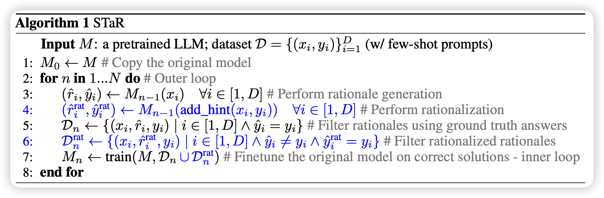
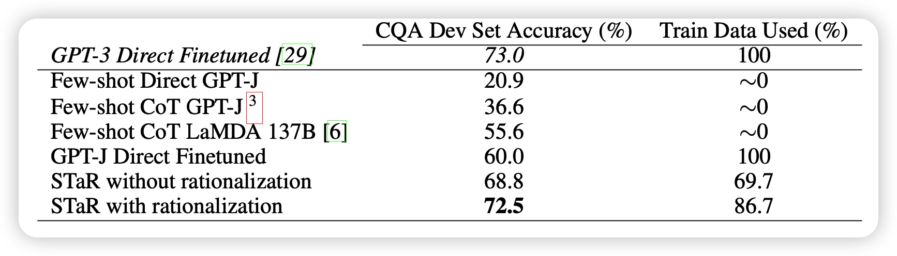
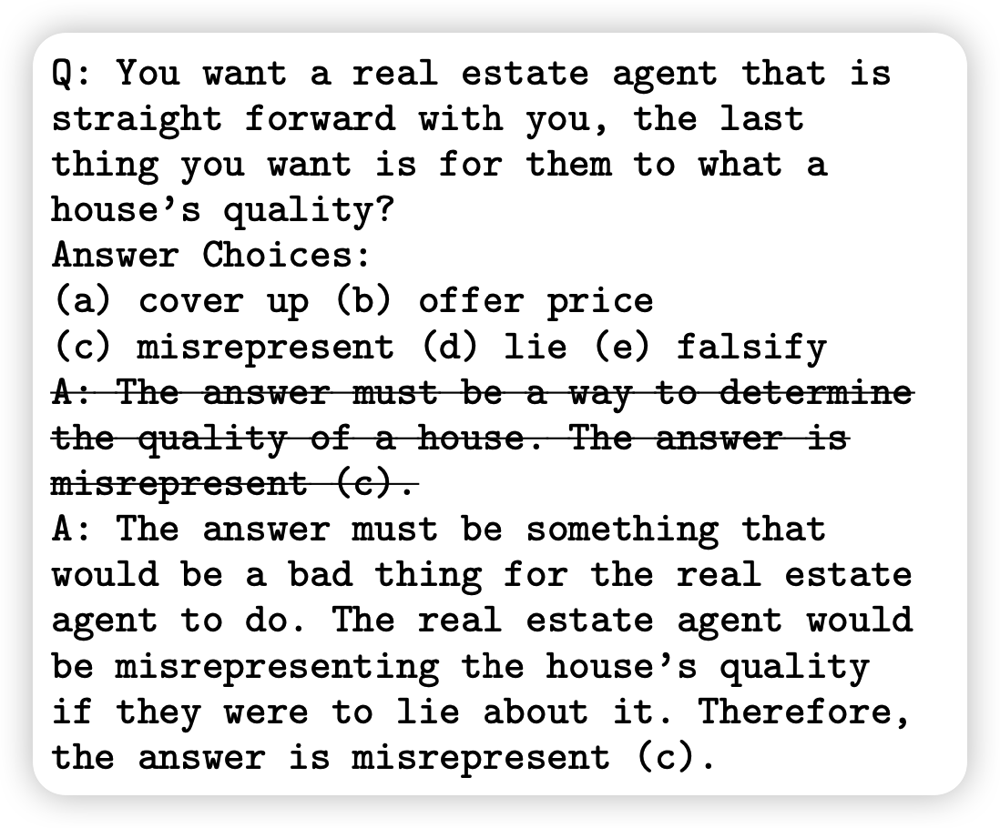
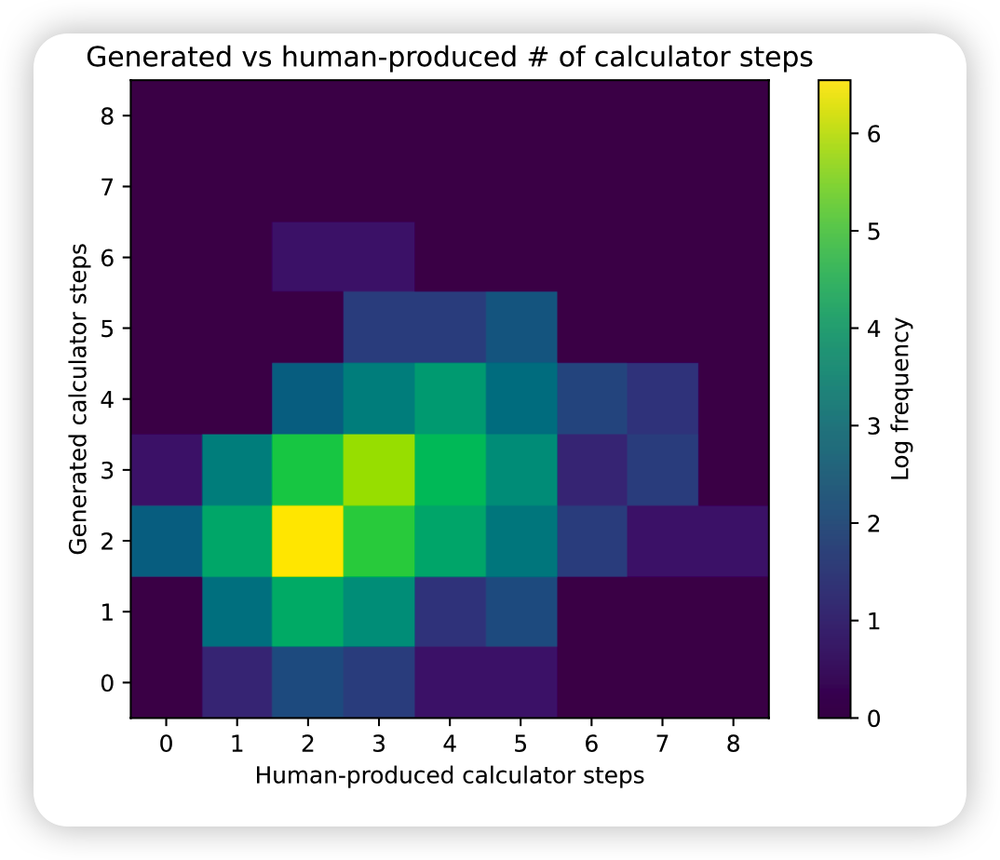

今天来讲一个和方法toolformer很像的文章：如何让模型左脚踩右脚学会做题？

<!-- more -->

作者团队来自stanford和google，

## Introduction

introduction是一个很经典的论文写作套路。

作者首先讲了讲做题这个领域。在做题领域，大模型直接做表现基本很差，few-shot版本也很差。(这里的few-shot是指只有 问题-答案 对的情况)。最近有一类方法叫chain-of-thought(CoT)，让模型think step by step，先生成一些思考链再做题，就能极大提高准确率。

这里作者就来思考：既然模型可以自己创造思考链，那能不能提高模型“创造思考链”的能力呢？

于是提出了所谓的self-taught reasoner。最后总结了一下贡献：

- 提出了一个简单的提高模型能力的方法。（无需检测生成的思考链是否正确）
- 提出了让模型对着答案学的方法
- 在很多数据集上做了详细地实验
- 是首次提出让LLM自己提升自己的方法

## method

那么是什么方法呢？这里要按照是否让模型自我提高分出两类方法。

### STaR Without Rationalization

这个方法就是algorithm里没有蓝字的部分

假设我们已经有了CoT，然后接下来就是把CoT转换成自动的过程：

- 先让人生成一些CoT，然后按照in-context的方式拼在前面

- 对于数据集里的所有数据，都可以生成一个CoT再做
- 对于生成的所有CoT，如果做出了答案，说明是“好的CoT”。将对应的(问题-CoT-ans)返回给模型进行训练
- 持续这个过程

这里之所以省掉了人类的大量的CoT标注。其实是有个偏置信息在里面：“生成正确的答案的CoT比正常的CoT质量高”。

这里其实就是和单步reward的RL有一些相似的观点在里面：不管过程是怎么做出来的，如果最后做对了，就认为过程里的所有步骤都是好的。

### Rationalization

作者又思考了上面算法的问题：这里其实是没有引入额外知识的，只是在激发模型本身理解问题、思考问题的能力。换句话说，如果模型不能再生成新的数据了，上面算法的上限就到了。

那么怎么引入额外信息呢？就是要关注聚焦于没做出来的题目，一个思路是让人标CoT，这个显然太“贵“了。作者提出的方法就是rationalization。

- 对于做不出来的题目，同时喂给模型问题和答案，让模型在看到问题和答案的情况下生成CoT。
- 然后认为这个CoT就是好的CoT，拿来训练模型

这里其实也是有一个偏置信息在里面：”看到答案的情况下，模型生成的CoT会比之前更好“。

上面两种方法的结合，就是STaR。

## 实验

作者在三个场景测试了STaR：

- 多位数加法，这个里面的CoT其实就是scratchpad
- CommonsenseQA(CQA)：这个任务是一些根据尝试回答问题。基本上CoT就是自己说一说问题里对应的常识
- Grade School Math (GSM8K)：全是高中数学题

和toolformer类似，作者也选用GPT-J 8B作为训练的基础模型

可以看到，

- 对于CQA任务来说,STaR+8B模型就能达到finetune+175B的效果。
- 另一个关键点是，即使没有左脚踩右脚，仅仅通过自己生成CoT的方式，效果也很不错

- 注意，这里说的fine-tune指的是直接生成答案。

上面的结果可以看出来，在训练中加入CoT是可以让模型更轻松理解题目、提高效果的。作者也做了case study，发现模型经过训练可以生成更合理的reason，做出原来做不出来的题目。

另外几个实验场景也有类似的结果。

对于数学题，作者还有另外的发现

作者罗列了答案的解题步骤的计算步骤和模型生成的解题目步骤的计算步骤，发现

- 计算步骤数量比较接近
- 数量不同时，一般是模型的步骤更少。作者在这里做了case study，发现其实是模型找到了另外的、比正确答案更好的解法。有点神奇……

> 作者额外提到了一点，这个方法想要有效必须模型本身够强。同样的方法在GPT-2就没有效果。

## 我的思考

- 感觉他toolformer类似，都是通过一个已有标注的数据集开始，让模型自己去”看着答案给步骤“。这样相当于对答案做reverse-engineer，让模型自己生成符合自己习惯的办法。

- 也许对于强的模型来说，学简单的例子没什么用处，in-context足以。只有自己做不出来的”困难例子“，才需要模型想办法去学习。
