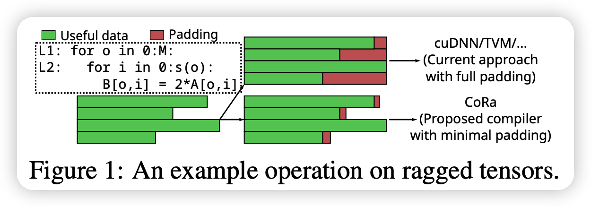
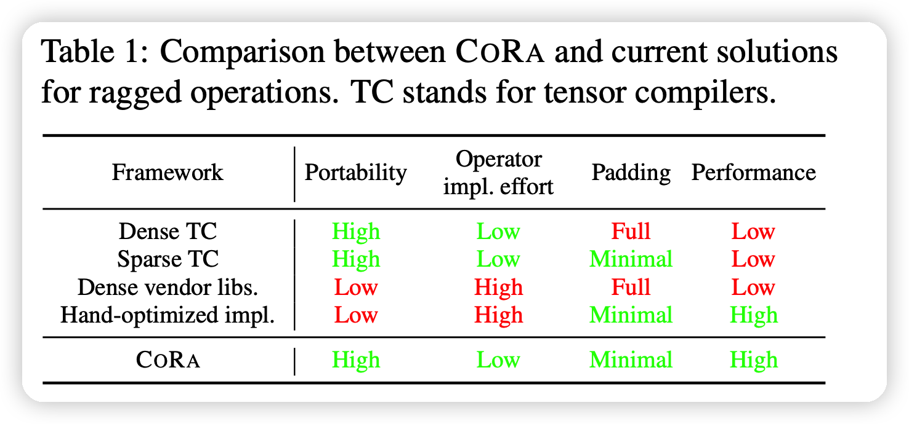
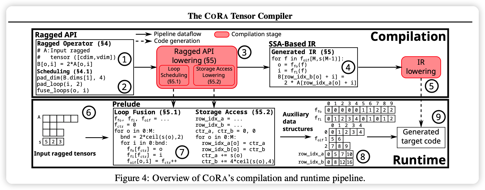
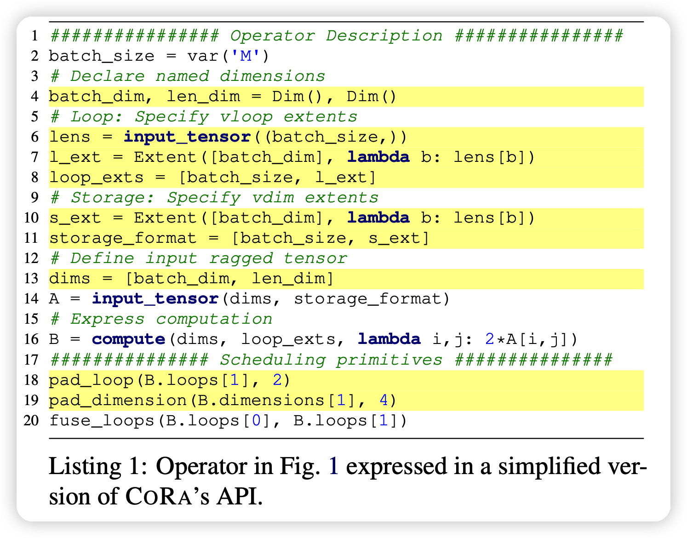
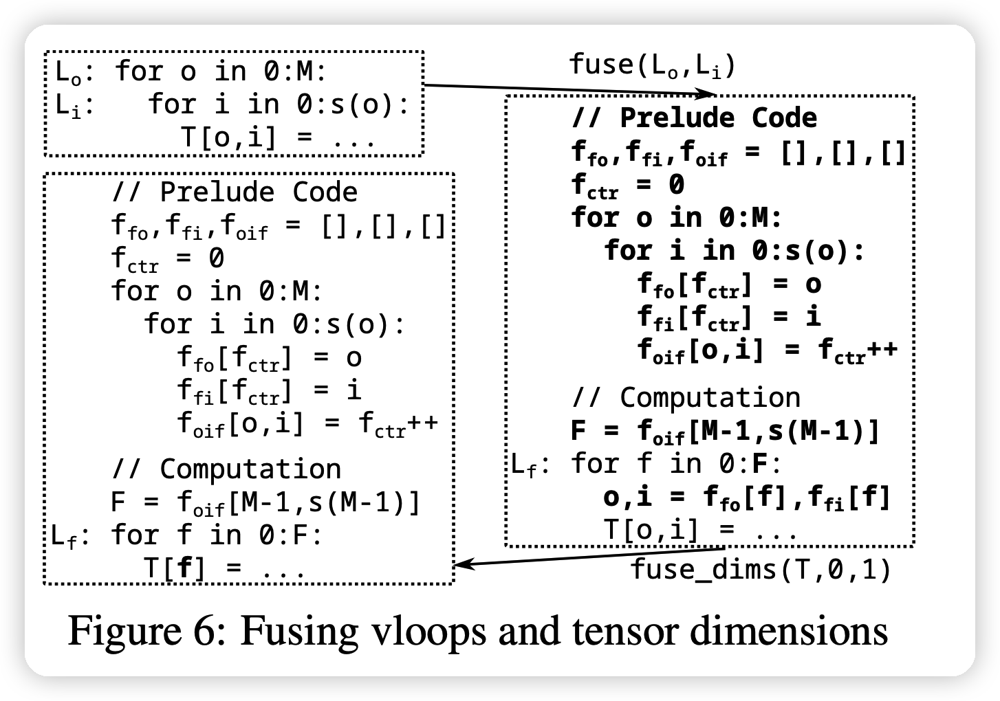
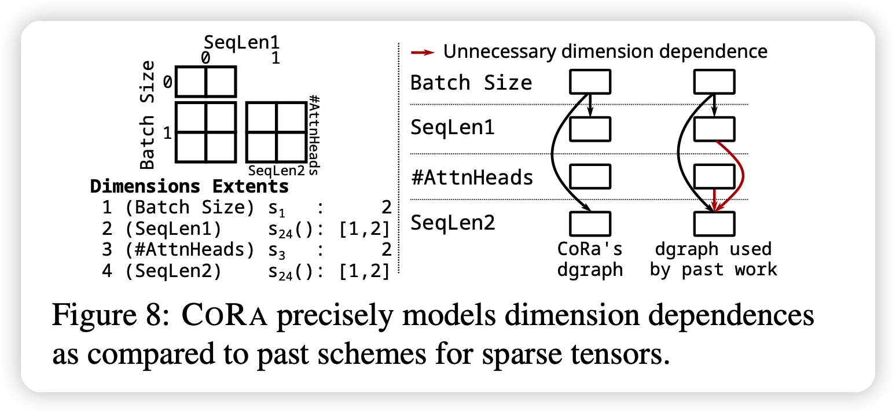
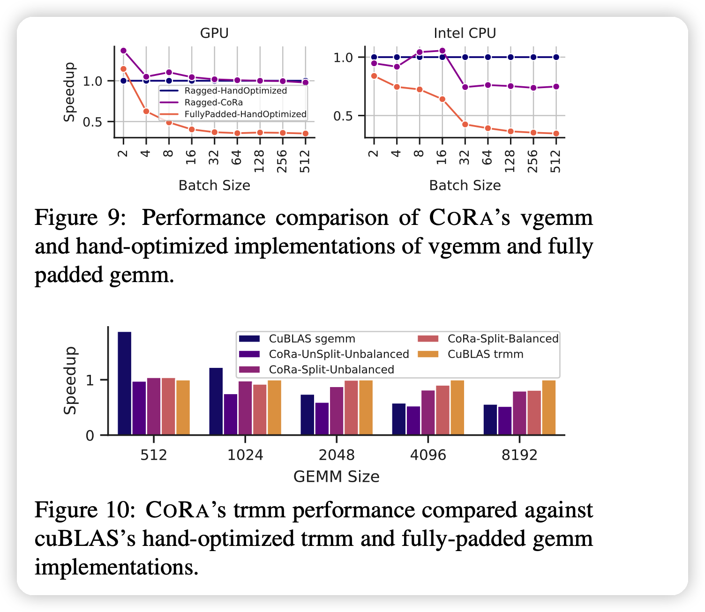

陈天奇在MLSys 22发的另一篇文章，讲的是如何提高输入不对齐时的表现。

<!-- more -->

已有的方法面对不对齐的数据，常常是padding到一个长度，这样会造成额外的计算。本文解决这个问题，得到了Pytorch上16倍的速度提升，TensorFlow上1.4倍的性能提升

## Introduction

DL模型的输入常常不对齐，如下图所示：

最近有一些编译器开始支持不对齐的数据，但是范围、效果很受限。而经典的cuDNN，oneDNN库都采用了MASK，PADDING的方法。这种方法会带来额外的计算损失(红色部分)，而且随着batch size的增大这个损失会更加严重。

本文提出了一套compiler-based方法解决不对齐数据的问题。稀疏和密集的tensor的研究很多，但大多不能应用到rag tensor,同时本文提出CORA (Compiler for Ragged Tensors)：

- Irregularity in generated code：可变的循环带来可变的代码，使得GPU性能下降。
  - CORA使用minimal padding方法，来平衡高效代码生成和thread remapping strategies
- Insufficient compiler mechanisms：由于可变循环内的依赖关系复杂，Representing transformations效果很差。并且稀疏tensor的优化方法可能不能应用到rag tensor，因为后者可能更加稀疏。
  - Cora用uninterpreted functions表示循环边界，来调度operation
- Ill-fitting computation abstractions：接口和抽象不匹配的问题。dense compilers不能表达rag op，sparse compilers没有办法生成高效的code。
  - CORA给padding，thread remapping等提供一套抽象，来解决不匹配的问题。

和已有方法对比如下：

本文主要贡献：

- 提出CORA，第一个高效解决ragged tensor的tensor编译器
- 为ragged tensor提供了新的API，抽象和scheduleing方法
- 进行了详细评测。

## CORA OVERVIEW

基于以下的两个灵感：

- ragged operation中的不对齐性在计算前就可以获取到
  - 可以在真正计算前预计算不对齐性带来的辅助信息
- ragged tensor比起稀疏tensor，可以用$\mathcal{O}(1)$时间访问（HASH方法虽然可以$\mathcal{O}(1)$稀疏tensor，但不利于GPU执行）
  - 可以辅助生成高效的代码

CORA总体执行如上图所示

## 术语

- *variable loops* or *vloops* ：如果内部循环的边界是和外层变量有关的
- vloop nest：包含多个vloop
- *variable dimensions*：当存储tensor不用padding时，齐形状取决于外部tensor。这个形状称为variable dimensions，或者vdims
- cdims：固定形状
- ragged tensor：有最少一个vdim的tensor

## CORA’S RAGGED API

CORA的API要求对于ragged tensor描述出vdim是怎么计算的，由外层循环的什么特征来定义。满足此条件后，CORA就可以自动的符合后面计算API的实现。

### Scheduling Primitives

- Loop Scheduling：CORA不允许对vloop交换顺序，因为没有发现有什么实际需求。
- Operation Splitting：CORA可以把OP分解成多个OP，后面把拆除的部分并行计算。
- Horizontal Fusion：CORA支持hfusion，可以把最外层循环内的几个operator并行计算
- Loop and Storage Padding：对于minimal padding(二对齐、四对齐)，可以对齐的存储，并且不浪费很多额外的空间
- Tensor Dimension Scheduling：CORA允许用户交换tensor的维度
- Load Balancing：CORA允许用户去自己满足*thread remapping policy*，来解决这个问题。

## CORA’S RAGGED API LOWERING

这一部分讨论把CORA API lower到SSA-based IR的技术

### Loop and Tensor Dimension Fusion

对于左上角的二重循环，如果想要变成一层循环，就需要计算出边界以及什么时候换。CORA预计算这些信息，再执行计算部分的代码。

### Bounds Inference

- Variable Loop Fusion：
- Named Dimensions

### Storage Access Lowering

考虑上面的4维tensor，24维是vdim。

CORA提供右图左面的组织形式，可以达到快速的$\mathcal{O}(1)$访问时间，通过预计算。CORA需要存储额外的形状信息。

## IMPLEMENTATION

CORA通过扩展TVM的代码进行实现

- Ragged API：目前的代码只支持vdim取决于最外层的dim
- Lowering：这部分代码基于一篇已有工作修改。

## Evaluation

大概就是CORA更好

