上次讲了多模态大模型，今天讲另一个有意思的大模型工作：toolformer——如何让大模型自己学会去使用工具。在使用工具的情况下， 6.7B的GPT J效果远胜175B的GPT 3.5

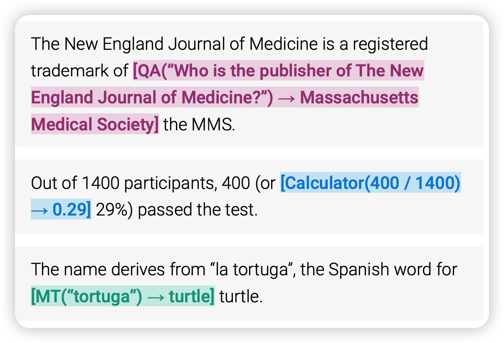

<!-- more -->

作者团队来自Meta AI

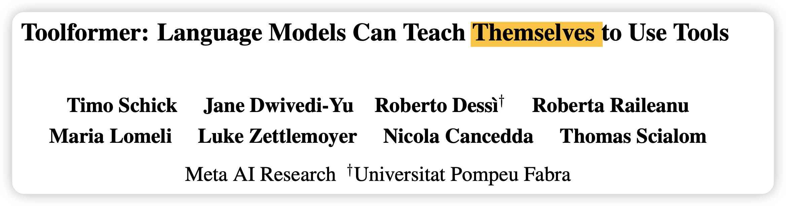

## Introduction

作者在这里和Kosmos类似，讲到(语言)大模型能力越来越强，可以理解人的需求，理解人的问题。但是，对于一些精确计算，或者涉及到事实性的地方，模型的表现总不是太好、或者说不稳定，即使这是一个很简单就能解决的问题。

一个比较好的解决这个困难的办法就是引入外部的工具。让模型去调用外部的工具。这就是本文的主要贡献toolformer:

- 一个self-supervised，不需要人工标注的学习方法，让模型自动的学习使用工具的方法。
- 大模型应该有能力去自己决定要不要使用工具，使用哪个工具。

## method

下面看一下到底是怎么做到的吧。

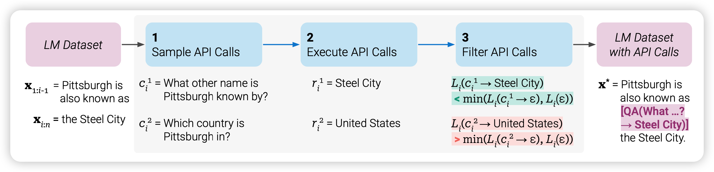

toolformer首先要从一个“强”的大模型出发，本文用的是GPT-J，一个6.7B的预言模型。第一步，是生成一个带有tool标注的数据集。作者使用通过in-context的方式，现在prefix里写一些人使用工具的prompt，接下来让模型对训练数据集里面自己生成很多的工具使用示例。

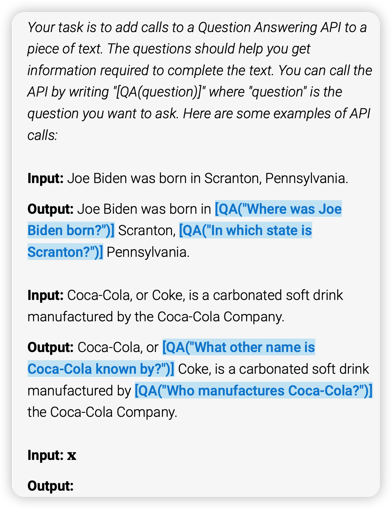

对于一个工具调用，作者使用token来代表

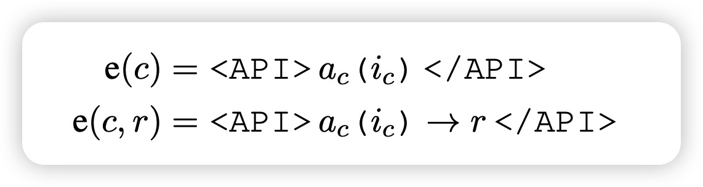

LM模型会生成很多带有工具调用的实例

对于一个好的工具使用事例，理论上通过观察工具的数据，降低后面正确答案的loss，作者通过这个偏置信息。计算使用和不使用工具时对于后文的loss。作者定义了给定前缀z和权重w的情况下的loss算法
$$
L_i(z) = - \sum_{j=1}^n w_{j-1 }·\log p_M(x_j | z, x_{1:j-1})
$$
里面的weight w，希望更靠近工具调用的部分，选用
$$
w_t = \frac{\tilde{w_t}}{\sum_{s\in \mathbb{N} }\tilde{w_t}} \text{with} \quad \tilde{w_t} = \max(0, 1 - 0.2 t)
$$

也就是说越靠近工具结果t的地方权重就越大。

对于给定一个API call，$e(c_i, r_i)$,算出不同的loss
$$
L_i^+ = L_i(e(c_i,r_i)) \\
L_I^- = \min (L_i(\epsilon), L_i(e(c_i,\epsilon)))
$$
如果使用工具以后，loss比原来降低超过阈值
$$
L_i^- - L_i^+ \geq \tau_f
$$
就认为是有效的工具调用，保留这次生成。最终制作出一个带有有效工具调用的数据集。然后让LM在这个数据集上fine-tune一下，就学会了工具调用。

在实际使用时，如果模型生成了工具调用token \<API\>等到工具输入结束生成token →以后，就执行工具，然后把结果直接贴过去。

## experiment

作者在实验中实际使用了以下工具，使用方法如下：

- 计算器
- 日历
- LM-based问答工具
- Wikipedia Search
- 翻译系统

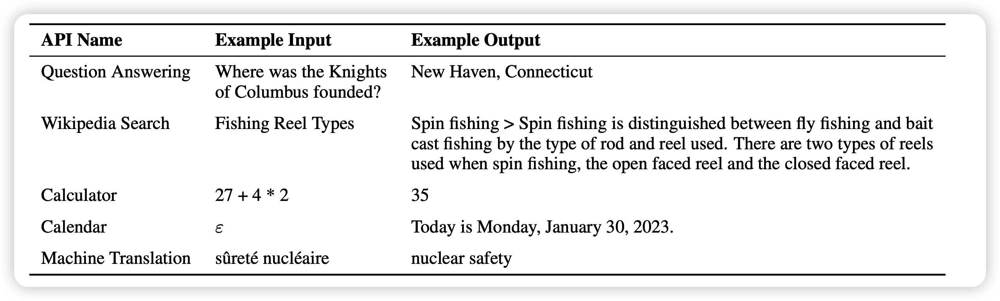

作者在CCNet预训练数据集上进行了工具数据集生成，使用GPT J 6.7B作为LM基础模型。

生成的带标注的数据大概在几十万这个量级，其实不是很大。

### 主试验

在很多任务上做实验做实验

- SQuAD, Google- RE, T-REx几个事实性任务
- ASDiv等几个数学任务上做评测
- QA任务
- 翻译任务

作者选定了一下baseline，

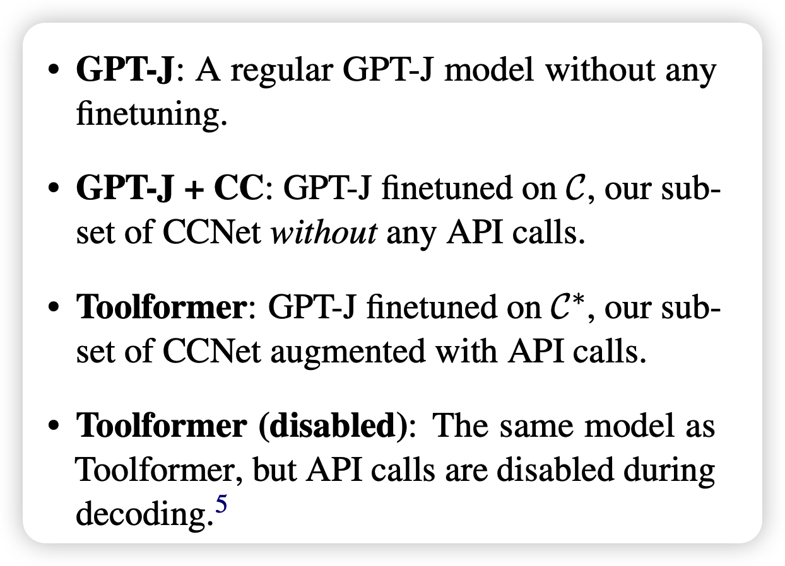

分别是阳性对照、阴性对照，还有主试验模型和他的阴性对照。

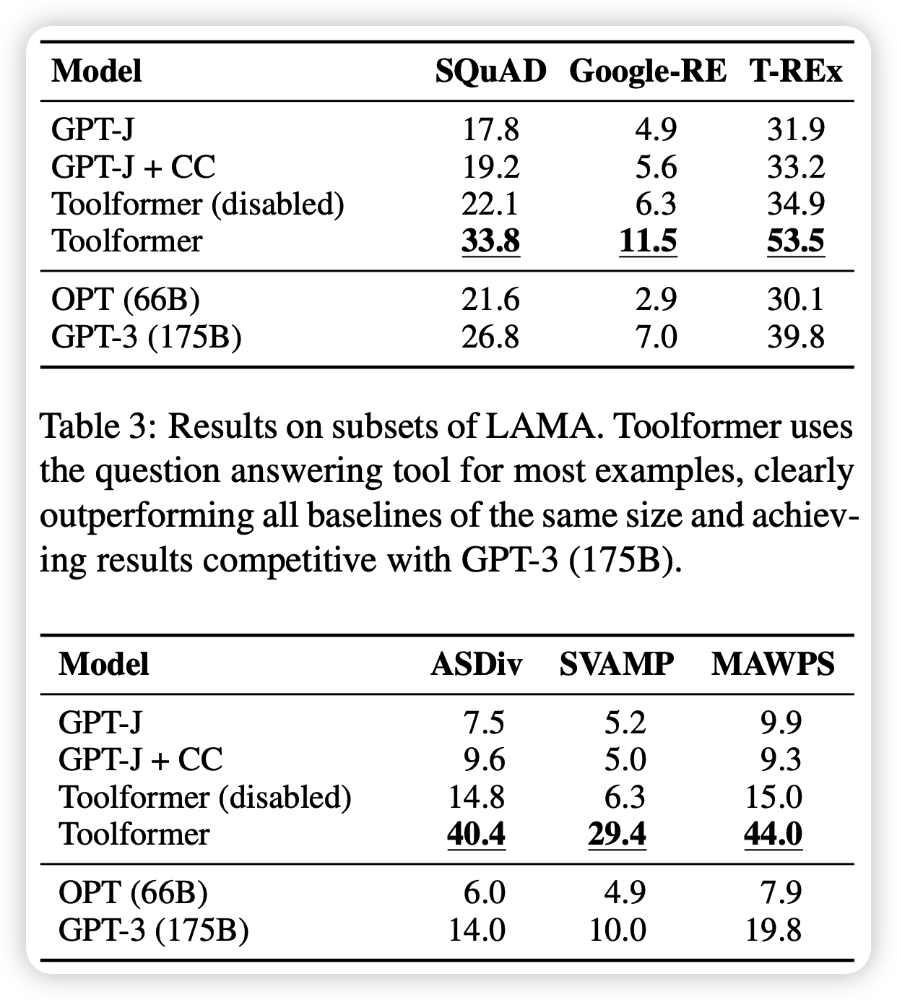

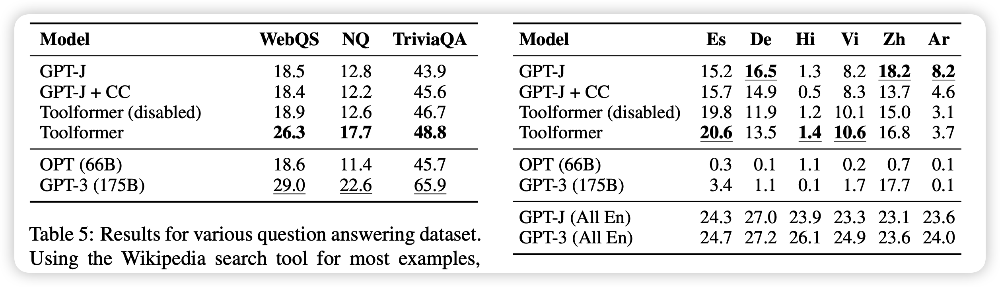

可以看到

- 基本上toolformer远胜没有tool的方法，即使是175B的 GPT 3 text-davinci

- 工具调用的输入也会带来表现得提高。我理解有可能正确的工具输入会给模型一种类似”chain-of-thought“ 的效果？

另外，作者也做了些对比实验。

### 规模实验

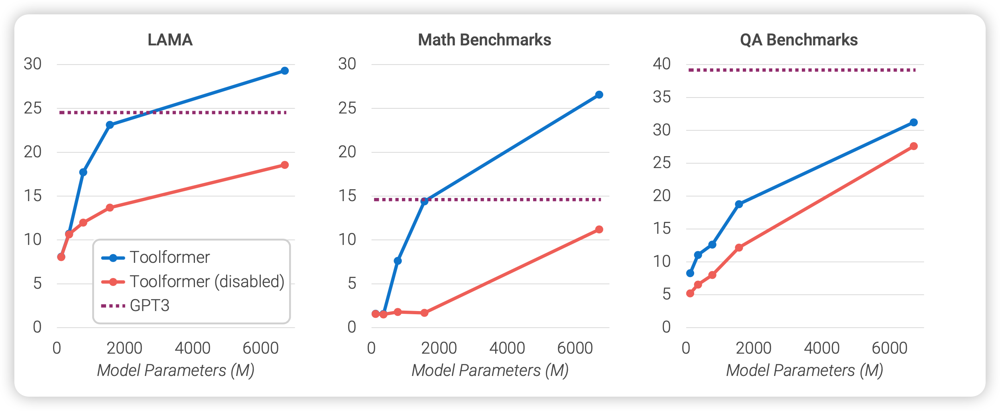

作者探索了不同模型大小对于工具学习的能力，可以看出：当模型小的时候，toolformer和基础模型拉不开差距。但随着模型增大，toolformer和基础模型的差距越来越大。也就是说，只有模型”大“起来之后，内部的推理、理解能力变强，才逐渐拥有了学会调用工具的能力。

### k实验

比较有意思的是k的实验

> 解码的时候有个小trick，如果token \<api\>的概率排在前k，就直接认为输出了api调用。k越大，模型的调用就越频繁。

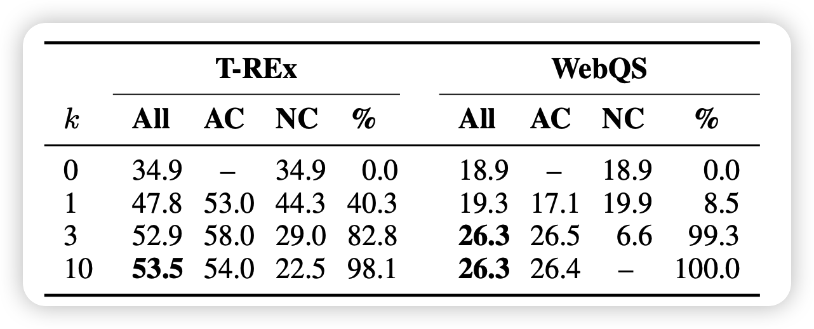

可以看出，当k小的时候其实效果并不好，也就是说模型对于输出api调用是很不自信的。

>  假如我是研究员，很可能最开始就是设定k=1。然后发现效果拉胯，这个时候，其实是很考验发现问题的能力的。值得深思

最后，作者谈到了toolformer方法的局限性

- 不能链式调用工具，一个输出作为另一个输入，只能一次一个工具
- 不能zero-shot学习，最起码要人进行一些prompt的辅助，但人其实是可以通过看说明书、--help等方法进行zero-shot学习的
- 对于k很敏感
- 数据集生成效率很低：过了几千万的文档，最后就生成了几十万的有效调用
- 模型对于工具本身的开销没有计算

## 我的思考

- 感觉让大模型使用工具，也是基础模型能力增强以后的一个进化方向。
- 理论上，多模态大模型也可以算作工具的一种：比如一个diffusion text2image，可以看做一个文生图的工具。OCR也可以看做一个图生文的工具
- GPT J + tool都这么强，如果是davinci-003 + tool呢？
