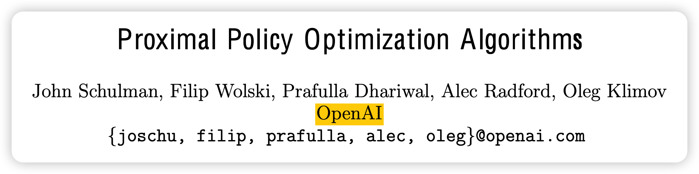

今天讲讲强化学习里的经典算法PPO，也是现在Gym库里默认的强化学习算法，最后再讲讲RLHF中的PPO算法是怎么算的。参考

> Proximal Policy Optimization Algorithms
>
> Trust Region Policy Optimization
>
> A (Long) peek into Reinforcement Learning

<!-- more -->

这是2017年的论文，作者团队是openAI。讲PPO，必须先说明一大堆前置知识。我先简单说说前置知识，不保证正确。

## 前置知识

强化学习领域就是让智能体agent和环境e一直交互，最终强化智能体。

强化学习的一次交互为多个state，action链式连接。

强化学习优化的对象叫做return。环境对于每个action给出的反馈叫做reward。return是所有未来state的reward指数衰减
$$
return_i = \sum_{t=i}^T \gamma^{t-i} Reward_t
$$

- return是个未来函数，只有跑完后面才知道前面的reward。我们只能用模型模拟或者求期望
- 在很多情况下，环境也不能给出密集的reward，很有可能只有交互结束才能给一个reward(比如下棋)，这个领域叫sparse reward
- $\gamma$是时间衰减函数，说明未来的收益要衰减。这是因为未来有不确定性，所以未来的回报没有现在的重要。至于为什么用指数衰减，这是未了后面的数学推导更简单

强化学习分为两大类方法，基于动作的policy method和基于评估的value method

### value method

这是指用一个模型来拟合value。要知道value，要先知道Q(s,a)

Q(s,a)是衡量模型在状态s做出动作a到底好不好，值就等于未来状态return。$Q_\pi(s_t,a) = return_{t+1}$

Q(s,a)包含动作a，不好。把a积分掉(或者离散情况下就是$\sum$)以后得到$V_\pi(S) = \sum_{a} \pi(a|s)Q(s,a)$

另外，$\text{Adavantage}_{a} = Q(s,a) - V(s)$专门表示采取动作a带来了多少额外收益

经典的Q-learning用模型去学习Q(s,a)，怎么学？通过贝尔曼方程，根据Q的定义
$$
V(S_t) = R_{t+1} + \gamma V(S_{t+1}) \\
...\\
V(S_{T-1}) = R_T
$$

$$
Q^*(s_t,a_t) = R_t + \gamma \max_{a\in A} Q^*(s_{t+1},a)
$$

- $Q^*$是指最好的Q，就是说$s_t$采取动作$a_t$以后最好的结果就是$Q^*(s_t,a_t)$了

这衍生出了TD-error(temporal difference):等式右边的V估计更准确，因为右边计算用到了真实的回报$R_{t+1}$。通过这个归纳偏置就可以学习$Q^*$了:

- 用一个模型拟合$Q_\theta(s_t,a_t)$

- 在状态$s_t$中通过$\epsilon-\text{greedy}$采样一个动作。采样方法是指有$\epsilon$概率采取一个随机动作，剩下的时候按照$Q_\theta(s_t,a_t)$最大的$a_t$采取动作
- 执行$a_t$，进入$s_{t+1}$并得到回报$R_t$
- 对于$Q_\theta(s_t,a_t)$的更好的估计是$R_t + \gamma \max_{a\in A} Q_\theta(s_{t+1},a)$。用做target，然后用mse loss优化就行

Q-learning里的最经典的算法叫做deep-Q Network，大概做了几个改进:

- 经验重放：就是说实际在环境里跑交互太慢了，我可以提前跑，跑完把状态转移对$(s_t,a_t,s_{t+1},R_t)$存下来，然后再多次更新、多次利用
- periodically update target，就是我算loss的时候那个target里的$Q^*$不用现在的参数，而是用一段时间之前的参数，每隔一段时间同步一次。这是为了减小loss尖峰带来的影响，让训练更稳定

### policy method

前面提到Q-learning等方法学习Q，然后采取动作是用$\epsilon-\text{greedy}$解码。这里的思路是说我不学Q，我学习一个agent $\pi(a|s_t)$输入一个状态，我返回在这个状态下做所有动作的概率分布。

优化的目标当然就是让好的动作概率更大，坏的动作概率小
$$
\mathcal{J}(\theta) = \sum_{s\in S} \left( \sum_{a\in A} \pi(a| s)Q_{\pi(s,a)} \right)
$$
经典的REINFORCE算法就是一大堆数学推导，最后使得
$$
\Delta \mathcal{J}(\theta) = \mathbb{E}_{\pi \theta} \left[ \Delta \ln \pi(a|s) Q_\pi(s,a) \right]
$$
$\Delta \mathcal{J}(\theta) $是$\theta$的函数，可以看做loss，用梯度上升来做参数更新

很优雅，用了log换元。但是上面的式子要求期望，还是有两个$\sum$，显然没法直接算。一个简单的方法就是用蒙特卡洛近似，就是在环境里跑完一大堆状态转移，然后倒着算回来所有的$Q_\pi(s,a)$(这里视为这个是数字，和$\theta$无关，是一个近似)。再拿上面的式子就能训练$\pi$ 了

上面的reinforce算法有个问题：上面的梯度受到环境影响大，方差大不稳定，要找个东西减小方差，这叫做baseline方法。

一个思路就是用上面提到的advantage$=Q(s,a) - V(s)$代替Q(s,a)。

### actor-critic

上面说我们蒙特卡洛模拟，然后反着求Q，这个Q的估计显然是不准确的，有解决办法吗？我们搞ai就是working is all you need：我们用另一个模型拟合$V_\theta(S)$。这种两个模型的方法就是actor-critic。一个演员采取行动，一个裁判进行打分。

经典的actor-critic是用另一个模型来拟合$Q(s,a)$。Q的参数更新就用上面讲到的Q-learning里的temporal difference (TD-error)，然后$\pi$的参数更新用模型输出的Q来算$\mathcal{J}(\theta)$。注意这里要把Q的输出的梯度detach掉，就是不要反向传播到Q的参数里。

这种双模型的方法是现在RL的最常用的方法。简单区分几种方法，来自知乎：

> actor就好比是你，critic就好比你妈。你做一件事情，比如抓蜜蜂，结果被蜇疼了，下次你再抓蜜蜂的概率就减小了，这个就是policy gradient。你刚手伸出去要去抓蜜蜂，你妈就说，别抓，十有八九会被蜇疼。你听了后停止了抓蜜蜂，并且下次抓蜜蜂的概率减小了，这个就是actor-critic。你每次看见蜜蜂的时候都问你妈，抓蜜蜂好还是不抓蜜蜂好？你妈说不抓蜜蜂好，通常你听你妈的话就不抓蜜蜂了，偶尔心情不好的时候（以$\epsilon$的概率）还要去抓蜜蜂，这个就是Q-learning。那么妈妈是怎么知道抓蜜蜂会疼的？当然她也是抓过蜜蜂的（Q-value update）

## PPO

下面正式开始PPO讲解。PPO基于更早的一个叫TRPO(trust region)的算法。可以理解成一个actor-critic方法，大概做了几个改进。

Trust region是一篇数学很多的论文，大概讲的事情是
$$
\mathcal{J}(\theta) = \sum_{s\in S} \left( \sum_{a\in A} \pi(a| s)A_t \right)
$$
上面的估计是很不稳定的，要想办法用另一个让它变稳定：用一个叫做的方法，可以用另一个分布来估计原始的分布。
$$
\mathcal{J}(\theta) \sim \mathbb{E}_{\sim \pi_{\theta_{old}}} \left[ \frac{\pi_\theta(a_t | s_t)}{\pi_{\theta_{old}}(a_t | s_t)}A_t \right]
$$
这样这个分布的采用使用$\theta_{old}$就在数学上成立了。然后训练时我们每隔一段时间更新一次$\theta$，在这段时间内用之前跑出来的状态转移对进行训练就行。极大地提高了训练效率。

我们希望两个分布不要差太远，这是因为上式可以一阶等价于$\mathcal{J}(\theta)$，因此需要分布很接近才行。因此可以再给loss加一个KL散度惩罚。
$$
\mathbb{E}_t \left[ \frac{\pi_\theta(a_t | s_t)}{\pi_{\theta_{old}}(a_t | s_t)}A_t - KL(\pi_{\theta}(·| s_t), \pi_{\theta_{old}}(·| s_t))  \right]
$$
这就是论文里说的代理训练目标

PPO把这个分式重新命名了一下
$$
r_t(\theta) = \frac{\pi_\theta(a_t | s_t)}{\pi_{\theta_{old}}(a_t | s_t)}
$$
把TRPO中的loss称为 $L^{CPI} = \mathbb{E} \left[ r_t(\theta) A_t  \right]$ 

然后提出了两个变体
$$
L^{CLIP} = \mathbb{E} \left[ \min(r_t(\theta) A_t, clip(r_t(\theta, 1-\epsilon, 1+ \epsilon)A_t ) \right]
$$

$$
L^{KLPEN} = \mathbb{E}_t \left[ r_t(\theta) A_t - \beta KL(\pi_{\theta}(·| s_t), \pi_{\theta_{old}}(·| s_t))  \right]
$$

这两个变体都能使得训练更稳定。其中变体二的超参数$\beta$是自适应的:

- $\beta \rightarrow \frac{\beta}{2}$ 如果 $本次KL/1.5 > 平均KL $
- $\beta \rightarrow 2\beta$ 如果 $本次KL*1.5 < 平均KL $

除此之外，模型的更新就和actor-critic方法没什么别的区别了。

- 它使用了经验重放，交互用的链可以更新多次(4 epoch)再同步参数$\theta_{old}$

- 他的更新用的不是Q,而是Advantage $A_t$，这是为了减少方差，稳定训练。

$$
A_t = \delta_t + (\lambda \gamma) \delta_{t+1} + ... + (\lambda \gamma)^{T-t+1} \delta_{T-1}
\delta_t = r_t + \gamma V(s_{t+1})  - V(s_t)
$$

$$
\delta_t = r_t + \gamma V(s_{t+1})  - V(s_t)
$$

- 其中$V(s)$是需要训练的第二个模型。然后训练流程是先用$\pi$跑完一整轮，得到$V(s_1),...V(s_T)$再倒过来算出所有的$A_t$，再把$A_t$拿过来训练$\pi$
- V的值同样通过TD-error的mse-loss进行更新$V_\text{target}$注意计算要用到那个慢更新的优化，用的是一段时间以前的参数算的V

## RLHF中的PPO

上面讲完了PPO，那RLHF中的PPO又是怎么算的呢？这一部分我是根据代码阅读的结果来讲的，实际上可能每边都有每边的实现，我讲其中一种。

RLHF算法分3个大块：SFT，reward model training, RLHF。我这里讲最后一个部分，也就是说我们已经有了一个reward model可以给任何一个(query, response)对输出一个 $r \in [-1,1]$的讲理，越高说明越好越符合人的期望输出。这个就是假的"环境"，可以给反馈

### what is model

首先，PPO明显是需要两个模型policy model， value model。怎么实现呢？

- policy model其实就是语言模型自己，我们把一次response生成的每个token生成视为一个状态转移，然后action就是对应的token t。
- value model这里和语言模型是共享参数的，我们在最后语言模型的hidden state层后面加一个 model_dim -> 1的映射（正常是 model_dim->vocab_size->softmax映射到词表），所以所有的状态下都有一个float的输出，把这个当做$V(s_t)$
- 至于两个模型要不要共享参数，是个实验问题。我只能说，如果不共享参数的话，首先需要存两份，然后每次交互都要跑两次前向，反向传播也是，这个在尤其是大模型场景下，对算力的消耗是多很多的。

我们需要记载一个最开始的模型的参数，这个开始是指原始的LLM语言模型的参数$\pi_{start}$，这是为了让RLHF阶段的更新不要太多，不要丢失语言模型原本的语言、推理能力

### advantage

然后就是reward的计算

- 对于正常的token，除了最后一个token以外，reward就是引入模型分布和原始分布的KL散度$KL(\pi_\theta(r|q), \pi_{\theta_{start}}(r|q))$
- 对于最后一个token，额外引入最终response的reward，就是reward和KL散度的和。

KL散度怎么算？其实就是$\log P(·|s)$的差值。其实就是你的模型的输出logit $[seq-length, vocab-size]$。过完log-softmax层，然后把你实际取的token的对应位置的值取出来，得到一个 logprobs $[seq-length,float]$。把现在的参数$\theta$和之前参数$\theta_{start}$的对应logprobs都取出来，然后直接做减法就行，得出来seq-length长度的序列，就是对应每个位置的KL散度reward

有了所有未知的reward以后，就可以用PPO的方法倒过来算出所有位置的advantage $A_t$，注意这里的$A_t$计算需要用到Value-old输出$V_{old}(s_t)$而不是现在的$\theta$的输出，这是为了训练更稳定
$$
A_t = \delta_t + (\lambda \gamma) \delta_{t+1} + ... + (\lambda \gamma)^{T-t+1} \delta_{T-1}
$$

$$
\delta_t = r_t + \gamma V_{old}(s_{t+1})  - V_{old}(s_t)
$$

### value model loss

接下来计算Value的loss，使用$loss_{V} = ||V(s_t) - A(s_t)||^2$作为loss，这里可以进行一下clip使得更新不要太大
$$
loss_{V-clip} = ||clip(V(s_t), V_{old}-\epsilon_1, V_{old}+\epsilon_1 ) - A(s_t)||^2 
$$

$$
loss_{V} = \frac{loss_{V} + loss_{V-clip}}{2}
$$

### policy model loss

接下来计算policy的梯度。首先是openAI定义的那个$r_t(\theta)$。因为是除法，相当于lo概率的减法再e指数。直接用之前算KL时那个log-softmax的输出减法再指数就行，得出来也是seq-length长度的链。
$$
L^{CLIP} = \mathbb{E} \left[ \min(r_t(\theta) A_t, clip(r_t(\theta, 1-\epsilon_2, 1+ \epsilon_2)A_t ) \right]
$$
$$
loss_{pg} = - L^{CLIP}
$$

然后要注意！这里的L本来按policy gradient算法是要最大化的，所以在AI框架实现中最后要取个符号作为loss(或者就直接用负的，然后换成$\max$)

最终得到最终的优化目标
$$
loss = loss_{pg} + \alpha · loss_{V}
$$

### 训练框架

- 1.初始化模型$\theta$，用一个预训练LLM来初始化。同时初始化value model,其实就是加个linear层。
- 2.用现在的$\theta$跑一堆response数据。query就是采样自你的query数据集
- 3.把repsonse送进reward model打分。注意reward model要锁参，然后这里记得detach。
- 4.存下来2，3出来的 (query,response,reward)对，记录现在的$\theta$为$\theta_{old}$
- 5.对4的数据做几个epoch的更新(比如4个)，每个epoch
  - 按上述方法算出 $loss_{pg}, loss_V$
  - 不管是不是分离的policy、value model，反正进行梯度更新
- 6.删除刚才的跑出来的数据集4，节省空间。回到2
