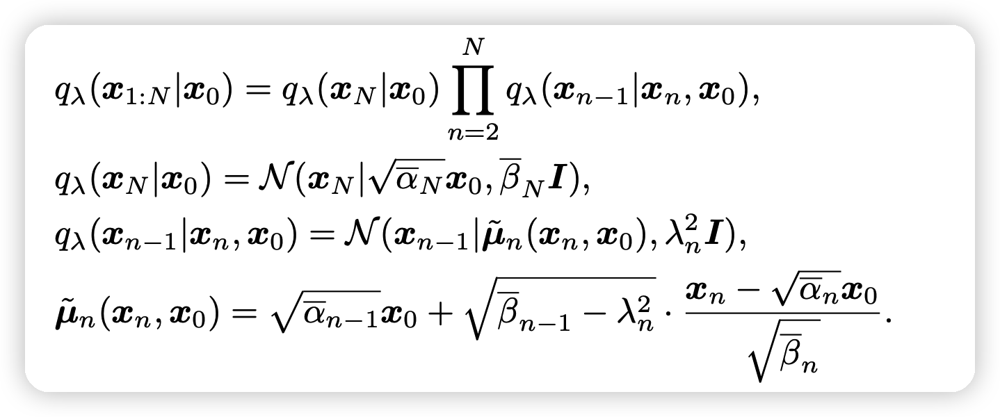
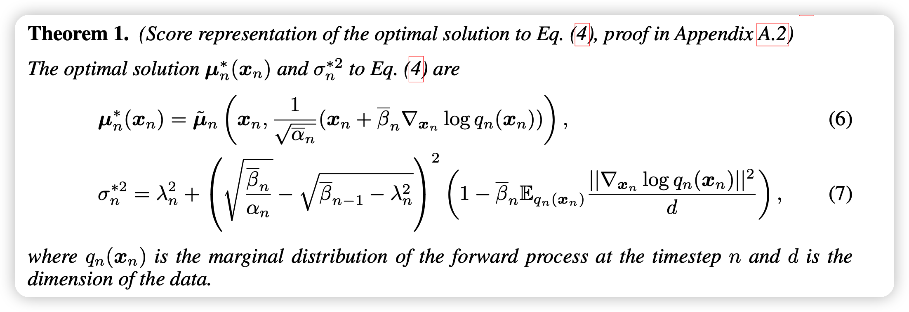
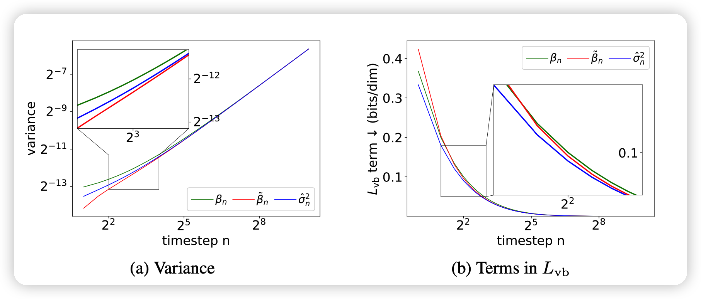
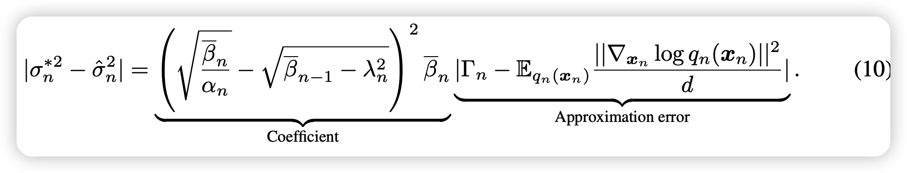
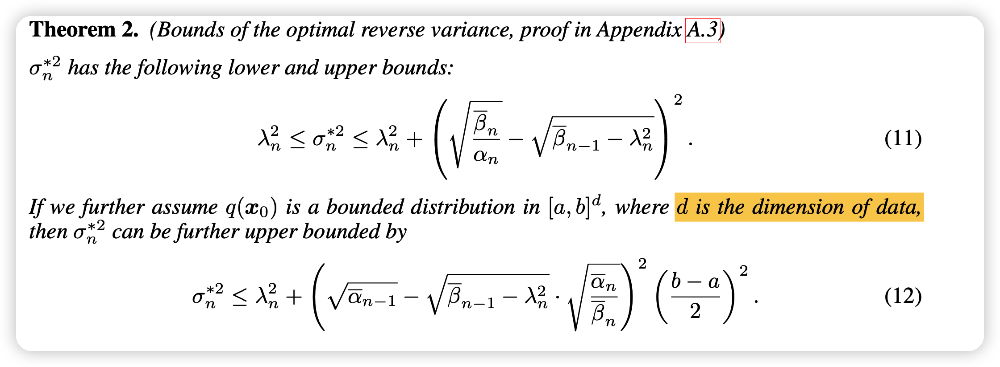
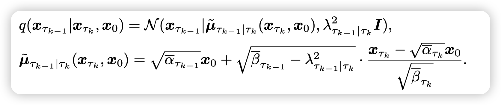
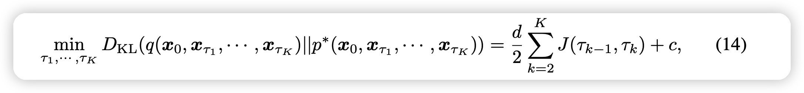
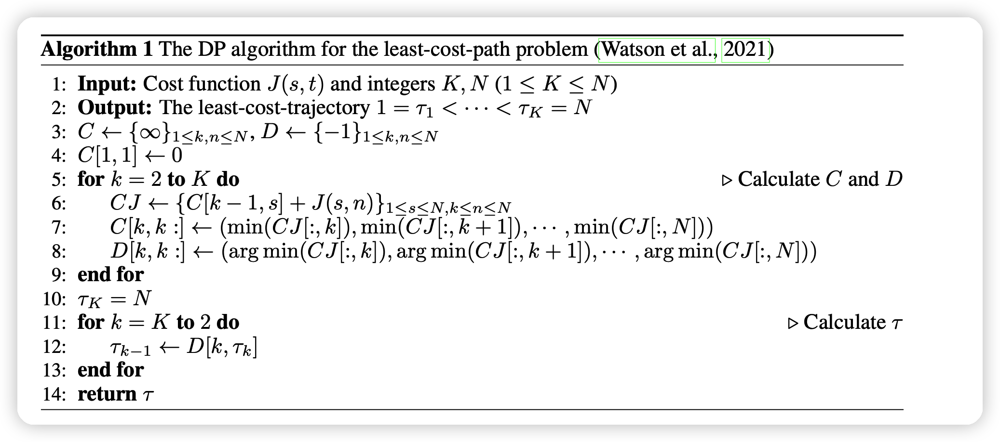
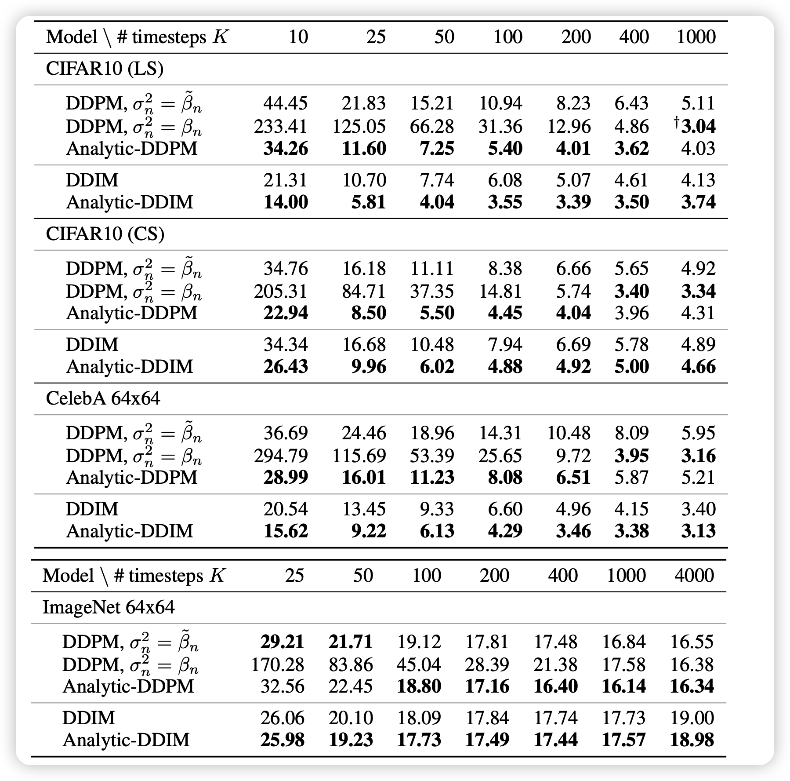

这篇论文是朱军老师组做的工作，非常的数学。

## Introduction

- DPM生成很慢，这是因为逆过程对方差的估计花了额外的时间
- 本文发现最优的期望和方差竟有解析形式（iDDPM岂不是优化了个寂寞…）
- 本文用蒙特卡洛模拟最优方差，预计算
- 在获得更高质量图片的同时得到了80倍的速度提升(对，效果甚至更好)
- 本文在选取快速路径时用动态规划
- 本文是plug-and-play的，任何DPM模型拿过来换个$\sigma$就行

## Background

重新说了一下DDIM里的推广形式：

其中$\overline{\alpha}:=\prod_{i=1}^N \alpha_i, \overline{\beta} := 1-\overline{\alpha}$

- 当$\lambda_n^2 = \tilde{\beta_n} := \frac{\overline{\beta}_{n}}{\overline{\beta}_{n-1}}\beta_n$时，模型就会推导出DDPM
- 当$\lambda_n^2 \equiv 0$时，就是DDIM

上面这种前项过程的逆过程是一个马尔科夫过程：
$$
p(x_{0:N}) = p(x_N) \prod_{n=1}^N p(x_{n-1}|x_n), \quad p(x_N) \sim \mathcal{N}(0,I) \\
p(x_{n-1}|x_n) = \mathcal{N}(x_{n-1}| \mu_n(x_n),\sigma_n^2 I)
$$
其中$\mu_n(x_n)$用一个score based model来学习$s_n(x_n)$，
$$
\mu_n(x_n) = \tilde{\mu}_n\left(  x_n,\frac{1}{\sqrt{\overline{\alpha_n}}} (x_n +\overline{\beta_n} s_n(x_n) ) \right)
$$
如果认为$s_n(x_n) = -\frac{1}{\sqrt{\overline{\beta_n}}} \epsilon_n(x_n)$，这和DDPM的推导结果是一致的

对于方差的估计：

- DDPM使用$\sigma_n^2 = \beta_n或\sigma_n^2 = \tilde{\beta}_n$
- DDIM使用$\sigma_n^2 = \lambda_n^2$

作者说，这实际上是一个负优化

## ANALYTIC ESTIMATE OF THE OPTIMAL REVERSE VARIANCE

接下来引入文章的本体，作者证明了上述定义的DPM的逆过程的均值、方差的最优形式：

这个结论的证明非常复杂，感兴趣的同学可以看附录A

- 只要按照上面的式子进行去噪，就能得到最好的结果，到达模型的极限能力
- 对应的SDE的连续时间形式，也有类似的结论，参考附录(目前用不上)

- 可以看出，上面的均值部分和已有方法的优化的$\mathcal{L}_{LVB}$具有一样的形式，因此现在的DDPM等模型的训练就是在逼近最优的均值，训练没有问题。

接下来，作者就要把之前的手动设计的方差替换为解析的形式，对于后面的密度项，作者使用蒙特卡洛进行估计
$$
\Gamma_n = \frac{1}{M}\sum_{m=1}^{M} \frac{ || s_n(x_{n,m})||^2 } {d} , \quad s_{n,m}\mathop{\sim}^{i.i.d} q_n{x_n}
$$

$$
\hat{\sigma}^2_n = \lambda_n^2 + \left( \sqrt{\frac{\overline{\beta_n}}{\alpha_n}} - \sqrt{\overline{\beta}_{n-1} - \lambda_n^2 } \right)^2 (1 - \overline{\beta}_{n}\Gamma_n)
$$

- 这个方差和训练无关。在模型训练以后，可以预计算出来每一步的方差，再统一的进行infer
- 随着蒙特卡洛采样数M的增大，这个估计会越来越准确，逐渐逼近最优的方差。作者提到，取M=10,100基本上就收敛了

下面这个图

- 显示出了作者的估计值和DDIM和DDPM手动设计的方差的区别
- 显示了作者的方差对于$L_{vb}$是最小的，这个应该是针对一次infer而言。

### BOUNDING THE OPTIMAL REVERSE VARIANCE TO REDUCE BIAS

这一部分，作者分析了他的逼近形式和真正的最优形式之间的bias：

- 由于模型的训练，会带来不可避免的误差(因为不可能有完全没误差的模型)
- 如果在sample时选取一个较短的路径，左边的coefficient部分会变大

接下来，作者尝试能不能减小误差，作者又证明了真实方差的上下界

- 这个上下界都是确定的、和模型训练无关的，在选定了$\beta_n$之后就唯一确定了。
- 同时作者证明了(12)中的上界是一个比较接近真实值的上界。

因此，作者才计算完拟合的方差$\hat{\sigma}_n$之后可以用上下界再做一次CLIP。

## ANALYTIC ESTIMATION OF THE OPTIMAL TRAJECTORY

这一部分，作者讲了在一个缩减的去噪路径中优化的方法。还是先提到了DDIM优化的故事线：

- 其中 $1 = \tau_1 < \tau_2 ... < \tau_K = N $,把一个长为N的路径变成了长为K的采样路径

在这个过程中，我们的$\lambda^2_{\tau_{k-1}| \tau_k}$也可以变成拟合的新形式：

- 其中的$\Gamma_{\tau_{k}}$可以在$\tau_{k-1} \sim \tau_{k}$之间通用

$$
\hat{\sigma}^2_{\tau_{k-1}| \tau_k} = \lambda_{\tau_{k-1}| \tau_k}^2 + \left( \sqrt{\frac{\overline{\beta_{\tau_k}}}{\alpha_{\tau_{k-1}| \tau_k}}} - \sqrt{\overline{\beta}_{\tau_{k-1}} - \lambda_{\tau_{k-1}| \tau_k}^2 } \right)^2 (1 - \overline{\beta}_{\tau_{k-1}}\Gamma_{\tau_{k}})
$$

上面的推广是显然的，然而，路径的选取大有说法，

作者竟然推导出了一个K路径中模拟的偏差的下界：

- 其中$J(\tau_{k-1},\tau_k) = \log (\frac{\sigma^{*2}_{\tau_{k-1}| \tau_k}}{\lambda_{\tau_{k-1}| \tau_k}^2})$,c是一个和路径选择无关的量 
- 如果把$\sigma^{*} \sim \hat{\sigma}$的话，这个最小值就是可计算的，只要路径被选定

甚至，这是一个动态规划问题，从T里选取K个数，要求K个数的损失之和最小，每个数的损失都是确定的。在模型训练完、K被选定后，可以执行一次算法，得出具体怎么选会得到最小的损失

## RELATIONSHIP BETWEEN THE SCORE FUNCTION AND THE DATA COVARIANCE MATRIX

这一部分是说了score function和协方差矩阵之间的关系。今天作者在ICML的另一篇论文推广了这个优化，这篇就不讲了。

## Experiment

这里作者用了：

- 自己在CIFAR-10上分别用cosine和linear两种$\beta$炼出来的CIFAR-10(LS), CIFAR-10(CS)

- DDPM和DDIM在ImageNet上预训练的开源模型，分别使用和不使用Analytic方差
- 作者在全部模型上CLIP了方差，因为这个上下界是恒存在的

这个结论是很明显的，可以说是吊打：

- 凡是加上了拟合方差的，基本上都比不加要好
- 对于K小的时候，会很明显
- 当T=K的时候，总的效果也要更好
- 甚至用了50步，就战胜了普通DDIM 1000步的效果

当然作者也提到了几个现象：

- Analytic的形式不是永远比不用要好，这和解析形式的“最优”结论是不一致的
- K更大时效果不一定会更好
- 用动态规划OT的K选取不一定总是最好的

## 我的想法

- DDPM里面有一点就是，去噪方差要手动设置。
  - 一个直观的想法就是，如果方差里也引入模型，效果会更好。iDDPM就是用模型来学习方差，但收敛难（参考GAN）
  - 这篇文章结论就是：用学均值的模型，可以顺便用一个蒙特卡洛模拟来近似最优的方差！不需要额外学！
- 这篇文章正文没有一个图片，就拿了ICLR outstanding paper，值得唏嘘。正文10页，附录29页，基本全是数学证明，可见AI的本质是数学（
- 作者在附录中的future work里说后面要做speech领域，用上面说的最优形式的连续时间推广形式。我们是不是想办法看看NLP怎么用
