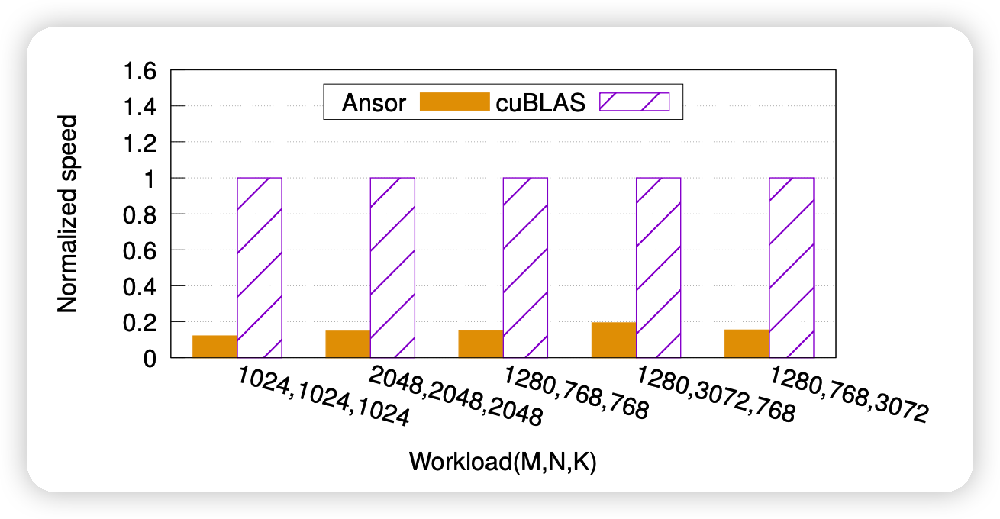
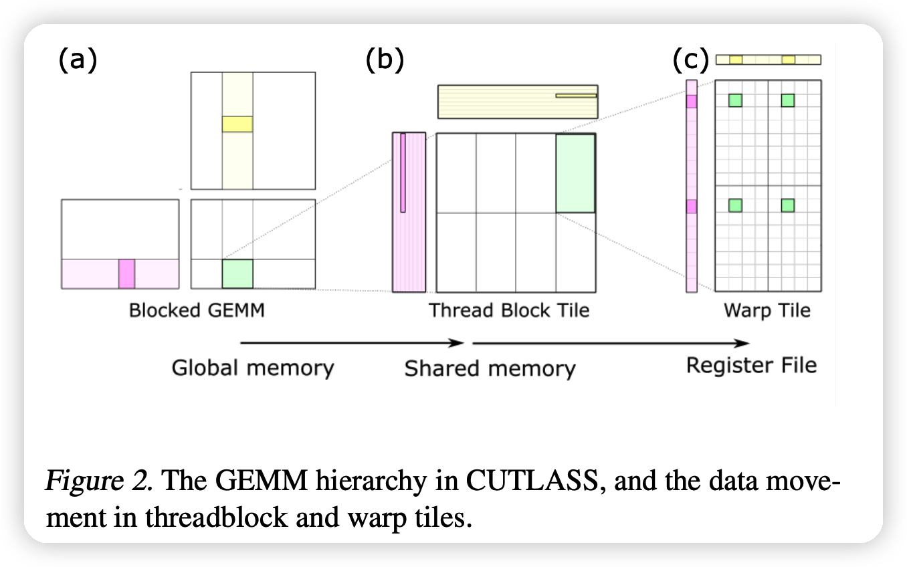
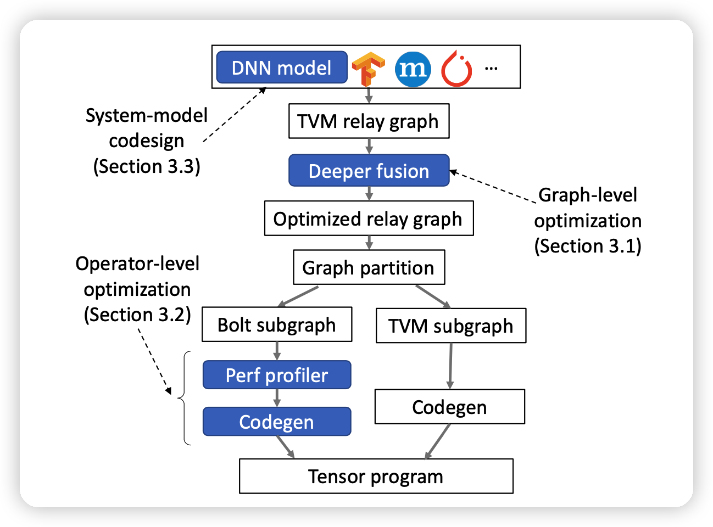
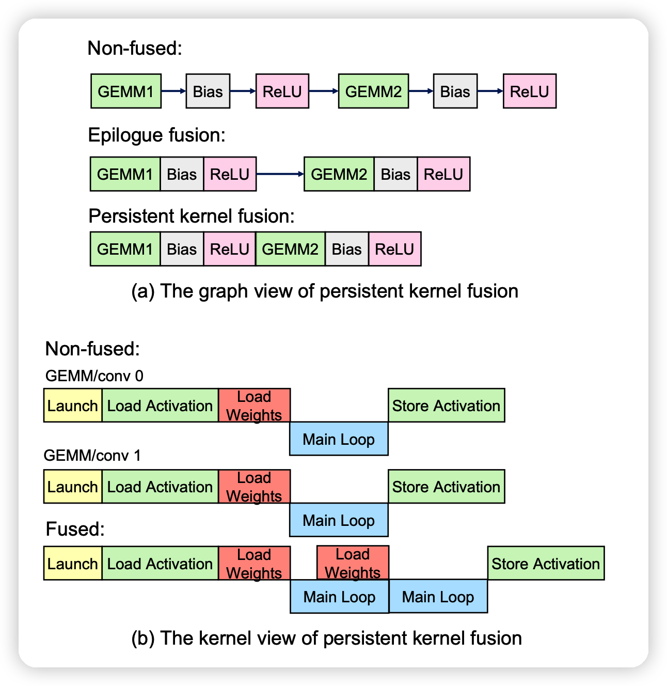
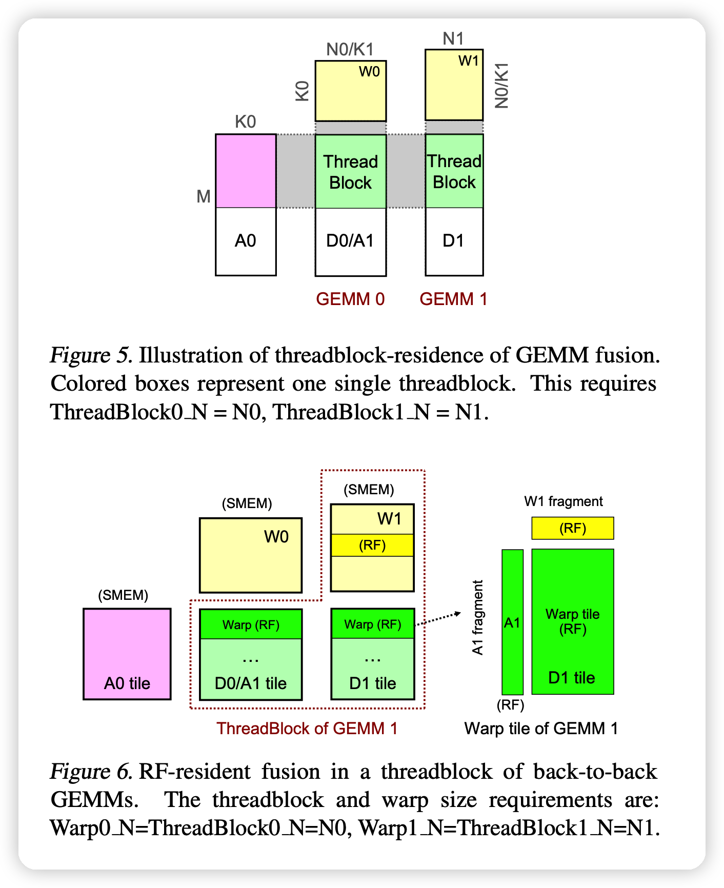
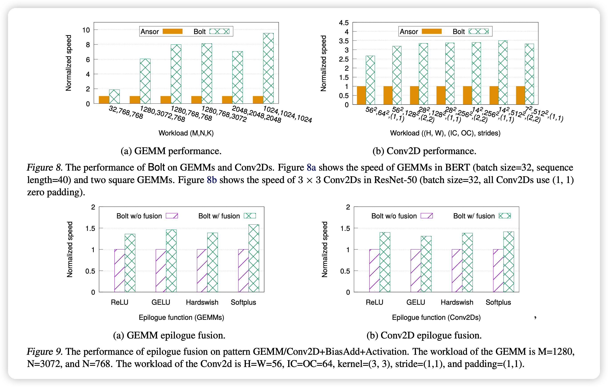

上次读了陈天奇关于auto-tuner中使用动态形状的论文，这篇论文是解决利用硬件信息的。本篇工作重新思考了图、算子、模型粒度下的优化方式，打算更好的在auto-tuner中利用硬件信息，达到vendor library相似的效果。

## Introduction

作者首先点出来一个事实，那就是现在的两种常用方法：auto-scheduler和vendor library的效果差的很远，如上图差了5倍。作者寻找原因：

- auto-tuner没有考虑硬件信息，硬件不透明，导致不能利用很多硬件原生的加速
- vendor library考虑硬件实现，虽然拓展性更差，但效果会更好

作者还提到，不仅是效果，编译时间也差的很多：ResNet-50在NVIDIA GPU需要编译7天。作者提到一个可能的解决办法是通过特别的数据库来更好的利用cache信息。但这种方法并不长远，因为模型的动态性和输入的动态性让cache很难得到高效地利用。

本文想要弥补这两种方法的gap。观察到一个事实：现有的vendor library有一个模板化的趋势(templated)

- NVIDIA CUTLASS：给出一些模板，不对具体的函数负责，比较好的扩展性。
- Intel OneDNN (Intel) ，AMD ROCm：类似的特性

作者提出了BOLT，代码已经merge到TVM：

- 首先，用vendor library支持的模板来搜索优化模板，利用hardware-native performance，生成tensor program
- 接下来，通过排列模板进行计算图优化
- 可以用hardware-native performance来同时进行图级别和算子级别的优化
- 也可以通过符合提出的设计原则的模型来进行模型级别的优化

作者的主要贡献：

- 结合templated vendor library和auto-tuner来弥补前面的表现差异
- 提出persistent kernel fusion，
- 提出寻找模板参数的方法，可以直接生成常规的vendor library代码
- 总结了三个系统友好的设计理念
- 详细评测了BOLT的效果，远超SOTA

## BACKGROUND AND MOTIVATION

### Auto-tuners have a performance gap

一方面，Auto-tuner达不到硬件原生的表现。因为比如NVIDIA特殊的硬件结构，tensor核心，FP16加速机制是Ansor达不到的,因为对于auto-tuner来说硬件是不透明的。

另一方面，Auto-tuner编译速度慢。一种解决办法是利用cache，重复使用前面的tuning log。对于静态的模型，效果不错。但对于动态模型、动态输入，只有运行时才能获取真正的工作流，效果不好。本文的Bolt方法可以减少编译时间。

### The emerging trend: Templated libraries

作者提到一些模板化的vendor library可以方便的实现新函数，实现新模板。这些templated libraries可以考虑硬件的实现，达到硬件透明的auto-tuner达不到的效果。

- CUTLASS：NVIDIA的templated library。给每个GEMM（矩阵乘）的CUDA model的每一个layer都做了c++的模板。带入正确的参数( tile size, data type等)，就可以实现电压、安培架构、优化FP优化、混精度计算等要求。

上图的例子是在计算$C = A · B$,C是绿色。例子表明CUTLASS可以自动利用起局部的cache(容量更小但是更快)

### **Bolt**: The best of both worlds

新的模板化vendor library提供下列特性：

- 可重复利用的达到硬件原生性能的primitives
- 对于不同的输入格式，可以很方便的参数化
- 更好的进行auto-tuning search
- 基础类可以很好地自定义、扩展、封装成更复杂的实现，进一步提高搜索效果

这些特性带来下面的编译器设计：

- 更轻量化，更好的考虑硬件的实现
- 可以直接利用上面的templated library

**图级别**：Bolt可以更好的进行operator fusion。提出了 *persistent kernel fusion* 的方法，原有的auto-tuner可以实现更深层次的fusion，但得出的算子不被cuDNN支持，但Bolt的可以。扩展了graph-optimization的方向。

**算子级别**：原生的templated library太底层，并且需要集成到模型中。Bolt通过设计一个 light-weight performance profiler来自动的进行模板参数的搜索。可以在缩减搜索时间的同时，让生成的tensor code达到硬件原生的性能。

**模型级别**： 符合设计理念的模型可以被更好的优化。

## BOLT DESIGN

整个Bolt工作流如上图：

- 对于一个特定的框架的模型，先通过TVM的前端生成一个relay graph
- 接下里，调用deep fusion对graph做优化
- 再接下来，同时用TVM和Bolt的templated library参数搜索对两种子图做优化
- 最后，把生成的tensor code编译到一起

### Enabling deeper operator fusion

这一部分讲了如何做复杂的op fusion：

- 可以减少内存读取的时间损失
- 可以减少部署延迟，对于小的batchsize
- 增加的可优化的空间

作者提到，Bolt第一步是先用CUDLASS自带的epilogue fusion方法优化一次，然后在此基础上继续优化。

#### *Persistent kernel (GEMM/Conv) fusion*

这一部分的大体逻辑是如果做更深层的fusion，上一轮的运算结果可以存在寄存器或者shared memory里，更快。
$$
D_0 = \alpha_0 A_0 W_0 + \beta_0 C_0 \\
D_1 = \alpha_1 D_0 W_1 + \beta_1 C_1
$$
像这种组合的式子，如果合成一个算子，如上图。就能减少运算，

**Key property: Threadblock residence**：管家在于算GEMM2的时候可以不用从global memory读取前面的输出。 作者提到一种 *threadblock residence*，如果GEMM2和GEMM1对应的threadblock有相同的memory(shared memory或register files)。没有一致性的话，又要去global memory取数据，等于白优化。

> 查了一下：好像thread是cuda里的变成概念，可以硬件并行化。然后不同thread组成了叫block的概念。我理解大概是比如矩阵运算的时候会做很多的并行，然后这一堆”线程“就放在一个快里，共享一堆内存。

后面作者分别讲了在register file级别和shared memory 级别这种一致性怎么保持，这一块读了半天都没读懂，实在是专业不对口……大概就是作者修改了一些CUDLASS的代码来保持这种连续操作的存储一致性，没动本身计算的接口。

> 大家可以看原论文(5-6页)来自己理解一下: [原论文](https://proceedings.mlsys.org/paper/2022/hash/38b3eff8baf56627478ec76a704e9b52-Abstract.html)

总结一下，这种deeper fusion可以对连续的GEMM和CONV操作进行合并，通过实现persistent kernel templates

### Automating templated code generation

#### *Challenges in code generation*

作者提到，templated library只提供一部分算子函数，不提供模型的端到端的、函数化的支持。已有的BYOC方法可以最大化的引入TVM等。但不能解决所有问题：

- templated library本身不能跑，需要实际的参数。Bolt构建了一个light-weight hardware-native performance profiler，可以针对实际工作流搜索模板的最佳参数。
- BYOC把library看做黑箱，编译时用hook链接，这不利于自定义和增量开发。Bolt把函数看做白盒，可以直接生成符合lib规范的函数

> 注1：BYOC作者有个[介绍视频](https://www.bilibili.com/video/BV1r54y1W7Zk?spm_id_from=333.337.search-card.all.click&vd_source=8d8e22a2686676c4db7b7429ce8a2e98),大概就是可以让你支持多个编译器后端。在Bolt中就是引入CUDLASS库到TVM里

> 注2：hook。大概就是编译时把这个函数看做一个指针直接指，后面把指针链接到对应的库函数。因此对编译器来说这个函数是黑箱的。

#### *Light-weight performance profiler*

- 传统的自动调优器，通过生成样本并测量其速度来推断 Cost model，这需要大量的搜索空间和较长的调优时间。BOLT 通过将耗时的样例程序生成与性能测量分离，并通过有效利用硬件细节进行加速，大大减少了搜索时间。
- CUTLASS 模板中与性能相关的参数包括 threadblock、warp 和 instruction shapes、swizzling functor和stage 等。
- BOLT 采用白盒方法， 根据 GPU 架构以及特定于每个硬件的调优指南确定它们的可能值。
- 对于每一个GPU架构，BOLT 都会产生数十个最佳参数组合，并通过初始化模板生成对应的示例程序。这些样例程序可通过给定的不同输入跨模型和工作负载重用。不需要用户提供额外的信息
- 在运行时，BOLT 可以通过调用带有具体输入的预生成示例程序来分析性能。
  

#### *Templated code generation*

传统的BYOC不能支持模板化的库函数。Bolt通过搜出的参数先生成一波函数。其中，用到了以下优化：

- Layout transformation：对于CONV操作，CUTLASS只支持NHWC内存布局，但所有的pytorch模型都是NCHW布局。BOLT先都转成NCHW，全优化完再都转回NHWC。
- Kernel padding： 传统CUTLASS支持各种大小的kernel，但是表现差挺多的。Bolt自动用alignment 8，并且提前申请内存。

### Designing system-friendly models

作者提出了以下三个设计原则，我觉得用“设计原则”不太合适，感觉更像是”with Bolt，你可以怎么样“：

- Exploring different activation functions with epilogue fusion：由于Bolt尝试epilogue fusion，因此用什么激活函数对速度不敏感。

- Deepening models with 1×1 Convs：由于Bolt有deep fusion，你加一大堆 1x1 Convs可以提高准确率，而且模型基本不会变慢
- Aligning tensor shapes to use GPUs more efficiently：尽量让用到的tensor的形状是对齐的。

## Evaluation

这一部分还是简略说

结论就是：

- Bolt跑的更快
- Bolt编译更快

## 我的思考

- 同样是解决 auto-tuner和vendor library效果差距的文章，这篇是另外一个角度。
- 感觉vendor library也不是吃干饭的，上次说它扩展性不好，这次人家就有templated library搞出来了…
- auto-tuner利用硬件信息我觉得是很必要的，这是上次综述文章里讲到的backend应该干的活。但我在想这一部分是不是还是得硬件开发上那边支持，毕竟写硬件的人最懂硬件怎么跑得快w
- 说实话，感觉编译方面的论文都有点，啰嗦，就持续地说好多遍同样的东西……

