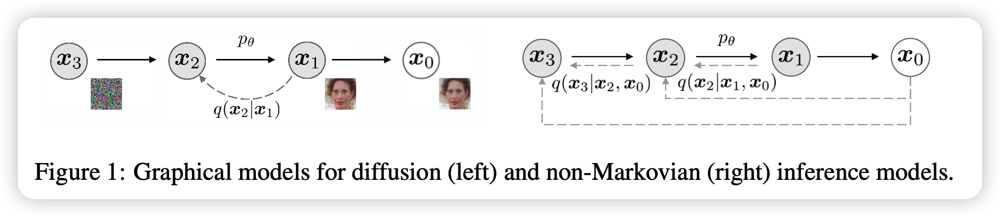
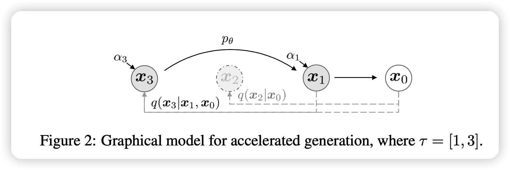
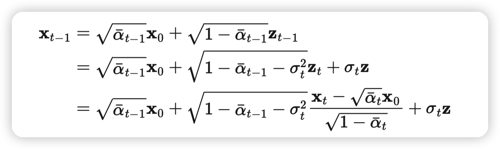
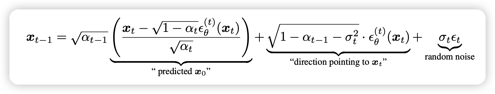
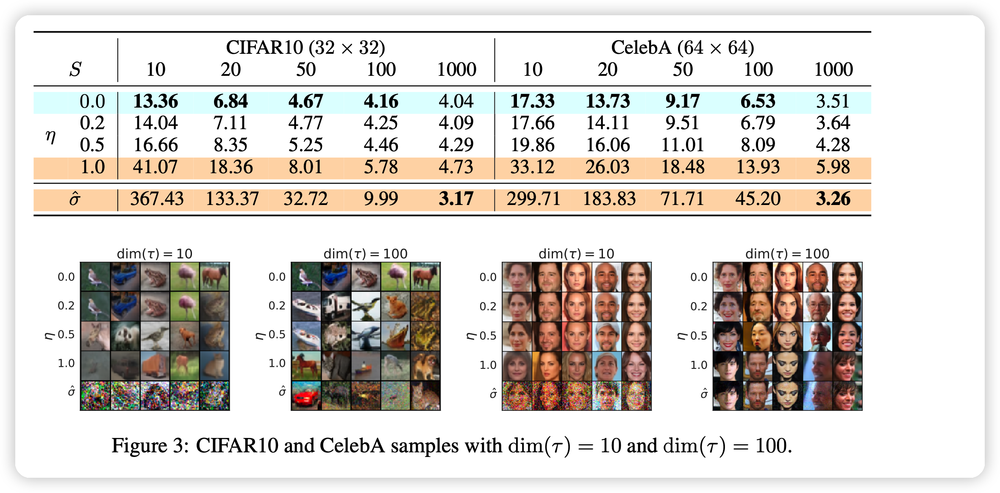
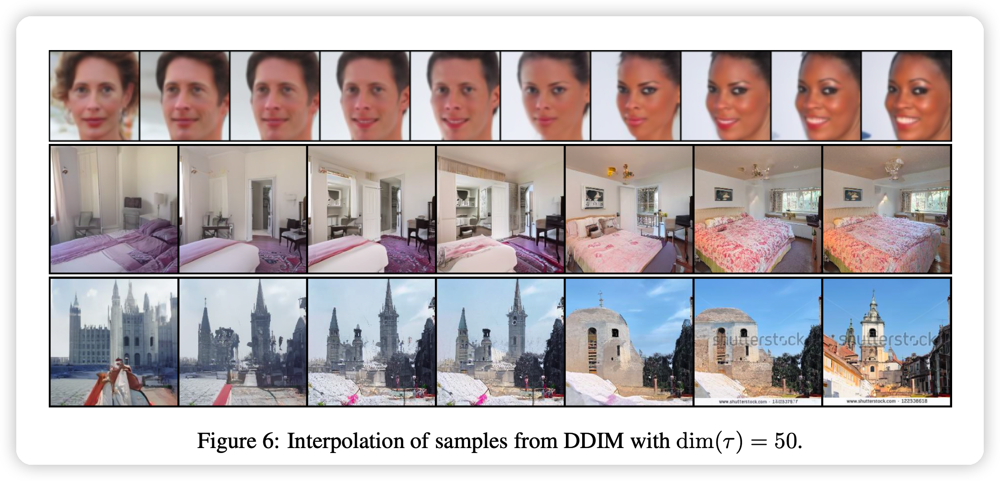

今天读了一篇编译，接下来回到老本行，来一篇diffusion model。这篇工作很有名，有点碰瓷DDPM的意思，其中“IMPLICIT”的意思是隐含。和DDPM的“probabilistic”相比，意思是减少随机性，加速采样。作者自己在AI Time上有个报告，好挺好的。

> [宋佳铭DDIM报告](https://www.bilibili.com/video/BV1M44y1B7bp?spm_id_from=333.999.0.0&vd_source=8d8e22a2686676c4db7b7429ce8a2e98)

这篇工作和别的diffusion model工作一样，比较数学，很多推导我就不详细写了，可以从附录里看。

## Introduction

大概意思就是：

- GAN很好，但今年的DDPM也不差

> 21年有一篇OpenAI的 BEAT GANS，用了DDIM，关注度很高，意思就是DDPM真的比GAN好

- DDPM的问题是慢
  - 在CIFAR-10做32x32要20h
  - 在CIFAR-10做256x256要1000h

- 本文解决这个问题,通过一个非马尔科夫的过程

## Background

作者先讲了一般的DDPM是怎么搞的，这个叙述方式挺好的，讲讲重点

有一个公式：
$$
q(x_{1:T} | x_0) := \prod_{t=1}^T q(x_t |x_{t-1}) \\
q(x_t |x_{t-1}) := N(\sqrt{\frac{\alpha_t}{\alpha_{t-1}} } x_{t-1},(1- \frac{\alpha_t}{\alpha_{t-1}})I)
$$
也就是说，正常的DDPM是一个马尔科夫过程，想要从$X_0$得到后面，需要一步一步加噪声。这个噪声是一个高斯分布，其均值和$X_{t-1}$有关，是sample出来的。

反向的公式是：
$$
q(x_{t−1}|x_t,x_0) = N(x_{t−1};μ_t(x_t,x_0),\hat{\beta_t} I),
$$
其中 
$$
\text{均值:} \mu_t(x_t,x_0) = \frac{ \sqrt{ \overline{\alpha_{t-1}} }\beta_t }{1 - \overline{\alpha_{t}}} x_0 + \frac{\sqrt{\alpha_t} (1 - \overline{\alpha_{t-1}} )}{1 - \overline{\alpha_{t}}} x_t \\
\text{方差:} \hat{\beta_t} = \frac{1 - \overline{\alpha_{t-1}}}{1 - \overline{\alpha_{t}}}\beta_t
$$

另一方面，由于这个高斯分布的传递性，我们可以把$x_t$视为单位高斯分布和$x_0$的线性叠加：
$$
x_t = \sqrt{\hat\alpha_t} x_0 + \sqrt{1 - \hat\alpha_t} \epsilon, \quad \epsilon \sim N(0,I)
$$
我们在训练时我们想要让 $\log p_\theta(x_0) \to \log q(x_0)$，也就是说，我们想要优化：
$$
L_{t-1} = E_q [ \frac{1}{2\sigma^2} || \mu_t(x_t,x_0) - \mu_\theta(x_t,t)||^2]
$$
其中

- 左边是实际马尔科夫链对$x_{t-1}$的估计，可计算

- 右边是我们的去噪模型$\theta$对$x_{t-1}$的估计，可计算

这里我们套入上面$x_t$的公式，看做$x_t,\epsilon$的函数，进行一波化简，最终得到
$$
L_{t-1} = C * \frac{1}{2\sigma^2} || \epsilon - \mu_\theta(\sqrt{\hat\alpha_t} x_0 + \sqrt{1 - \hat\alpha_t},t)||^2
$$
忽略常数C，同时对所有的L进行优化：
$$
L_{\text{simple}} = \sum_{t=1}^T L_t
$$
就能学出DDPM模型了

## VARIATIONAL INFERENCE FOR NON-MARKOVIAN FORWARD PROCESSES

上面全是DDPM的数学推导。接下来，作者讲了他的贡献。它发现：

- DDPM中的loss$L_\lambda$只依赖于$q(x_t|x_0)$，和$q(x_{1:T} |x_0)$无关。这样符合边缘分布的可能性有很多，作者选取了一个非马尔科夫的过程

$$
q_\sigma(x_{1:T} |x_0) := q(x_{T} |x_0) \prod_{t=2}^T q_\sigma (x_{t−1} |x_t , x_0 ) \\
q_\sigma (x_{t−1} |x_t , x_0 ) = N \left( \sqrt{\alpha_{t-1}}x_0 + \sqrt{1 - \alpha_{t-1} - \sigma^2_t} \times \frac{x_t - \sqrt{\alpha_t}x_0}{\sqrt{1-\alpha_t}}  , \sigma_t^2 I\right)
$$

接下来，对于 $x_0 \sim q(x_0) , \epsilon_t \sim N (0, I)$我们可以获取其对应的$X_t$，由
$$
x_t = \sqrt{\hat\alpha_t} x_0 + \sqrt{1 - \hat\alpha_t} \epsilon_t
$$
如果我们有一个对$\epsilon_t$的预测器$\epsilon_\theta^{(t)}(x_t)$输入不含$X_0$。我们可以用他来预测$X_0$：
$$
f^{(t)}(x_t) := (x_t − \sqrt{1 − \alpha_t} · \epsilon^{(t)}(x_t))/\sqrt{\alpha_t}
$$
由此，这个去噪的过程可以看做：
$$
p_\theta^{(t)}(x_{t-1} | x_t) = q_\sigma (x_{t−1} |x_t , f^{(t)}(x_t) )
$$
式子右边只和$x_t,\epsilon$有关

作者接下来证明了这个算法的train过程用到的loss和DDPM是等价的(差一个常数)。**也就是说，训好的DDPM模型可以认为是训好的DDIM模型**

## sample

这个模型是怎么infer的呢？

进一步展开、化简刚才的$p_\theta^{(t)}(x_{t-1} | x_t)$，我们可以得到

这个式子里面只有最右边的部分是带有随机成分的。而且当
$$
\sigma_t = \sqrt{(1 − \alpha_{t−1})/(1 −  \alpha_{t})}\sqrt{1 − \alpha_{t}/\alpha_{t-1}}
$$
时退化为DDPM

如果我们取$\sigma_t = 0$。式子有确定性的输出，这个模型称作DDIM。

### ACCELERATED GENERATION PROCESSES

说完了采样，那么加速在哪呢？

作者证明了：

- 上面的逆过程不需要从$T,T-1,...,1,0$一路下降，其实选取一个递减的子集也是可以的！

## 实验

实验部分，作者实际上选取了：
$$
\sigma_t = \eta \sqrt{(1 − \alpha_{t−1})/(1 −  \alpha_{t})}\sqrt{1 − \alpha_{t}/\alpha_{t-1}}
$$
其中$\eta$是超参，0代表是DDIM，1代表是DDPM。另一个变量是选取的子集S的大小($|S|=1000$代表没有简化)，跑了这个图：

可以看出，DDIM在步数少的时候表现最好。最下面那个$\hat\sigma$代表原始的DDPM祖先采样。可以看出，衰减非常明显

作者还提到了这个方法的另一个优势：

- 由于确定性的增加，相同的初始噪声映射到基本相同的结果。可以方便做图片的修改。

## 我的思考

- 虽然证明和数学过程很复杂，但结论却是惊人的简单：同样的DDPM，换一个采样方法，就能加速50倍
- 这个感觉是对上面论文ODE的一种实现？作者在论文里也用一小节说了这事。



- 有个后文 DPM-Solver，10步就能媲美DDPM-1000步，过两天笔记整上
