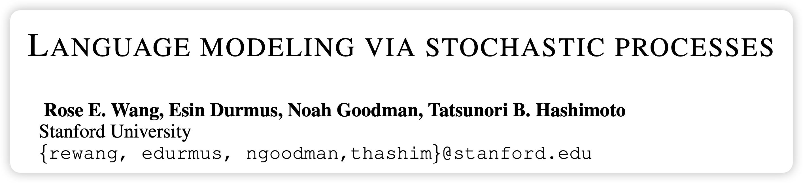
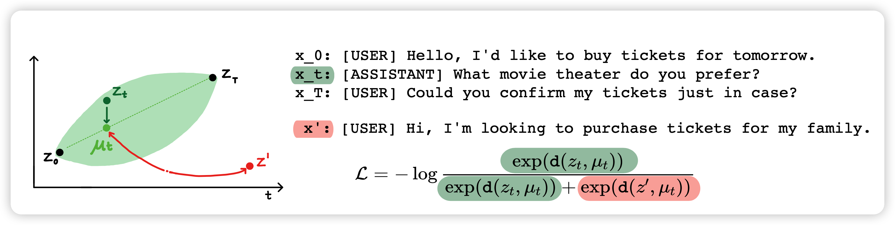
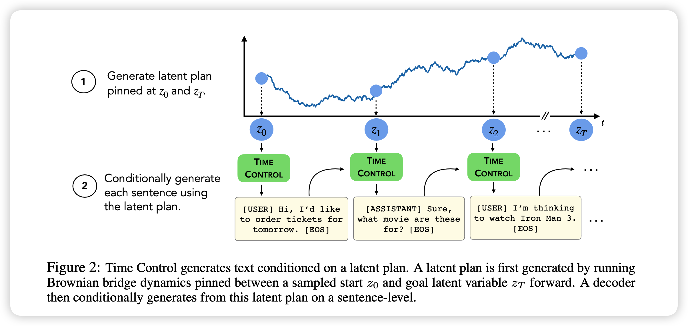

今天来讲一篇我很喜欢的工作，ICLR 2022上通过对比学习建模长文本生成过程的文章。

<!-- more -->

作者团队来自斯坦福大学

## 动机

这篇文章瞄准了现在长文本生领域的一个问题：coherence。正常Autoregressive model做长文本生成其实面临两个困境：

- 由于teacher forcing的训练方式，会造成explosure bias，在inference时很难真的把长文本的所有位置的生成都做好，尤其是一步错步步错。
- 在长文本生成中，受限于显存，序列长度不能太长。模型只能有所取舍，比如每次只看到前面500个token是什么，这就从本质上上模型不能感知到前面生成了什么。

作者提到对于前面一个问题

- 目前有一些基于plan的方法先一些plan，最后再去做真正的生成。然而，这样就会带来的方法的效果其实非常依赖于一些人工的对plan的标注。

- 另一方面，作者也提到有一些通过对比学习等方式尝试对一个长文本的生成过程做一个更好的建模，但这类方法在结果上都不好。

  > 这类方法，还有一些关于长文本生成过程面临问题的本质探索的分析性文章，我后面也会阅读一些，可能为大家做一些分享。

在本篇工作中，作者着眼于第一个问题，提出了一种基于随机过程布朗桥的建模方法，通过新颖的对比学习loss设计巧妙利用了正例和负例，对长文本生成的atomic process做了更好的表示。最终得到了更好的长文本生成效果。

## 方法

那么，作者是怎么看长文本生成过程的呢？

在这里作者想到了随机过程中的布朗桥。就是一个粒子从一个点到另一个点，中间可能会有一个偏移的过程，离起止点越远，这个偏移就越严重。

作者引入了一个归纳偏置：文本生成也遵循这样的道理。如果把每一句话的句表示都看做一个"点"，一段文本中的很多句话的句表示正是一个句表示空间的布朗桥。这样，最终生成的一整段话的语义应该有比较好的一致性和承接性。
$$
p(z_t| z_0, z_T) = \mathcal{N} \left( (1-\frac{t}{T})z_0 +  \frac{t}{T} z_T, \frac{t(T-t)}{T}\right)
$$
其中这个t可以认为是中间隔了一些句子。

### 布朗桥sentence encoder

上面的说法很有道理，但是你该怎么训练这个sentence encoder呢？作者很巧妙，在这里就想到了contrastive learning的方法。

对比学习一定要有正例和负例，作者这里是怎么考虑正例和负例的呢？

- 要判定是不是在布朗桥里，需要最少三个样本。
- 正样本明显可以直接从数据集里一段话采样三句
- 负样本呢？作者认为，起止点还要是正确的起止点，但负样本应该要求中间的句子来自于一条其他的数据。

假如说我现在训练一个encoder $ \theta \rightarrow f(\theta)$,对于一个三元组，我们就能算出偏移量
$$
d(x_0,x_t,x_T; f_\theta ) = - \frac{1}{2\sigma^2} ||f_\theta(x_t) - ((1-\frac{t}{T})f_\theta(x_0) + \frac{t}{T}f_\theta(x_T)) ||^2_2
$$
对于正样本希望它绝对值小，负样本希望它绝对值大。

接下来通过采样真实的$x_t$和负例$\hat {x_t}$就能算出对比学习的cross entropy loss
$$
\mathcal{L}_N = - \log \frac{e^{d(\text{正样本})}}{ \sum e^{d(\text{所有样本})} }
$$
通过继续不断地采样，最后encoder就会学到怎么把一个段中的句子编码成符合布朗桥过程的句表示。

具体实现上，作者使用了GPT2 freeze，然后在最后一层的句子EOS表示的基础上叠加了4个可学习的MLP层进行预测

在这个层面上，作者也类比已有方法的一些setting，论证了布朗桥建模的正确性。我后面可能也会看看他引的其他论文。

### sentence embedding decoder

当第一阶段的sentence encoder训练结束以后，作者就会开始第二阶段的实际文本生成过程。在这里，其实有一个sentence embedding和之前生成的内容作为指导信号。作者直接fine-tune了一下GPT2做这个decoder。

作者在这里fine-tune时不仅要求模型可以做next-token predicition，同时要求可以同时predict出来下一句话的sentence embedding

具体的decoder结构作者在正文中没有提，但在附录里说了一下：

- 假如一个段落分成两个句子 [SOS] [s1] [s1] [s1] [ . ] [s2] [s2] [s2]。其中[.]是句子开始符号，[SOS]是段落开始符号。s1是第一句，s2是第二句，分别有z1,z2两个句表示。接下来作者直接把句表示z贴在position embedding上z1, z1, z1, z1, z2, z2, z2, z2，然后当正常的GPT2来做fine-tune

- 采样时就是你先有生成的z1和s1 tokens，然后有个z2。你直接在后面加position embedding然后Autoregressive decode到下一个[.] token就算完成了。

对于一个长文本的解码过程，

- 就是先随机采样一个Z_0和Z_T,都是从训练集的分布中采样的。
- 接下来，定义一个T，比如说数据集平均句子长度，然后按1000token算一下有多少句子。
- 接下里就是采样一个布朗桥z0,z1,...,zt。然后上面的方法一句一句来做，第i句就加第i句的positionembedding。如果后面还没有结束，就用z_T一直加直到结束。

以上就是完整的方法、训练和测试流程，后面的实验和附加实验分析部分留到下次再写吧。

