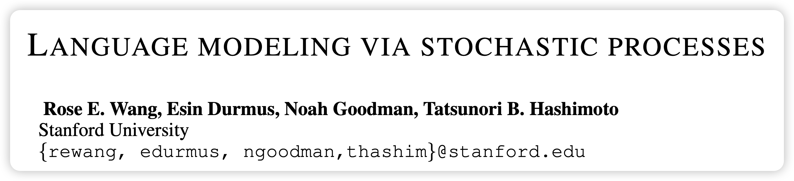
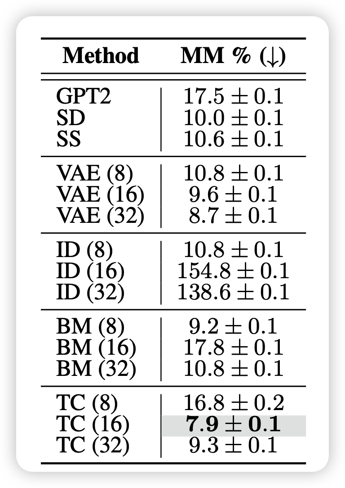
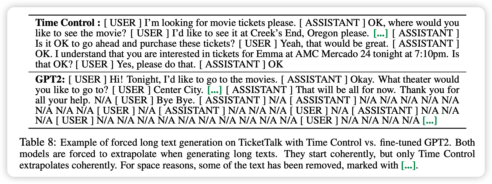
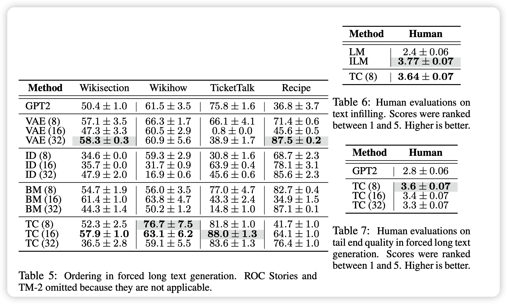

继续讲一篇我布朗桥建模长文本生成的实验部分。之所以单拎出来，是因为他的实验部分的论文书写方式比较有意思，不像是mehtod类的论文，反倒像是分析性文章。我很喜欢这种写论文的思路，就单独拿出来说说。

<!-- more -->

作者团队来自斯坦福大学

## 实验

在这一部分，作者瞄准动机，想要设计实验回答下面四个问题：

- 可以很好的encode句子级别的语义吗？
- 可以很好的做句子级别的生成吗？
- 可以很好的编码全局信息吗？
- 可以很好的做全局的长文本生成吗？

作者在主模型的基础上做了几个消融模型：

- Implicit Dynamics (ID)：专门用一个autoregressive模型来预测下一个sentence embedding，给定前面的embedding
- Brownianmotion(BM)：不用布朗桥的三个句子训练，而是直接用两个句子的布朗运动用 $z_t | z_s \sim \mathcal{N}(z_s, t-s)$作为随机过程的编码oracle
- VAE：用VAE做句子编码，这里不考虑句子间的关系，只是对单独句子要求做0-1标准分布的对齐loss

### 可以很好的encode句子级别的语义吗？

这一部分就是在衡量sentence encoder的能力。作者在这里用了一个实验性的定义：

- 如果我们能从embedding中恢复句子的前后关系，说明句表示的学习有很好的承接关系

作者因此用encoder跑出来的句表示数据集训一个MLP classifier区分句子的先后关系，其实有点像对抗……这个实验最差的结果应该随机给，正确率50

可以发现，正常的GPT2、VAE、BM基本都是random来搞。而TC最好地保持了这种句子顺序的关系，说明这种由3个句子形成的对的建模效果很好。

> 尤其是BM这种单向布朗运动的结果是random。这也许说明这种建模其实不能让模型学到先后关系。

同时，ID方法其实在conversation数据集上的效果很好，说明Autoregressive建模其实也还不错。

最后，作者有一个小细节带过了，但我们可以想一想：采样的句子举例k=1时，所有的模型最后都是瞎猜。这是不是说明相邻句子的编码关系其实没有那么好？但其实人做分类时，相邻句子是可以做的很好的，这一点上，我们still have a long way to go。

### 可以很好的做句子级别的生成吗？

这一部分，作者使用了in-filling作为代理任务，因为需要同时考虑前面和后面的内容才能保证生成的内容一致性好。在这一部分，作者对比了一个非常强的baseline ILM，就是做in-filling的SOTA。注意，TC并不是一个专门做in-filling的模型

作者在BLEU上甚至战胜SOTA。这强烈证明了布朗桥建模确实非常有利于建立一个连续地语义的变化过程。

### 可以很好的编码全局信息吗？

在这一部分，作者思考了另外一个setting。通过生成一个wikipage和原始page的长度之间的差距来衡量全局建模能力。作者在这里对比了GPT2。

- 为了加强GPT2的能力，作者还给了GPT2某些oracle的能力，提前告诉GPT2对应哪些段落，然后段落名的embedding，再让GPT2对应生成段落。

在这种情况下，TC仍然战胜了所有竞争者。说明TC方法确实很好的把握了全局的语义信息，生成出了正确的长度。作者在这里也提到别的模型的错误主要来源于对于单个段的长度有错误的判断。

> 然而，这里可能有个bias的问题，就是训练的时候我们其实采样过了wiki的语料，这说明TC其实对于wiki的段落长度有个大概的感知，下游任务段落长度判断准确是可以理解的。因此这里我觉得可能涉及有循环论证的问题。

### 可以很好的做全局的长文本生成吗？

最后，作者目标指向了最终的全局长文本生成问题。叫做forced long text generation。对于传统Autoregressive模型这很难，因为一旦生成EOStoken你即使让它接着生成，后面也会开始说一些怪话，表现会很差。

但矛盾就在于，模型正常说几十个字就会出现EOS，这不是我们能决定的。在这里作者对于传统GPT2就直接forced long generation。对于所有plan系的模型，都是按照之前讲的那一套方法进行进行生成

应该说，不管是在哪个机械评分还是human评分上，TC方法都赢了。说明这种建模方式对于长文本段语义保持的有效性。

## 思考

- 作者这个实验部分挺有意思。用回答问题的方式设计实验，而不是先设计实验再做分析。不知道作者在完成工作的时候用的是什么顺序，但读起来就会让大家觉得故事线非常完整
- 同时作者的对比实验和各种附加实验以及人工评测都做的很详细。这样的完成度才像是ICLR的体量
- 有一个有意思的点是作者用的句表示维度其实只有最多32维，效果就已经不错了，并且也可以明确分出来句子表示的先后顺序。这也许说明句子中实际含有的语义可能没有我们想象的那么难以表达。
- 布朗桥的思路非常新，引入的这个归纳偏置值得考究。但是文本生成真的就是想布朗桥一样吗？比如所谓的起承转合，或者欲扬先抑的语义在这套体系下就不能表示。
- 我们能不能想到更一般性的表示法，有更强的表征能力，然后模型甚至去重新发现所谓的归纳偏置。不过这样可能有点回到了作者之前提到的former work的感觉。
- 最后，就是感觉这种摆一个strong specific SOTA baseline然后用一个一般性模型打败它，这种实验好酷啊……
