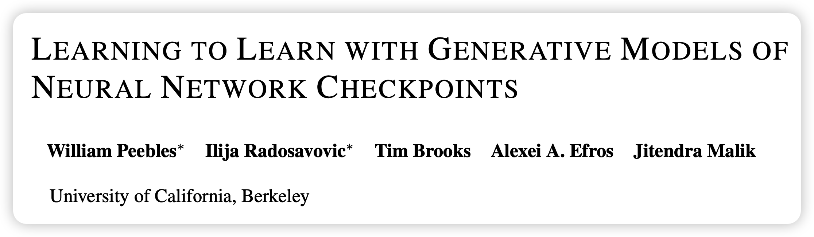
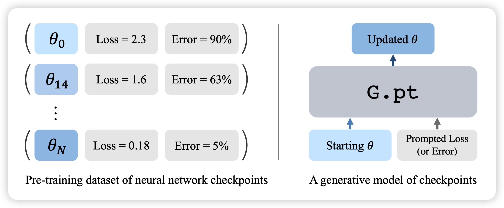
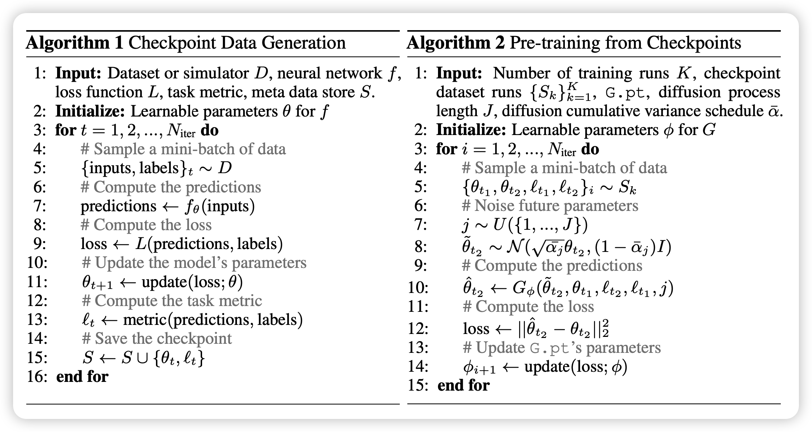
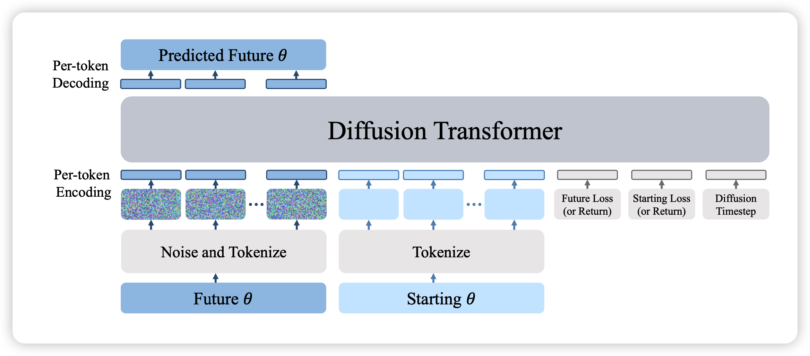
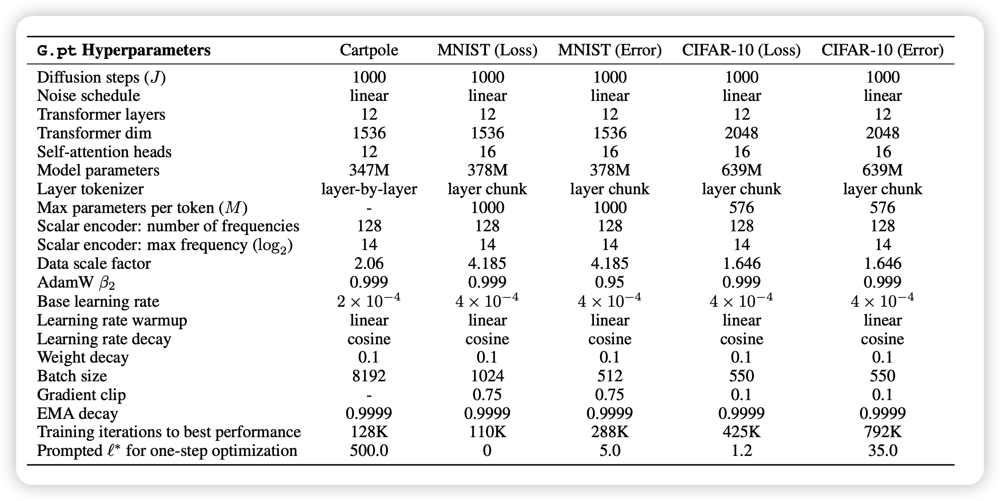
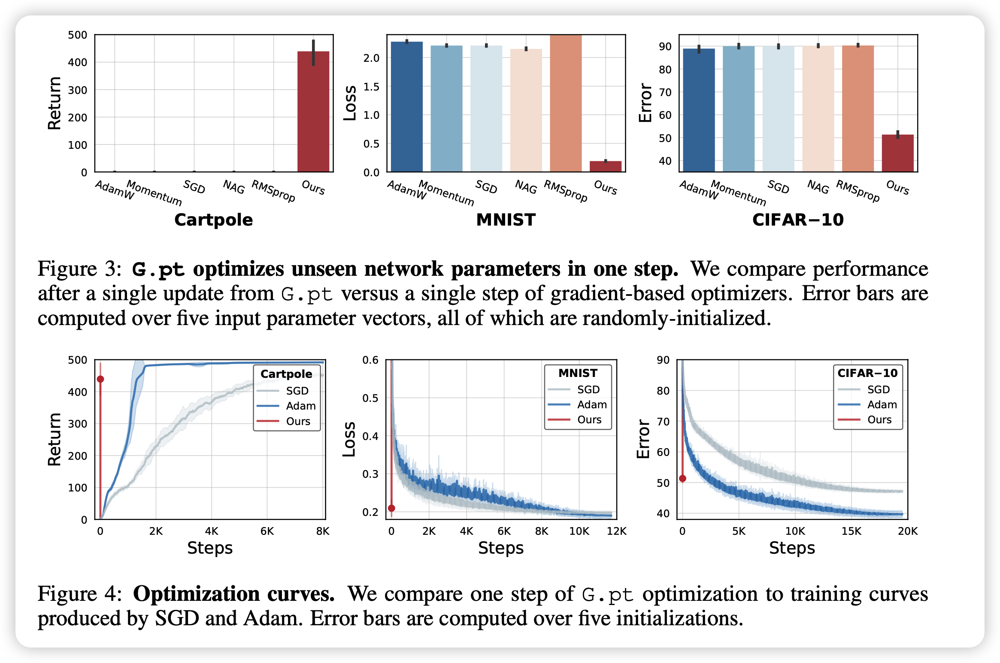
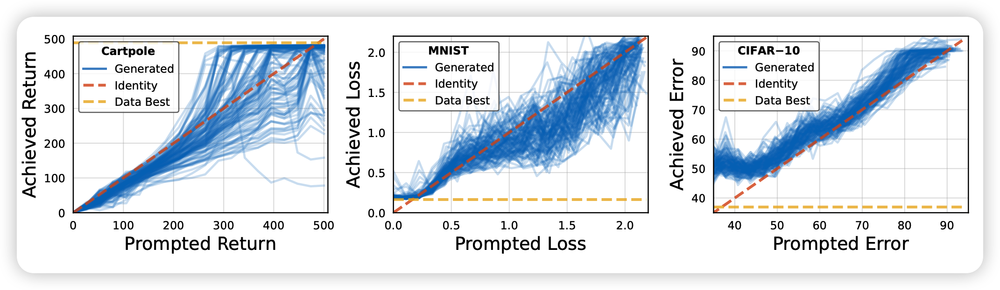
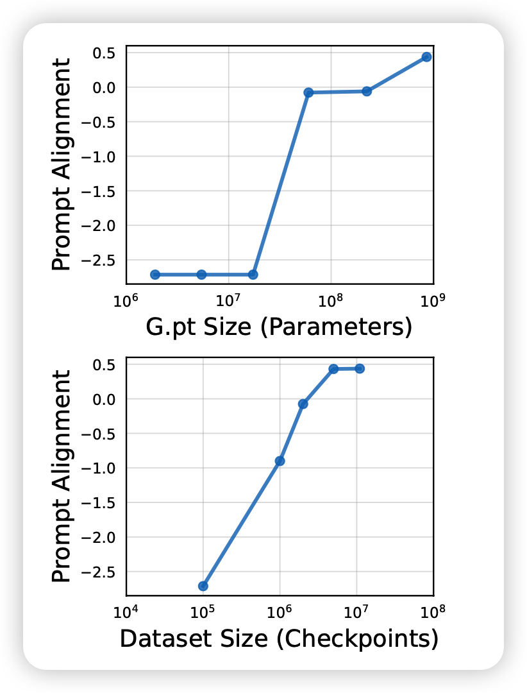

今天分享一篇最近挂arXiv的很有意思的工作，是讲用diffusion模型来做optimizer优化的。

<!-- more -->

作者团队是伯克利，一作其实是做CV的，他的`GAN-Supervised Dense Visual Alignment `在今年CVPR上获得了Oral Best Paper

## Introduction

首先要说一说什么是optimizer

> optimizer就是负责优化模型的。它持续的接受当前模型的参数和本次的梯度，然后负责进行模型参数的更新。可能会利用模型历史参数的信息来做一些类似momentum的方法。

作者在这里提到一些已有的设计好的优化器manual optimizer比如SGD，ADAM，它们面临的问题优化速度很慢，不能从过去的经历中学到东西。这个”过去“是指过去的run。比如说你用同一个初始参数来初始化模型，用同一个数据集训练。跑100次，第一次和第100次都是需要同样多的epoch才能收敛。

于是作者开始递归了……能不能训练一个优化器来优化模型，这就是`learning to learn`的意思。希望可以从一些已有的checkpoint作为数据集（大小23M），其中含有模型参数、模型初始参数、每个状态的loss、Error、Return等信息。是的，不含有梯度信息，只是单纯的loss，因此RL的score也在这个范围内。同时作者训练一个G.pt(generative checkpoint)模型来输入最开始的参数$\theta_0$和希望到达的loss，让模型快速地输出目标参数。在这里，作者非常巧妙地用到了diffusion训练框架，后文会提到。

总体而言，这个方法有如下优点：

- 可以对不同的初始化参数通过1次更新就得到很好的效果
- 它可以非常方便的对各种大小的loss都能更新出来
- 对于out-of-distribution的初始化方法，效果也不错(diffusion能力？)
- 对于不可导的loss比如RL的score，也能出结果。

## Method

总体算法如下图所示：

### 首先是如何制造这个数据集

- 数据集里的每一个checkpoint组其实是一次running里的多个checkpoint，就是把模型正常的训练一下，然后最终每个running都采样一些

- 由于数据很大生成很慢，可以思考进行数据增强

> 比如permutation，连续两个矩阵运算，两边的参数分别左乘右乘互逆的交换阵，就是一个等价的模型。
>
> 比如大小变换也是，前面所有参数乘2，后面的除以2，还是等价模型。

总之，作者最终获得了一个从MNIST, CIFAR-10数据集训练MLPs, CNNs结构的10万次running里的23M个checkpoint

### G.pt是什么样子

#### training and sample

在训练时，可以知道一个模型的初始参数$\theta_0$与初始loss $L_0$。同时还有后面某个step的参数$\theta^*$和loss $L^*$

接下来，先把$\theta^*$按diffusion时间j进行noise变成$\theta_j^*$,然后使用diffusion的训练方式：
$$
\mathcal{L}(G) = \mathbb{E} \left[|| \theta^* - G(\theta_j^*, \theta_0, L_0, L^*, j) ||^2_2 \right]
$$

> 有个小细节，在这里，作者的模型G.pt是预测参数$\theta_j$，而不是noise或者什么，这个方式叫做predict signal

> 作者在后文提到了另一个细节Training on intermediate checkpoints improves one step training。也就是说在选取训练batch的时候，初始$\theta_0$可以不是真的初始参数，然后目标参数$\theta^*$也可以是训练中间的一个参数，这样会使得G.pt总体表现提升50%

训练结束以后，模型直接输入一个新的初始参数$\theta_0$和$L_0$，然后构造一个比较低的prompt Loss，让模型跑一次，就行了(这个一次，是指一次diffusion采样，可能会很多T=1000)。作者sample公式使用DDPM传统公式

#### tokenize

G.pt需要输入模型参数，参数要如何表示，作者考虑了NLP里tokenize的方法，把模型的每个layer变成M维token(超过M就用多个chunk一下)。

注意，所有的时间j，loss L， return R，error E作为单独的token也要输入进去

接下来，作者有个小细节，tokenize完以后要用一个MLP全连接过一次，每个token的MLP是不共享参数的

#### gpt 2

后面，就直接把模型扔进一个gpt 2结构做一次decode。作者提到去掉了casual mask，这是因为模型应该需要看到”未来“，知晓所有信息

然后把前面$\theta_j^*$位置的next token prediciton的结果拿出来，再过一个不共享参数的MLP作为模型的输出

#### Global residual connection

作者提到，模型本身的输出还有一个全局的残差连接。然后模型其实是预测$\theta^* - \theta_j^*$，同时让模型的参数按照全0初始化，也就是总体而言是一一映射初始化。

超参如上图，可以看出作者的G.pt模型其实不小，训练时max length应该有几千，还是挺烧卡的。

## Experiment

作者首先摆出来了一次sample的结果，G.pt给的prompt loss在上面的超参的图里。

可以看出传统优化器一次sample基本啥效果都没有，但G.pt效果已经不错了。后面一行是传统manual optimizer训练曲线，红线是G.pt一次的结果，看起来G.pt一次顶传统optimizer炼1个小时。

多次的持续sample，每次prompt loss低一些效果怎么样呢？

- 对于初始化方法接近的模型，第一次效果基本就可以了，再来一次效果差距不大
- 对于out-of-distribution的数据，多次sample的效果更好

另一方面，作者也考察了输入不同prompt模型输出的准确度，可以看出对于不同的prompt loss，模型输出的目标参数对应的loss，确实比较接近prompt。

接下来作者做了个很有意思的实验，首先作者探索扩大模型规模对结果的影响(10M-800M)，发现基本是线性的。同时对比了扩大数据规模的影响，发现基本触顶了，这说明的G.pt结构的能力还可以被大模型进一步的发挥。这个实验设计很有意思，参考了

## 我的思考

- 这个工作一看就是很好的工作，diffusion泛化能力的又一体现，让人看了就觉得自己可以follow一下。研究的问题也很有实际意义
- 全局残差连接是不是成功的关键？连接起了diffusion框架里prediction noise/signal的问题，但作者没多说
- 我个人感觉这个最少是2023 ICLR oral，没准是best paper。现在放arXiv应该是赶ICLR投稿
