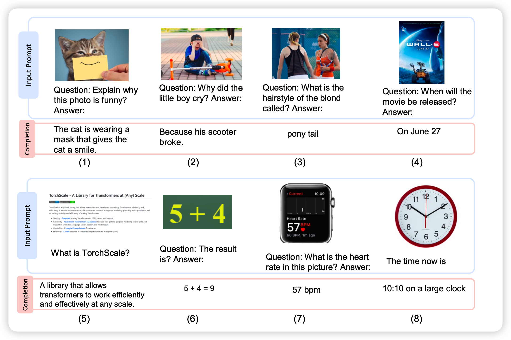
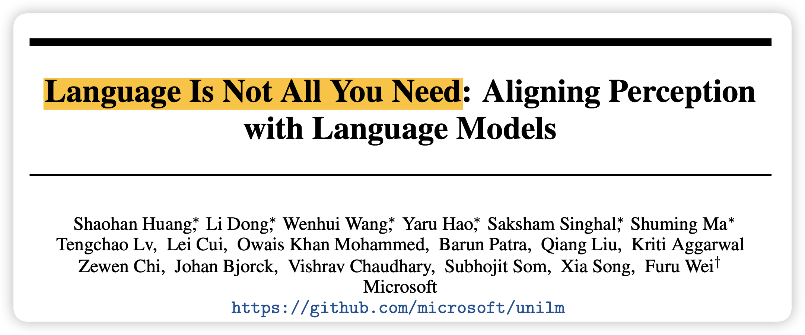
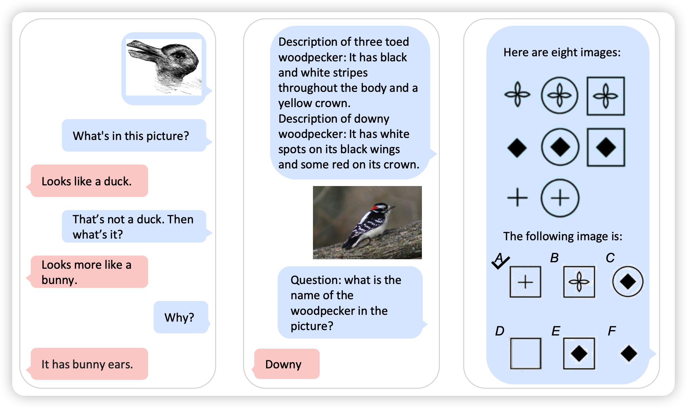
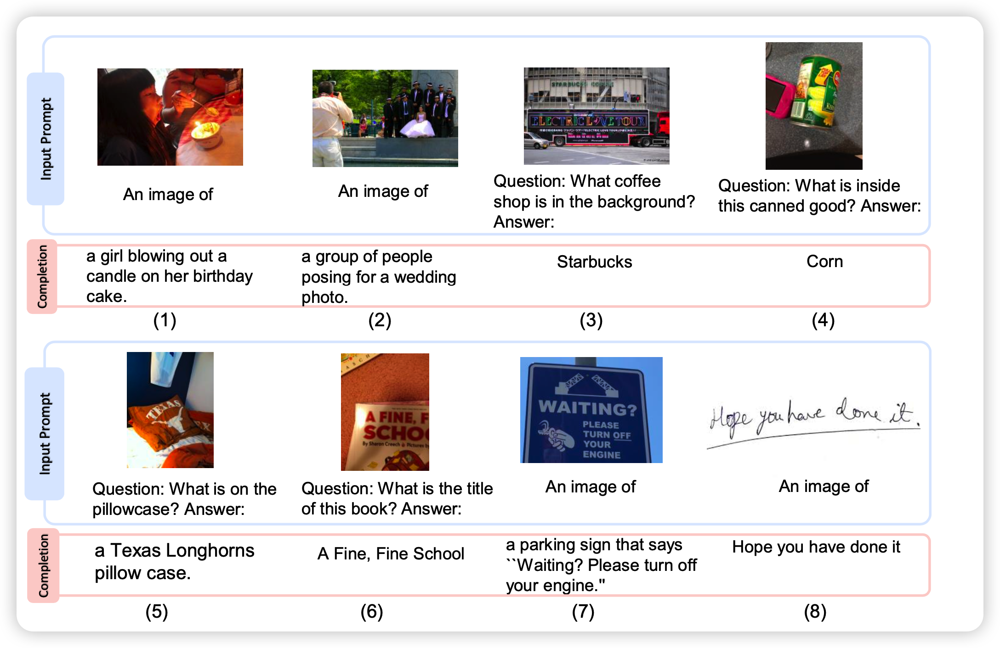
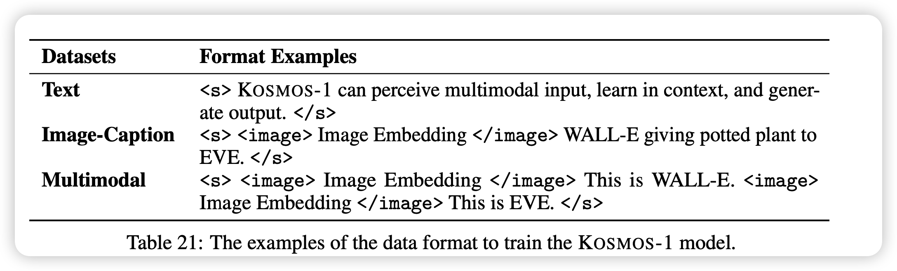
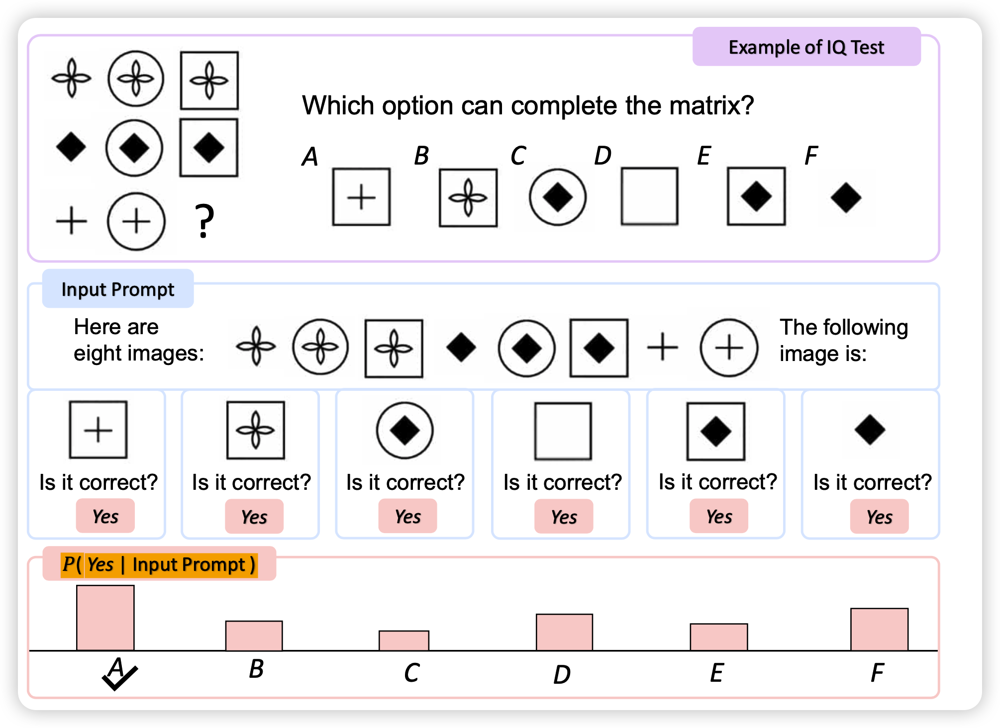
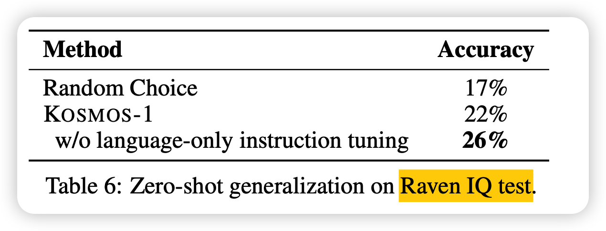
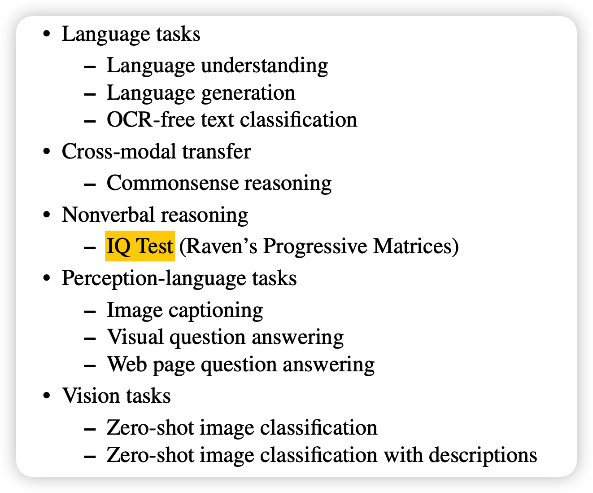
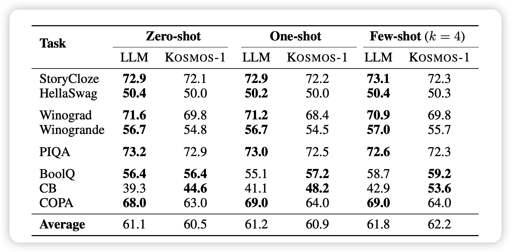

今天来讲一篇前两天刚挂上的多模态预训练的论文,这个模型KOSMOS可以直接输入文本、图像模态的信息，也可以平滑的进行多模态的任务，甚至是智商测试。值得一提的是，模型甚至只用1.3B

<!-- more -->

## Introduction

作者团队来自微软，主要参考了他们的之前一篇工作

> MetaLM：Language Models are General-Purpose Interfaces

从标题就可以看出，这是在碰瓷transformer的热度，并且点出了关键点：

>  他们要做above language的LLM工作

这就是本文的核心概念：MLLM。

所谓MLLM(multimodal large language model)，就是说要输入多模态的内容，然后完成语言模型的任务。其实这也是现在一个新的趋势，从之前versatile diffusion论文出来开始，就能看出预训练大模型现在有能力去处理多模态的内容了。

在这篇文章中，作者仿照一般大模型论文的写法，做了下面的事情：

- 占坑了MLLM这个概念
- 作为概念，整了个多模态的预训练数据集
- 作为例子，炼了一个**1.3B**的丹KOSMOS-1，并且说明比起之前的工作效果更好

这里可以看出，作者心是很大的，一般上来就叫xxx-1的，就是想要比肩GPT系列，形成类似行业规范的大模型。

下面就来看看本文主打的方法吧

## From LLMs to MLLMs

现在的预训练语言模型LLM的水平极高，并且有很强的任务理解能力，或者说通用性的语言理解和建模水平。拥有成为“general-purpose interface”的潜力或者说实力。

然而所有的LLM有一个绕不开的问题：只能输入文本。因此很多任务“不得不”对齐到文本模态，比如表格生成等等。真正的通用人工智能显然不能只有语言模态：需要输入图像、文本、声音、视频，输出文本、图片图像、乃至动作空间等等。这就意味着我们需要更进一步。

作者在这里迈出了一小步：先把输入变成多模态的，输出还是只有文本模态，称之为multimodal large language model

这样，很多多模态任务就可以很轻松的转换成MLLM模型的输入格式，比如说：

- 文字识别任务不需要专门定义，就输入一个图片，然后问“文字写的是什么”就可以了，甚至还可以针对回答进行一些进一步的对话
- 图像描述也不需要专门定义，还是把图片喂进去然后进行一个类似对话问答的场景即可
- 甚至还有很多开放性的图像问答类任务，“图片背景里的咖啡店是什么店？”，这种开放性问题之前是没法处理的，但对于MLLM都是可以做到的

可以想见，这种MLLM的通用性比一般的LLM更好，现在的LLM能力也宣誓着MLLM确实可以做得很好。接下来，作者就真的训了一个1.3B的MLLM出来

## KOSMOS-1

### 表示方法与训练目标

想要输入图片，就要表示图片，这里有两种思路：

- 用类似ViT的格式把图像和文本直接表示在一起
- 用一个专门的图像编码器编码图像，再把类似图像latent的东西喂给LLM

作者使用的第二种方法，并且用了一个锁参(除了最后的linear层)的ViT-CLIP模型作为图像编码器

图像编码完了以后就直接把latent当做token喂给模型。模型对于这种图像、文本一起的内容进行auto-regressive的学习

### 数据集

数据集是所有预训练模型任务里最重要的部分，也是基本上大多数论文阅读者都会跳过的内容。我们就来详细看一下作者的训练数据是怎么来的。

- 首先是纯文本部分，作者和已有的模型GPTxxx、OPT、PaLM、Chinchilla、LLaMa等等类似，关键点是加入了代码数据训练

- 接下来是混合模态部分,这里有两大类：
  - image caption：用了text2image的数据集，最大的那个LAION-5B里面2B的英文子集
  - Interleaved Image-Text Data：这个是带图片的网页，作者从2B网页里筛出来了71M的网页，没有公布筛选的办法，但是作者提到删掉了一半只有一个图片的网页

### 模型结构

主体是transformer encoder+casual mask，总体大小1.3B：

- 24 layer
- 32 head
- 2048 hidden dim
- 8192 FFN dim

这里就只说和transformer改进的地方：

- 加了更多的layerNorm，然后是采用postNorm
- MEGANETO初始化方式
- 采用的是相对位置编码，还是xPos变体，这个其实挺少见的，现在大多都是rotary embedding了

## 评测

这一部分就说一些好玩的结果吧

首先是智商测试

这是现在唯一一个能做智商测试的模型，虽然结果不怎么样，但是这个任务定义真的让我感觉我们又向着通用人工智能走近了一步

剩下的很多任务作者做的评测还是比较完善的

我们大约需要关注几个结论：

- 作者的评测baseline都是类似大小的模型，不过大的也没有

- 引入多模态输入的训练，对于任何一个模态都是很有帮助的
- 对于纯文本任务，表现没有相同训练成本的LLM baseline好
- 模型确实可以理解语义复杂的多模态任务定义，并且向着正确的方向做，即使模型只有1.3B

## 我的思考

- 虽然大小只有1.3B，但由于是多模态输入，其实训练成本并不低，这点要注意

- 之前看过一个说法叫“最小发布单元”，就是把一个工作的贡献拆成多个论文，最后凑出多篇论文的发表。感觉这篇论文作者就有很多后手等着：

  - 模型能不能再大点？
  - 既然是多模态输入，哪能不能输出图片？(现在Autoregressive直接输出clip embedding了，接个残血的DALL.E 2就行)
  - 图像和文字端可以联动，训练数据也有代码，是不是代码和图像模态也可以联动一下？比如来个什么代码可视化
  - 训练输入是网页，那应该天生做网页生成很在行

  - 以上这些估计就是作者在KOSMOS-23456里想做的了

- 我觉得这种MLLM，乃至MLM(multimodal large model)可能是未来几年的趋势，毕竟现在网页数据的common crawl，图像描述的LAION系的数据量这么大，搞一堆几百B的大模型应该不会缺数据。尤其是chinchilla之类的工作还说了现在的训练量不够

- ~~Language Is Not All You Need~~ money is all you need
