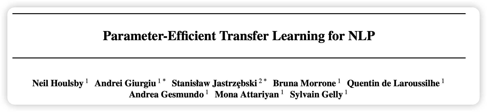
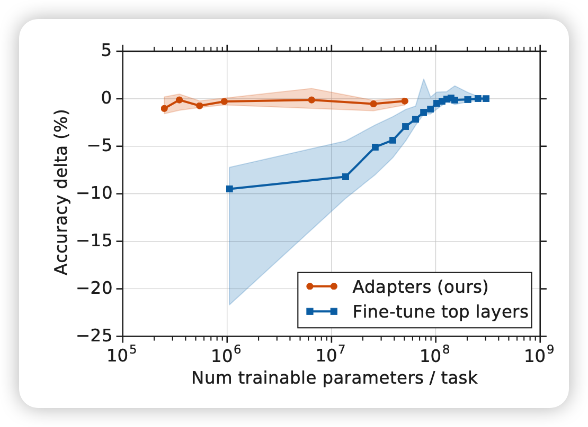
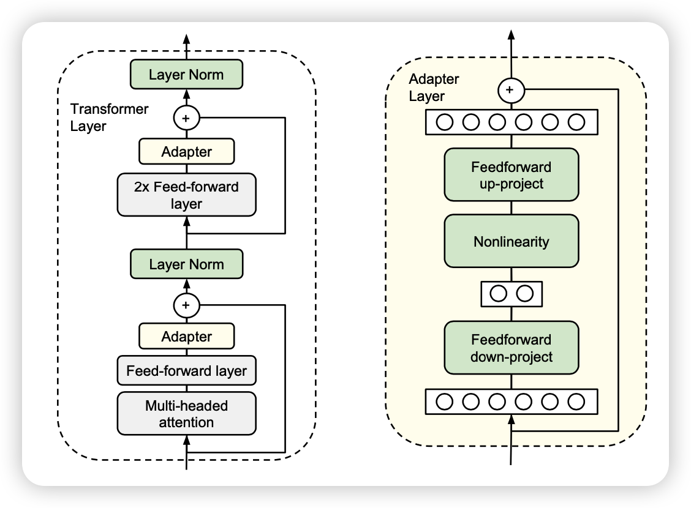
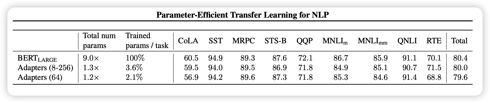
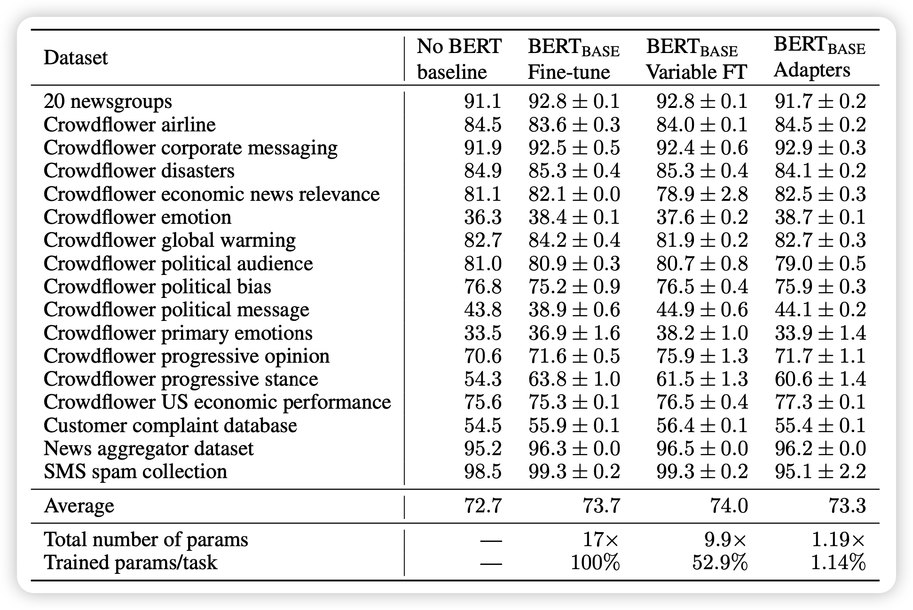
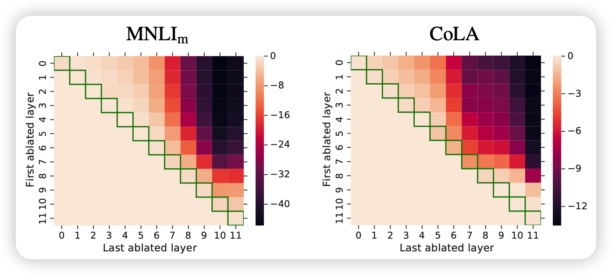
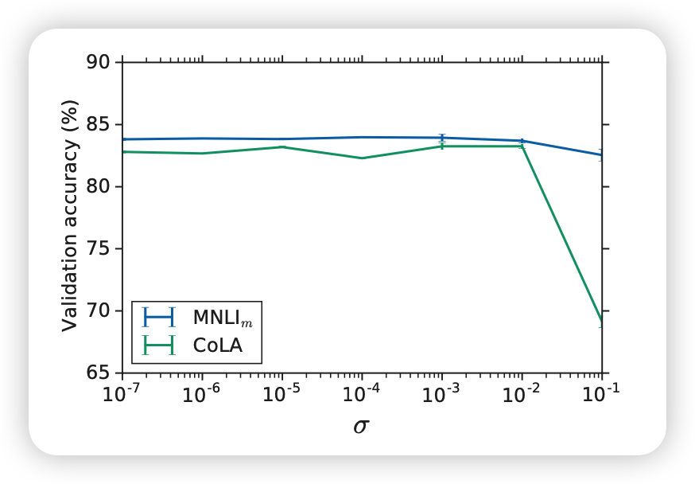

今天分享一篇delta tuning方向的经典论文Adpter tuning，是一篇比较早的工作，2019年的ICML。

<!-- more -->

作者来自Google Research和Jagiellonian University。

## Introduction

作者在标题里用的说法是parameter-efficient，这个词语碰瓷的是fine-tune方法。当时BERT刚出不久，基本统治了NLP所有任务。然后pretrain + fine-tune的manner是主流的思路，但这个作者发现：

- fine-tune需要调整所有的参数，对于N个任务，最后要存储$\times N$的参数，对于云服务器很不友好。
- fine-tune需要调整所有参数，对于算力的需求也比较大。

作者想要寻找有没有比fine-tune更好的方法，做到：

- 在下游任务有良好的表现
- 对于多个任务不用同时需求所有数据集(这个是对比一般的transfer方法， 对于多个任务的一般embedding需要同时需求所有任务的训练集)
- 对于每个任务，不需要很多的参数

作者想到了adpter tuning的方法，只用多训练大约3%的参数，就能在GLUE benchmark达到正常BERT的99%的水平，可以说是非常parameter-efficient了

## 方法

adpter的作用和优势很多，方法却非常的简单。在这里，作者一般性的考虑了transformer block

对于一般的transformer block一般是前面是一个self-attention/cross-attention，加一个feed-forward，然后是一个残差链接，接着一个layerNorm，再接一个feed-forward，然后是一个残差链接，接layerNorm

作者在这个过程中间插入了一些小的adpter层，在训练中只有绿色的部分是可训练的，别的部分的参数被锁定(BERT的预训练参数)

实现中和设计中有几个很重要的细节：

- 插入的adpter层在feed-forward后面，在残差链接前面，因此不影响transformer block残差链接在深度上的的效果
- adpter层本身是含有skip-connection的，因此全0初始化的adpter层对transformer block来说相当于不变。这一点很重要，因为训练的初期模型相当于和原模型保持一致，对训练的稳定性非常重要。
- 作者在训练中让transformer bolck的layerNorm层是不锁参的(用的pair-wise muliply norm)，这样的好处是

对于adpter层来说，为了减小参数量，用了所谓的feed-forward-down和feed-forward-up方法，使得中间变量的维度变得很小，SiLu激活函数连接。

作者提到，还有另外一些adpter层的设计方法，和这种设计方法的表现十分接近，本文就强调了这种设计，其他的设计还类似于:

- adding a batch/layer normalization to the adapter
- increasing the number of layers per adapter
- different activation functions, such as $\tanh$
- inserting adapters only inside the attention layer
- adding adapters in parallel to the main layers, and possibly with a multi- plicative interaction.

总体而言，这边文章的关键不在adpter具体的设计(设计背后的理论我在几天后也许有的论文分享中会有更详细的探讨)，而在于这种方法本身，parameter-efficient训练，或者现在叫delta tuning方法的灵感。

## 主实验

这篇论文的实验设计其实还挺好的，作者在包括GLUE benchmark在内的多个任务中，用BERT作为锁参的”大模型“来对比正常的BERT fine-tune， Variable fine-tune和非BERT SOTA的结果

作者行文用了很多的数据来表示：adpter方法和fine-tune基本没有任何区别，效果只下降了一点点点点

## 对比实验

在这一部分，作者对adpter训练方法的特性做了很多的探索，可以引发人非常多的思考，同时这一部分的实验设计更是非常巧妙：

### 移除adpter

正常adpter是在每一层都有的，作者试着单独一处某一层的、或者移除一些层的adpter看效果

这个热力图的横纵坐标的跨度对应的层的adpter被移除了，对角线代表只移除一个adpter，右上角代表所有的都移除。这个图其实很有意思：

- 对角线的表现基本没有下滑，这代表单独一层的adpter其实没有起什么作用，也就是说adpter层的参数和全0没啥区别。另一点上，对角线右下角(上层)的表现下降更多一些，说明上层的layer对模型的表现更重要

> 这一点有些佐证了”大模型前面层表征通用知识，后面层表征细粒度知识“的论点，因为后面的adpter对下游任务的帮助更大

- 当移除的数量增大时，表现下滑的很快，这说明adpter层其实是共同起作用的，并且起的作用各不相同。这其实正可以说明adpter层是非常parameter-efficient的了

### 鲁棒性

作者在这里探索了adpter层参数的表示是不是鲁棒的，也就是把正常训好的adpter参数叠加一个高斯噪声。

当高斯噪声不大时($\sigma$小)，模型的表现下滑不大

另一方面，作者探索了adpter层参数对表现的影响：其实用比较小的adpter就能达到差不多的表现。这个论点也许可以用intrinsic dimension的角度衡量，后面我也许会写论文阅读笔记。

## 我的思考

- 总体而言，作者在pre-train刚出半年多，就想到、对比了fine-tune manner，可见科研思路的敏锐。

- 同时，作者的adpter主打小参数，因此设计的一些鲁棒性方面的附加实验也非常好
- 既然通过给basebone模型添加一些参数，可以实现媲美fine-tune的效果；那么只训练basebone模型的一点参数，或者把运算方式进行一些改变，能不能获得媲美fine-tune的效果呢？
