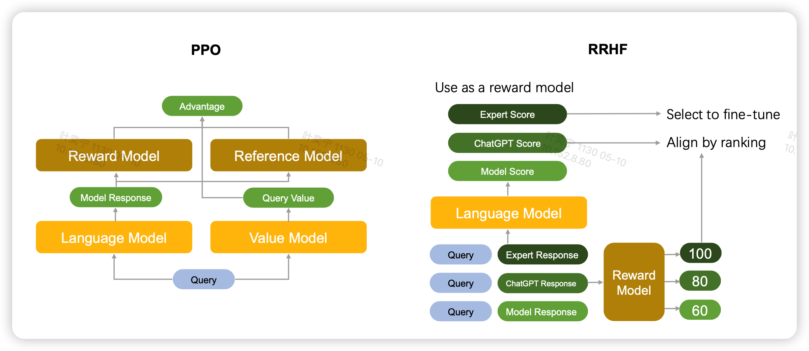
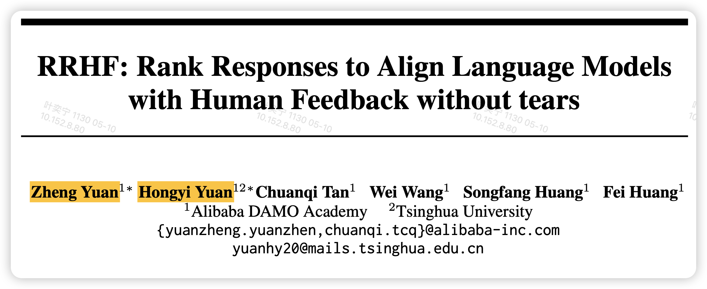
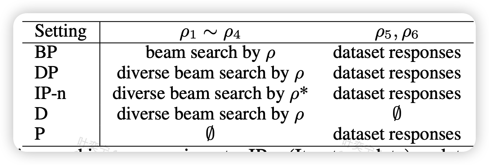
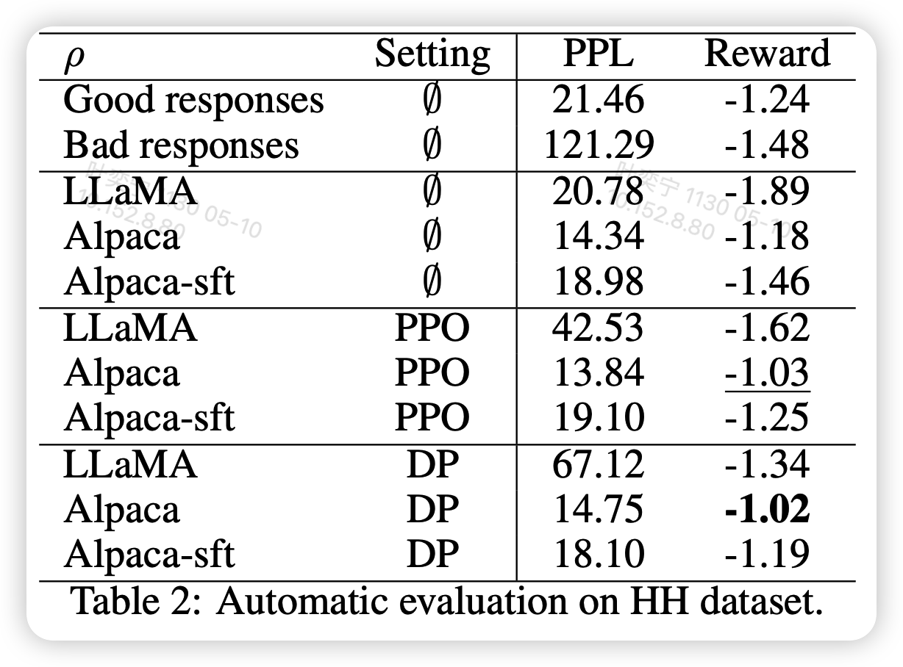
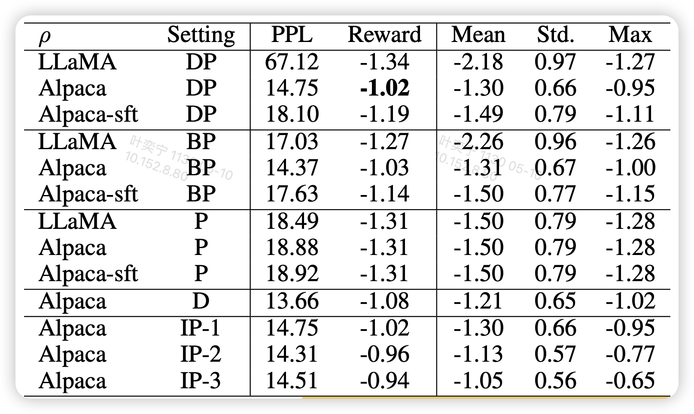
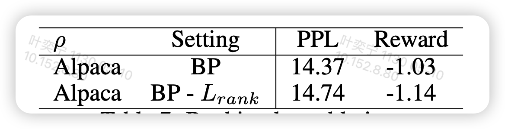

论文介绍了一个非常简单的RLHF中PPO的替代品，昨天听了作者的报告，今天来仔细读读。我认为它的思路和calibration有一定的关系。

<!-- more -->

作者来自清华和达摩院

## introdution

作者在introduction阶段主要介绍了一下传统的RLHF框架的过程，之前的博客也有讲过 。PPO算法虽然好，但有个巨大的问题，需要很多个模型放在一起：

- 首先预训练模型的参数作为ref_model要存一份，计算全局的KL散度
- 每次更新参数时old_model要存一份，计算PPO内KL散度
- 训练的模型得有一份
- 计算Value的model也得有一份，这个可以和训练的模型共享参数
- 更新参数时的EMA model又得有一份

这意味着什么呢？加入我们训练一个7B的LLaMA，按16位half精度存储，加载时大约需要14G显存。上面的模型只有训练model需要算梯度，那么显存就要翻倍，我们就当valuemodel共享参数不需要占显存。最后总体就要5倍，也就是70GB显存。这还不算前向时batch 带来的开销。

假如只使用40GB显存的A100，甚至不能放到一张卡上。

另一方面，PPO需要调很多的超参，$\alpha, \beta,\gamma,\lambda$等等，而且这些超参都很敏感，总体而言，PPO的训练还是很难的。

再有，PPO要求采集到的数据只能来自模型自己，甚至还必须要是top1解码出来的，如果用sample，可能训练就会崩溃。

因此作者提出了一种更省空间、需要训练的模型和需要调的超参都很少，并且在很多模型上做了实验

## method

那么这个方法是什么呢？作者称为RRHF(rank responses to align human feedback)。具体的改进是这样

RLHF的前两步SFT、rewardmodel train不改变，因此我们已经有一个一个rewardmodel

对于第三步，正常按照actor-critic的算法，我们需要一个value model，但这种manner其实破坏了语言模型的对称性，因为value基本都是从小到大的，就像是围棋某一局棋的胜率预测分布。但语言其实一个一个token就基本齐次的关系。再有就是value model和费空间

因此作者要去掉这一部分，但是又要和reward model形成一个训练对抗的关系，因此作者希望模型可以输出一个伪的reward。这里作者直接让model在输出输出next token logits的同时，用所有有效位置的log prob的平均值代表reward，保证在[0,1]范围内
$$
p_i = \frac{\sum_t \log P_{\pi}(y_{i,t}| x, y_{i,<t}) }{||y_{i}||}
$$
如果每次来的不是一个数据，而是一个数据对的话，reward model可以先给所有candidate一个得分$r_i$，然后模型对于所有candidate也会输出$p_i$

对于每个真实的偏序关系，作者定义一个loss
$$
\mathcal{L}_{\text{rank}} = \sum_{r_i < r_j} max(0,p_i - p_j)
$$
也就是说希望模型输出的"reward"也可以满足这个偏序关系，但这里为什么要用0 clamp，似乎没有解释。作者只是说借鉴了

>  BRIO: Bringing Order to Abstractive Summarization

另外，为了保证模型不炼崩，作者还引入了一个SFT loss，就是找到每组candidate里评分最高的
$$
i' = \underset{i}{ \arg \max}(r_i)
$$
然后直接搞个crossentropy loss
$$
\mathcal{L}_{ft} = - \sum_t \log P_\pi (y_{i',t} | x,y_{i', <t} )
$$
最后的总体loss是加和，甚至没有加权重
$$
\mathcal{L} = \mathcal{L}_{\text{rank}} + \mathcal{L}_{ft}
$$
作者提到有试过给rank loss加权重，但加了都比不加效果更差

作者后面讨论了这种方法和传统RLHF的步骤的联系

- 对比SFT：可以认为RRHF可以推导出SFT，只要把candidate固定，同时每组只有一个数据
- 对比rewardmodel train: 本方法让模型的logprob代表reward，而不是EOS token过linear
- 对比PPO：RRHF可以使用任何模型生成candidate

## experiment

作者尝试了RLHF数据集，用以下几个模型做candidate

- LLaMA 7B
- Alpaca: llama+instruction-tuning
- AlpacaSFT: ALpaca+sft

然后生成candidate时有不同的变种

这个是指作者在训练RRHF时，每组都有6个candidate，$\rho_1,..,\rho_6$他们的来源不同

- 左边的四个candiate是模型自己生成的，右边的两个来源于数据集自带的好坏pair
- 由于不限制采样方法，作者使用了beam-search和一个更强的叫diverse beam-search的算法

作者报告了reward model的得分。reward model是一个开源社区训练好的6B GPTJ

上面的图最上面的$\emptyset$代表不训练，中间PPO是用PPO训练，下面的setting和对应图里面的解码方法。其实还是有很多好玩的点的：

- Alpaca不训练就比数据集中good response的平均值还要好
- LLama直接跑PPO或者RRHF都会导致PPL爆炸
- RRHF和PPO效果不相上下

作者还对比了不同的解码方法

可以发现BP和DP的效果差距不大。另外，这个方法也是可以迭代做的

> 原始RRHF是可以先用原模型生成一堆candidate，然后算完reward，把rewardmodel delete掉，再直接跑训练，这个称为一轮
>
> 第一轮训完，可以递归地做这件事。注意从第二轮开始可能就也得加kl了

作者把多轮训练的版本叫做 IP-1，IP-2...可以发现，持续的训练会导致reward进一步的衰减

另外，只有D的setting，也就是纯用model自己生成的数据效果也不错。

另外一个有趣的点是，有一个领域叫做learn from Best-of-N,大概就是采样N个数据，直接拿最好的来finetune，那么这个和RRHF有啥关系呢？其实去掉rankloss就是learn from Best-of-N。其实从上面的图可以大概看出来，因为训练完以后的reward大概相当于训练前所有candidate的平均reward

因此作者做了这个对比实验

发现这个rank loss其实是很重要的

## 我的思考

- 这个方法感觉有点像蒸馏，因为候选candidate里还有别的模型出的infer。不知道换chatGPT的会不会违反用户协议
- 感觉这个思路和pretrain loss更接近，毕竟也是按token一视同仁的优化，就相当于变了个学习率？
- 还有从calibration的角度理解的话，这个相当于显式地把calibration的偏序关系和实际reward的偏序关系定义进了训练任务中
- 如果引入一些对比学习领域的思路，也许直接avg log prob是不是不在一个隐空间中？也许可以试试加一个linear？
