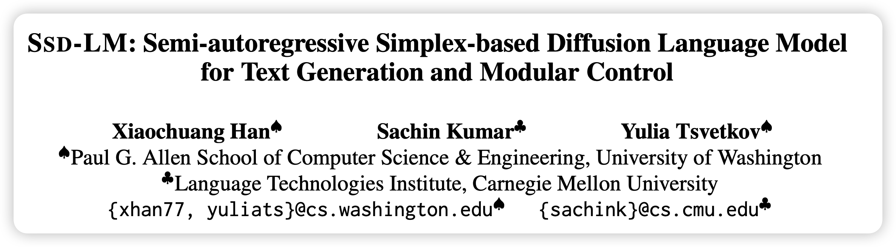
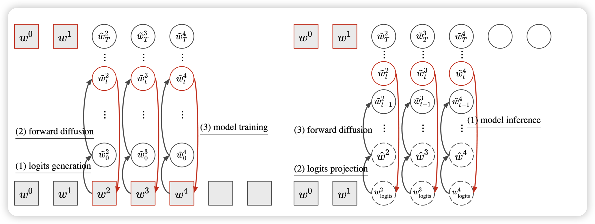
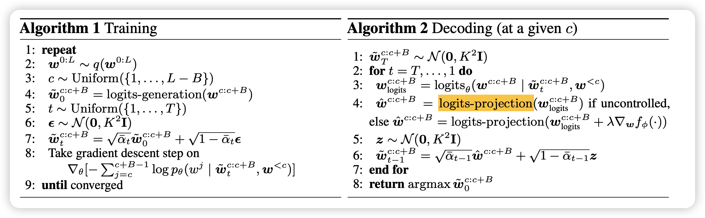
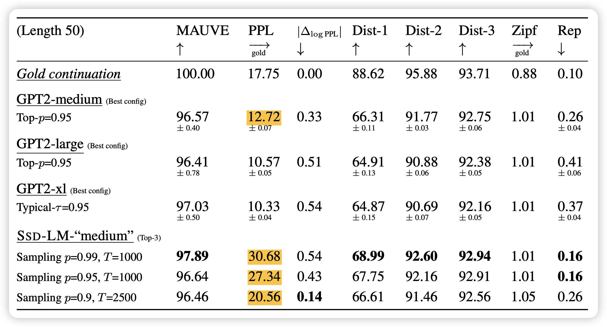
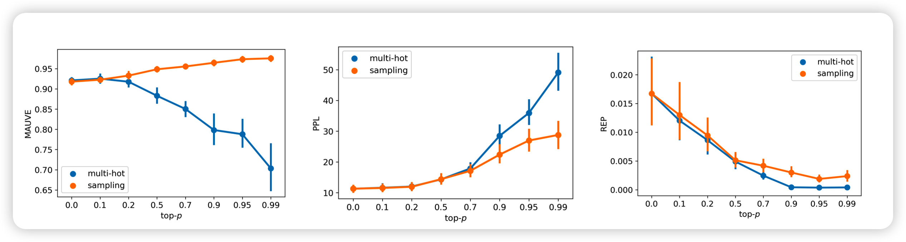
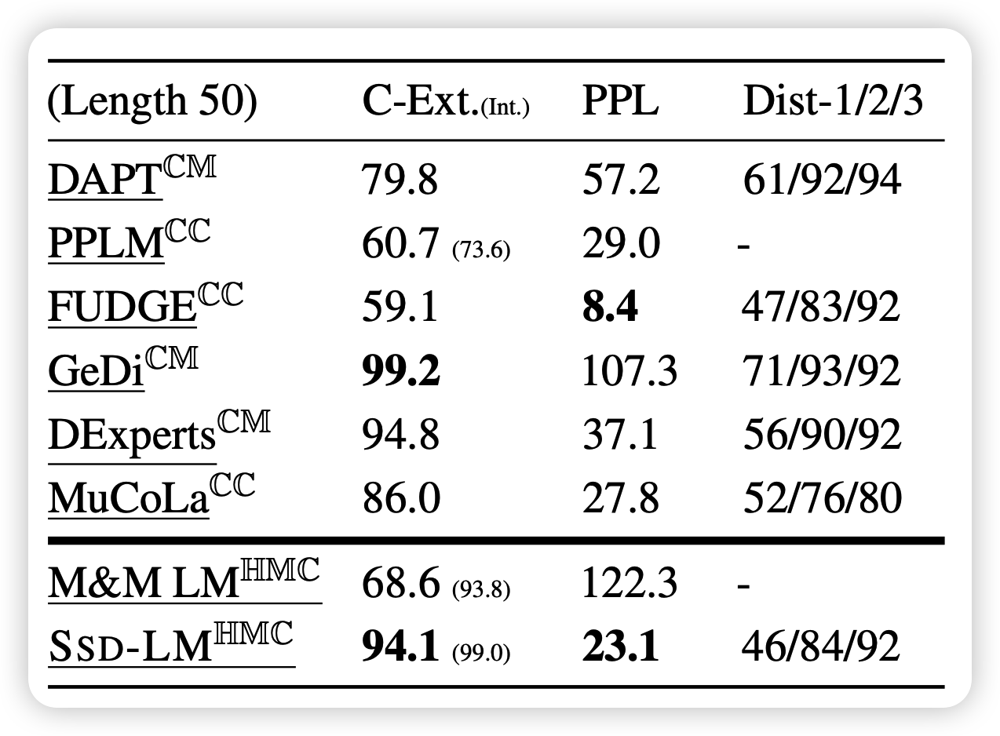

这篇文章是最近一个月新挂arXiv的文章，看格式是打算瞄准ACL 2023。作者用一个diffusion based和GPT2大小一样的模型打败了GPT-2。让我们一起看看是怎么做到的吧。

<!-- more -->

作者团队来自华盛顿大学和CMU。

## introduction

作者上来先说了diffusion text generation虽然很新、很controllable，但并不能赶上auto-regressive的效果，本文就是要解决这个问题。

接下来，作者谈到已有的diffusion文本方法基本都是在latent层面做，而已有的classifier基本都是在token(word piece) level做训练的，这有一个mismatch。

- 需要重新训练classifier做guidance
- 对于不同的t，甚至要训练不同的classifier-t

而作者的方法直接在离散token层面搞，可以直接把已有的classifier拿过来用。

最后作者拍出来结果：

- 我们用GPT-2一样的训练数据，基本一样大的模型
- 在无条件生成上打败了GPT-2
- 在可控生成上打败了很多可控的baseline(基本都是Autoregressive的)

## method

background部分讲了传统diffusion和传统Autoregressive的方法，这里我就跳过了，感兴趣的同学可以看看前面的笔记。

method部分我重点讲作者的两个改进: 

### Block-level diffusion

这一部分说的是传统的文本diffusion model都是对于一组输入进行加噪去噪，导致文本的语义非常难以保持，而本文作者想到一种所谓 semi-Autoregressive的方法，每次在一个block内进行全block的去噪，然后在block间采取Autoregressive的方法。

在这种情况下，模型的生成其实是给定前文的，没有噪声的之前blcok的信息也传入模型内。这样单独block内的去噪其实有比较好的语义性，因此流畅度和一致性就会更好。

### Continuous data representation

这里作者告诉我们如何把离散token转换成logits。作者用了一个所谓almost-one-hot的方法，就是把w转成一个和词表大小一样的embedding，其实每个维度的定义如下
$$
\tilde w_{i} = \left\{ 
\begin{aligned} 
+K, \text{when}\quad  w = V_i \\
-K, \text{when}\quad  w \neq V_i 
\end{aligned}\right.
$$
这其实相当于把单词的word embedding手动指定成了这个形式。在传入atomic模型时，就先把离散文本变成这个logits表示即可。

注意，这种情况下，随机噪声的方差不是1而是$K^2 I$,因此祖先采样的最终公式是这种形式
$$
\tilde w^{C:C+B}_0 = \text{logits-generation}(w^{C:C+B})
$$

$$
\tilde w^{C:C+B}_t = \sqrt{\overline{\alpha_t}} ·\tilde w^{C:C+B}_0 + \sqrt{1 - \overline{\alpha_t}} · \epsilon_t
$$

$$
\epsilon_t \in \mathcal{N}(0,K^2I)
$$

仔细对比一下，和之前Lisa Li那篇比是不是就相当于把所谓的rounding层给手动指定了word embedding。我个人认为好处是所有的单词针对embedding空间更平均，因为之前的end2end word embedding其实是希望类似单词更接近，这样可能造成embedding空间非常稀疏。

那么解码该怎么办呢？因为模型输出的是logits，如果要用classifier，其实是希望先回到token层面的。作者对标Autoregressive的解码方法提了三个变体，这相当于在Lisa Li的基础上(她是相当于用greedy)更进一步:

#### Greedy projection

$$
\tilde w_{i} = \left\{ 
\begin{aligned} 
& +K, \text{if}\quad  i = \text{argmax}(w_{\text{logits}}) \\
& -K, \text{else}
\end{aligned}\right.
$$

就是取概率最大的意思

#### Sampling

就是把概率按照top-p方法采样一个结果，p是超参数。

> top-p采样：相当于选取概率最大的一些token，保证选到的token的概率之和>p，然后剩下的score置为负无穷，最后再按照softmax以后每个token的概率大小采样

$$
\tilde w_{i} = \left\{ 
\begin{aligned} 
& +K, \text{if}\quad  i = \text{top-p-sampling}(w_{\text{logits}}) \\
& -K, \text{else}
\end{aligned}\right.
$$

#### Multi-hot

这个意思就是top-p留下的所有token都有可能选到
$$
\tilde w_{i} = \left\{ 
\begin{aligned} 
& +K, \text{if}\quad  i \in \text{top-p-all}(w_{\text{logits}}) \\
& -K, \text{else}
\end{aligned}\right.
$$
采样时每个中间状态要先用一个解码策略回到token level，作者称为 logits-projection，再加噪声变成下一次的噪声样本。当一个block解码完成后，就和之前的拼接在一起，然后进行下一个block的解码。

## 总体的训练和采样

如果要做classifier guidance的话，只需要拿出一个token level的提前训练好的classifier对中间状态进行指导。
$$
\tilde w^{C:C+B}_t = \tilde w^{C:C+B}_t + \lambda \Delta_{ w^{C:C+B}_t} f_\phi(y | \tilde w^{C:C+B}_t, w ^{< C})
$$
作者使用的训练语料就是GPT-2 OpenWebText，有9B token，总体模型作者使用RoBERTa-large，是一个transformer encoder。其中训练用的几个超参定义如下：

- L=200。一次采样的所有长度
- $B_{train}=25$，就是说前文最多175个token
- T=5000，diffusion step，看起来很大
- K=5。almost-one-hot概率用的超参，这应该和词表大小有关系

然后作者在32 V100并联跑了6天，100K steps ，batch_size=6144, lr=1e-4

## result

作者在多个无条件生成的指标上报告了SSD-LM的记过，可以看出和Autoregressive模型不相上下

> 值得一提的是，纯的PPL不是越低越好，可能是重复，然后作者也报告了和golden reference的log差值ppl。差值更小就更接近人的输出。

接下里，作者实验了几种解码方法的影响

可以看出：

- p越小ppl越低，但是作者提到可能会有很多重复
- multi-hot效果不好，可能是因为和训练时的输入形式不一样

> 也许可以考虑在训练时变成那种MASK的格式？

作者后面又做了可控生成的实验，就是sentiment可控的实验。作者首先调用了一个已有的classifier做guidance。同时为了评测，作者在yelp review上额外训练一个classifier得分(C-Ext)，来测试输出的语句的情感得分。

可以看到，SSD-LM很好的平衡了diversity和PPL。
