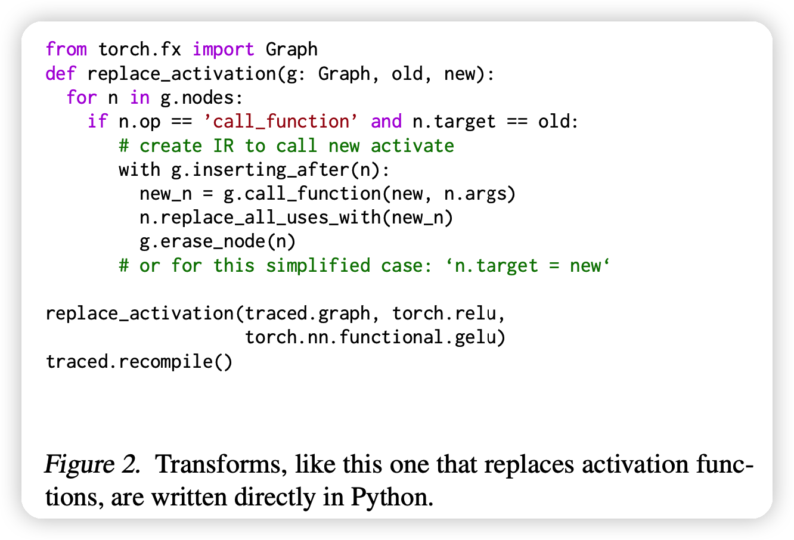
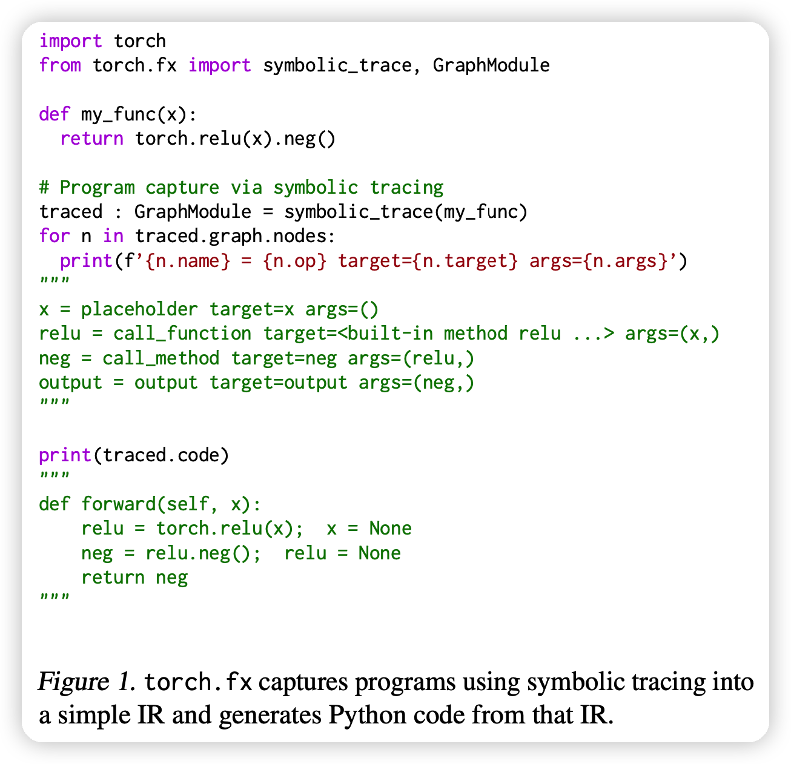
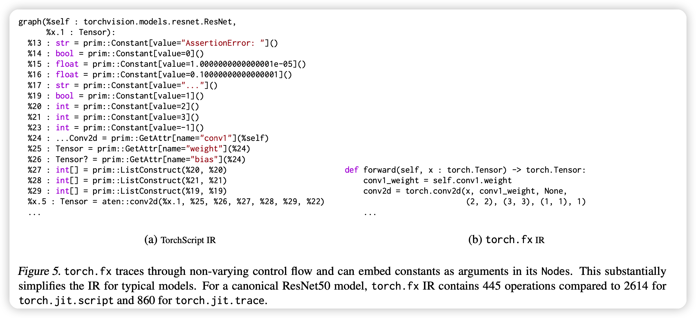
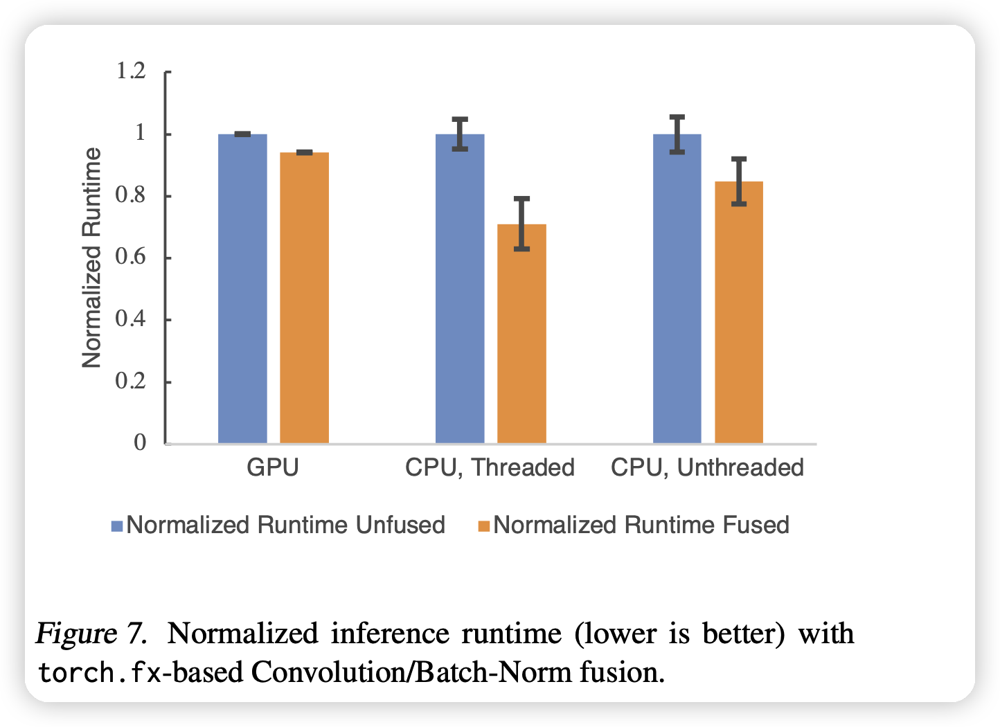

我理解这篇论文就是torch.fx的论文，作者是站在设计torch.fx的角度思考“我们为什么要这么做”，把他们的一系列实现整理成了论文发了出来。

<!-- more -->

## 摘要

摘要部分就是说很多python框架虽然使用eager execution提升了易用性，但是在真实的落地场景中，用户其实希望对模型做性能优化，可视化，分析和硬件调优。为了满足这个gap，作者设计了Torch.fx，一个纯python的程序捕捉和变换的库。

> Eager execution:其实就是define-by-run，可以让用户直接用high-level编程语言去定义计算图，可自动进行求导，进而训练和预测。非常方便开发

## Introduction

先区分了以下两种模式：

- define-and-run：早期的架构，定义很多API。用户来操作这些api去构建一些图的IR，进而框架去进行图优化、算子融合等编译优化。问题在于，用户需要同时懂host language和一种运行时的domain-Specific的语言，后者尝尝很麻烦。比如python的pdb debug系统。
- define-by-run（eager mode）：PyTorch或者TensorFlow eager等支持的。直接去翻译高层语言，去支持自动求导等过程，方便开发。但这时，就只能用一些 just-in-time的编译方法，而不是ahead-of-time里有的很多算子融合等技术，因此效果不如上面的好。

事实上，只是使用已知的计算图的一些IR结构就能方便的做一些图优化的手段。想要使用上他们，就需要一个eager mode框架也可以去捕捉程序结构，进而获取上面的信息。

其实，TorchScript通过捕捉python程序所有的AST是可以做这件事的。但问题在于，它捕捉所有的程序，cost太大，其实我们只需要捕捉计算图(nn.module)。因为优化手段基本上都局限在DAG图的范围内，因此这个捕捉手段是可以化简的。

因此作者实现了torch.fx,聚焦于dag图的表示，设计了一系列用户接口来让图满足这种格式，同时对各种图优化进行了支持

- 分析了图优化之于AI的重要性
- 实现了纯python的满足上述条件的库
- 一个只有6条指令的IR，便于表示dag图
- 可以进行图变化，进而生成优化后的代码返回给host language
- 分析了torch.fx的使用实例

## BACKGROUND

这一部分，提出了eager-mode的程序需要的几个要素

### Capturing Program Structure

这一部分对比了已有的框架们获取程序表示的几种方式：

- trace每一个操作的情况，需要用户给出样例输入。PyTorch’s jit.trace采用。
- trace每个的抽象的值而不是样例输入，不用用户给出样例输入。Tensor- Flow’s tf.function采用
  - 上两种的问题都是，只能支持python功能的一个子集，并且错误的追踪不精确
  - 另一个问题是只能用一些定义的API，而不是直接的python语言做开发。
- 允许让用户直接用embedded programming language开发，如TorchScript。
  - 问题是这种框架实现特别复杂，而且，还是只能支持python功能的一个子集(比上面更大的子集)
- 一些框架提供python到别的语言的接口，然后用别的语言的方式做优化，如Swift for TensorFlow。
  - 问题是需要退出python生态。但这个生态，包含里面的各种库，只有python有好的实现。

### Specializing Programs

这一部分讲特化，其实是关于shape的定义。
$$
a + b
$$
这个表达式在python里可以后推断各种type的输入，但对于计算图它需要比较确定。

- PyTorch’s jit.trace：只支持固定形状(样例输入)的输入，别的就炸了
- LazyTensor：可以just-in-time进行tracing。更灵活，但由于每次输入需要重新trace，代价太大
- JAX’s jit combinator：每次重新capture不是必要的，可以根据输入决定是否需要重新tracing。但可能会导致无法预测的各种运行时的问题。

### Intermediate Representation Design

这一部分讲IR的设计，总体而言，IR复杂，会使得优化效果更好，但也更难实现。

- Language：有些框架是跨编程语言的，比如PyTorch’s JIT and MXNet用c++作为他们的data structure。运行时表现更好，更好序列化，但是需要用户在开发python时有额外的学习成本

- Control flow：很多network不需要control flow，只要一系列if-statements or loops操作，称作basic block program。
  - *basic block* program可以直接表示成一个DAG图，MLP，CNN，transformer都符合这个情况
  - RNN不符合，因为什么时候停止需要动态推断。因此每一次state的内部都是一个basic block，总体有一个控制流
- State：这个state其实就是指模型参数。以为pytorch支持aliasing和mutation的语法，因此需要检查对state的操作是合法的。
  - TorchScript IR支持别名分析、指代分析，对IR做变换。代价很大，因为每一个表达式都要计算别名、指代消解。而且很多函数可能有改全局变量这种阴间操作。这种方法会降低优化的能力，但用户友好。
  - JAX使用一些别的框架来做这件事，比如把模型用FLAX封装一遍。任何一种变换都比较复杂，因为需要跨框架的交互。

## DESIGN PRINCIPLES

根据上面的分析，提出了torch.fx的几个设计理念：

- 更关注于已有的、经典的模型，不去执着于long-tailed、复杂的实现
- 更多使用开发者熟悉的python的数据结构、已支持的算子
- 让程序的捕获具有灵活性，方便用户去实现的自己的long-tailed需求

## TORCH.FX OVERVIEW

前面作者的思考和分析讲完了，这一部分讲作者到底怎么设计。

不在捕捉的时候特化计算图，而是在优化的时候做。

一个变换的例子如上图，直接用python语言书写图变换的方法

### capture

- GraphModule是 torch. nn. Module 的子类，其 forward 方法运行捕获的Graph。我们可以打印此图的Nodes以查看捕获的 IR。
- placeholder节点表示输入，单个output节点表示Graph的结果。
- call_function 节点直接引用了它将调用的 Python 函数。
- call_method节点直接调用其第一个参数的方法。
- Graph被重组为 Python 代码（traced.code）以供调用。 

捕捉的例子如下：

### IR

设计了只有6个语句的IR，非常简单

- torch. fx 的中间表示（IR）由一个Python数据结构Graph 来做的。

- 这个Graph实际上是一个包含一系列Node的线性表。
  - 节点有一个字符串操作码opcode，描述节点代表什么类型的操作（操作码的语义可以在附录 A.1 中找到）。
  - 节点有一个关联的目标，它是调用节点（call_Module、call_function 和 call_method）的调用目标。
  - 节点有 args 和 kwargs，在trace期间它们一起表示 Python 调用约定中的目标参数（每个opcode对应的 args 和 kwargs 的语义可以在附录 A.2 中找到）。
  - 节点之间的数据依赖关系表示为 args 和 kwargs 中对其他节点的引用。 

- torch. fx 将程序的状态存储在 GraphModule 类中。
  - GraphModule 是转换程序的容器，暴露转换后生成的代码，并提供 nn. Module 类似的参数管理APIs。
  - GraphModule 可以在任何可以使用普通的 nn. Module 的地方使用，以提供转换后的代码和PyTorch 生态系统的其余部分之间的互操作性。

### Source-to-Source Transformation

transformation的最后一步是重新从IR翻译回python语言，而不是到其他生态系统。同时也可以继续进行transformation。

## CASE STUDIES AND EVALUATION

大概就是说，torch.fx是做IR抽象还原的，所以IR很重要，比较了一下IR可读性、简便性。

左右一对比，确实可读性、简便性胜出。

还做了个实验比较效果，比如算子融合之类的，发现确实都可以做。

## 思考

- 感觉这个就是让工程师可以很方便的“用python优化python”，可以自己定义自己的pass，还能非常方便的再变换回python语言
- 我其实有点好奇这个东西的作用在哪里，后来看了一下是方便开发者可以直接把搞好的模型出来做python-python的转换：
  - 比如把所有的op都换一下
  - 比如不改原始代码，直接提取pretrain model的中间层的输出来做下游任务
