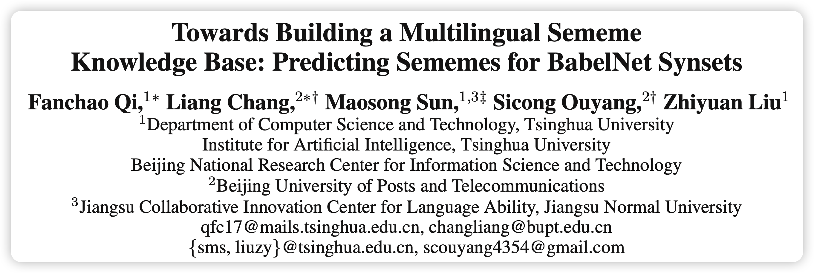
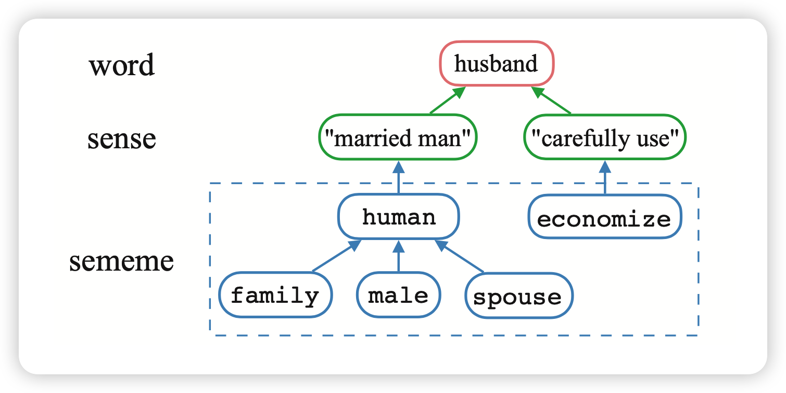
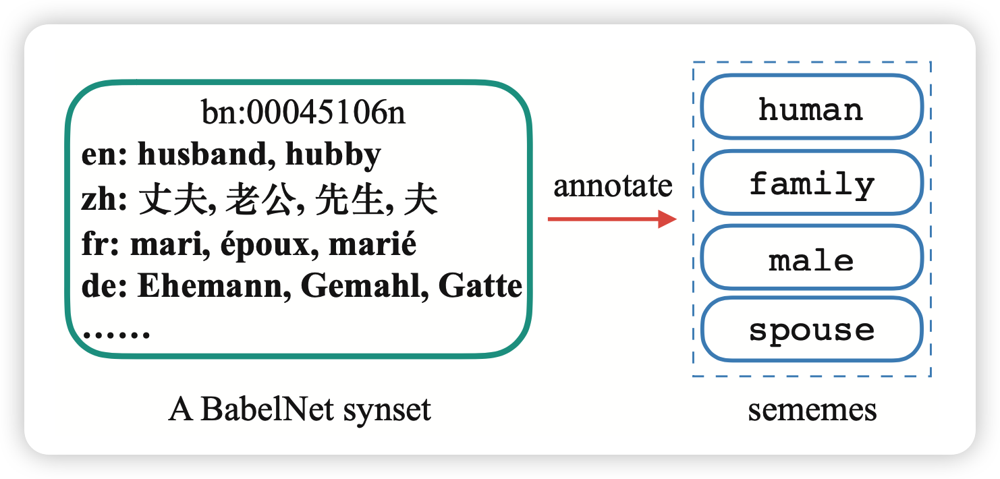
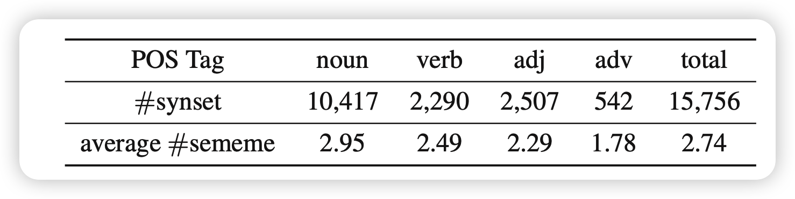
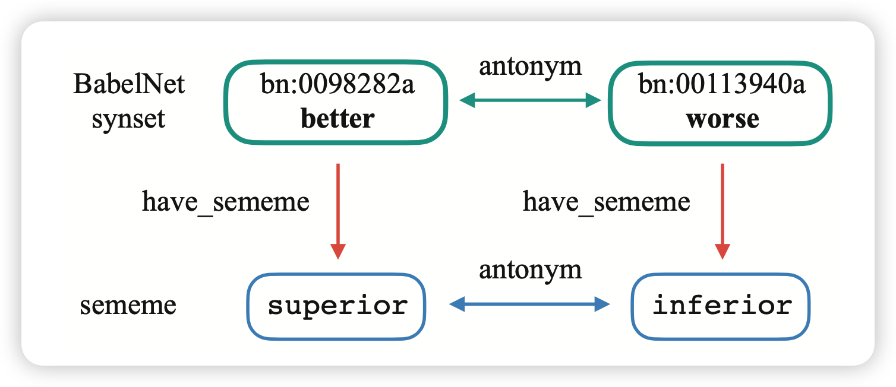
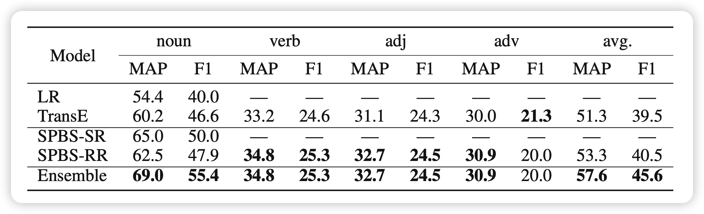

好久没写论文阅读笔记了，正好今天重读老论文，分享一下。这篇论文是关于义原预测的，发表于2020年AAAI。感觉这个方向的曝光度并不是很高，正好在这里和大家分享一下义原sememe的相关知识。

<!-- more -->

论文作者基本都是我们义原计算小组的成员。

## 字，意思和义原

首先为大家分享一下义原(sememe)的概念：

> 在中文或者英文中，都是把字或者词作为最小的单位，但语义的最小单位可以被进一步拆分成。比如说，一个词语可以有多个意思，而每一个“意思”，都可以被视为是一个由“义原”组成的树状结构。

义原的概念最早是1926年语言学家提出的。在上个世纪，董强先生花了大约20年具体的给中文系统整理出了大约2000个义原，并规定了它们的相互关系。同时给常见中文字都标注了对应的sense和义原树。义原树中的节点代表某个义原，而边代表了义原的相互关系。

从这里也可以看出，标注义原，尤其是结构化义原，其实是一个非常难、非常费时费力的任务。

如果我们可以获取到语义义原级别的表示，可以辅助我们进行NLP任务比如词义消歧。有几个优势：

- 首先义原和语言无关，因此不同的语言中的对应词的义原可能是非常接近的
- 义原作为一种专家知识，非常适用于小数据的情景。(比如一句话里的词义消歧)

## 论文本体

这篇论文是想要把义原知识库和知识图谱联系起来。具体来说呢，想要处理多语言义原标注的问题。这是由于已有的多语言义原的预测只能一次一个语言，速度很慢。

首先，我们找到了BabelNet数据库: 是一个多语言的、同义词数据库。里面的基本单位是同义词synset，包含各个语言的版本，以及一个英文定义，可能还有链接到的WiKipedia的内容。数据来源基本上是WordNet和Wikipedia的内容的组合，语言涵盖了常见的224种语言。

对于义原标注来说，如果标注了一个synset，可能就能把不同语言中synset内的词语都标注完成，因此可以一次进行多语言的义原标注。提出了给synset进行义原标注的任务SPBS: predicting appropriate sememes for unannotated BabelNet synsets。

## BabelSememe Dataset

我们提前标注了大约1.5万个synset的义原，只进行了无结构的标注。

选取了BabelNet同时含有中英文的一个20000的子集。然后候选集合是所有中文的义原的并集。让100为参与者通过定义、Wikipedia页面等辅助信息进行进一步的挑选，筛掉了所有Krippendorff’s alpha系数低的结果，保证每个synset最少三个人标注。最终平均alpha系数是0.702

## SPBS

这个任务的基本范式是：对于每个synset $b \in B$，找到每个义原$s \in S$的属于该synset的得分$P(s|b)$，然后通过超参$\delta$控制结果：
$$
\hat{S}_b = \{ s \in S | P(s|b) > \delta \}
$$
这里我们用到了两种思路:

### 基于 Semantic Representations： SPBS-SR

这个基本上之前word级无结构义原预测的方法。它的原理是:语义接近的synset对应的义原应该也相近
$$
P(s| b) = \sum_{b' \in B'} \cos(\textbf{b},\textbf{b'}) · I_{S_{b'}}(s) · c^{r_{b'}}
$$
上面的加粗符号是b对应的vector。然后 $I$代表是否含有特定义原(有是1，没有就是0)。c是一个超参。$r_{b'}$的意思是“b'的cos相似度在所有b里面排第几”，相当于更关注vector表示接近的synset。

这个方法需要有对应的vector表示。BabelNet如果synset是从Wikipedia来的，那么有对应的Wikipedia页面，可以用NASARI算法获取vector表示，可以用这个方法。

### 基于Relational Representations: SPBS-RR

这个方法适用于所有synset。它的思路是两个有相同"关系"的synset，对应的义原也应该有相同"关系"：

BabelNet中的元素可以视为三元组(h,r,t)。如果把“拥有某义原”视为特殊的关系的话，可以通过下面的公式进行义原表示s、synset表示b、关系表示r的联合训练：
$$
\mathcal{L}_1 = \sum_{(h,r,t)\in G} \max[{0,\left( \tau +  d(h+r,t) - d(h+r,t')\right)}]
$$

$$
d(x,y) = ||x - y||^2
$$

这个公式中t'代表另外的一个节点(不包含原来h,t的关系r)。再就是，由于synset的意思视为所有sememe意思的组合，因此有:
$$
\mathcal{L}_2 = \sum_{b \in B} || b + r_s - \sum_{s \in S_b} s ||^2
$$
通过$L = \lambda_1 \mathcal{L}_1 + \lambda_2\mathcal{L}_2$最终可以获取到所有表示，然后义原预测得分:
$$
P(s | b) = || b + r_s - s||^2
$$

### ensemble model

上面两种方法的得分可以组合：
$$
P(s | b) = \lambda_c \frac{1}{rank_s^c}+ \lambda_r \frac{1}{rank_s^r}
$$
rank是所有义原s的得分分别按降序排序的序号

最终在实验中，可以看到效果还不错：

## 思考

- 文章的主要贡献是第一次联系起来了Hownet和BabelNet，可以进行synset的义原预测
- 贡献一个精细标注的数据集其实对领域的前进和曝光有很大的作用
- 能不能进行细细粒度的标注，比如结构？以及在义原预测的时候，能不能进一步利用definition等信息？
