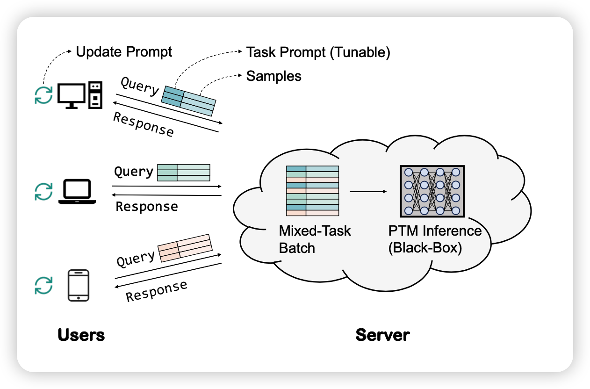

今天来讲一下Black Box Tuning这个方向，主要是基于:

> Black-Box Tuning for Language-Model-as-a-Service

> BBTv2: Pure Black-Box Optimization Can Be Comparable to Gradient Descent for Few-Shot Learning

<!-- more -->

这两篇的作者是一波人，来自复旦大学。这两篇都是今年的文章。

## Language-Model-as-a-Service(LMaaS)

所谓的黑箱训练，就是说如何在不能获取到模型的导数，只能有一个loss或者accuracy的情况下优化模型。

之所以提出这个概念，是因为目前随着模型的规模越来越大，很多模型现在都是不开源参数的，只能开原一些infer API，因此也不能获取到梯度。在这种情况下，下游任务的研究者首先进行fine-tune不现实(没有梯度,然后存不下)。已有的一些delta tuning的手段也不现实，因为没有梯度。作者把这个场景叫做Language-Model-as-a-Service(LMaaS)

作者希望提出一种方法，可以在这种情况下微调模型。

## derivative-free optimization (DFO)

这是另一个方向，专门在只有loss的情况下优化参数，有点像RL的场景。有一些已有的工作，我后面可能也会分享到。但大体面临几个问题：

- 训练很慢
- 当需要调整的参数多的时候，基本不可能实现

## Black-Box-Tuning

接下来作者就要讲本文的方法了。作者首先借鉴了Delta tuning领域，想要减少模型需要调整的参数。

作者用了soft prompt的方法。不过参数还是太多(length \* dimension)。因此作者又掏出来了LoRA那个假设

> fine-tune has a low intrinsic dimension

然后把prompt表示成了矩阵增多那个方法(Intrinsic原始论文那个搜索):
$$
z* = \mathop{\text{argmin}}_{z \in \mathcal{Z}} \mathcal{L}(f(Az + p_0; X),Y)
$$
这个公式的意思是，f函数是一个黑箱函数(模型输出)，通过一个prompt p和输入x返回一个y，这里y指的是类别概率(做的分类任务)

然后作者把$D = len \times dim$维的prompt表示成了d维的$z,A \in \mathbb{R}^{D\times d} $,然后p0是一个预先设计的prompt

其中A是一个uniform分布的矩阵，选定就不变了。$z \in [-5,5]^d$才是DFO算法实际优化的东西。

实际执行中，作者用的优化函数L是cross-entropy loss。然后DFO优化算法是经典的CMA-ES (Covariance Matrix Adaptation Evo- lution Strategy)算法

## Black-Box-Tuning V2

既然是两篇，那肯定是有改进的。第二篇说了BBT算法的缺点:

- 需要预先设计P0。可能是任务相关的，不算是完全的黑箱
- bbt算法主要是在拟合训练集，在测试集上并没有真的优化
- 对于entailment类的任务表现不加
- 和fine-tune比效果还是不够好

因此作者做出了写改进，具体如下：

### 分治

首先作者参考prompt tuning的改进方法在每一层都添加了prompt，然后由于多了层数L倍的参数，DFO肯定会下降。但作者观察到:

> 由于残差链接的原因，模型的前向可以认为是分治的。最终的输出可以解递归变成每一层输出的和

作者就用分治的手段，自底向上一层一层优化。然后A矩阵也是有L个

### A的生成

接下来，作者探索A矩阵的生成，原论文说是uniform分布更好，但作者觉得需要让A乘完了以后和真实的token或者模型的真实中间hidden state更接近，作者推导了一下矩阵乘的方差、均值，总结出来了下面的分布：
$$
\begin{aligned}
\mu & = \frac{\hat \mu}{d - \hat\sigma^2} \\
\sigma & = \frac{\hat \sigma}{\sqrt{d - \hat\sigma^2}} \\
\end{aligned}
$$
这个高斯分布采样出的A可以最大程度使得Az和真实分布接近

## 实验

**注意，作者做的所有实验都是few-shot场景下的，也就是训练集每一类给了16条数据，然后测试集用了全数据($\gg$ 训练集)**

经过下面的改进之后，作者在BERT, RoBERTa，CPM-2都进行了实验，效果还是很好的

对baseline的一些解释:

- BitFit, Adapter, LoRa, Prompt Tuning之前都讲过了
- P-Tuning v2大概就是在每一层都有prompt
- Feature-MLP, Feature-BiLSTM：有梯度的方法，是在CLS token上面叠加了新的模型，前面大模型freeze

后面作者还做了有意思的附实验:

大概说了几件事情：

- 搜索空间d越大，虽然变慢，但效果会变好
- 在d > 100以后基本上就触顶了
- 表现随prompt length先增后减，大概50的时候表现最好
- 换了新的A的采样方法以后，训练开了很多，并且测试集convergence增强了很多

## 我的思考

- 总体而言，这个文章提出的LMaaS场景感觉很大的实际应用空间，我觉得闭源大模型是个趋势; 尤其是，大概率以后前向本机的小破卡也跑不起来……
- 作者没说多数据的场景表现怎么样，但我感觉应该是有梯度的方法远胜BBT。这个可能是妨碍应用范围扩大的一大问题……
- 我觉得有一个重要指标，就是query次数作者不是很重视，这个在实际应用中很重要吧——闭源大模型你花的钱好像是要正比于query次数……
