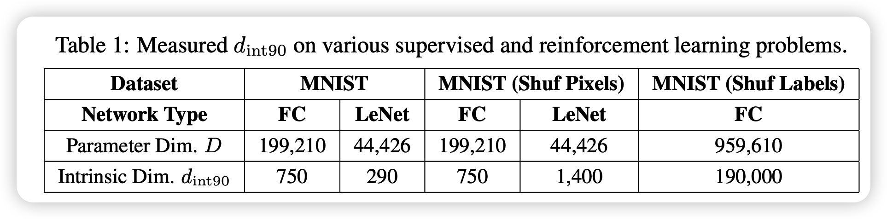
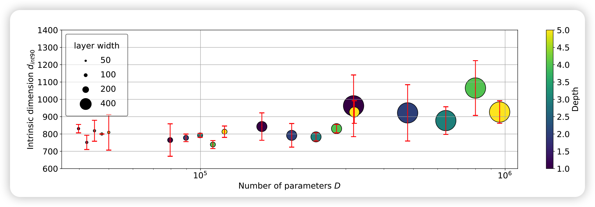
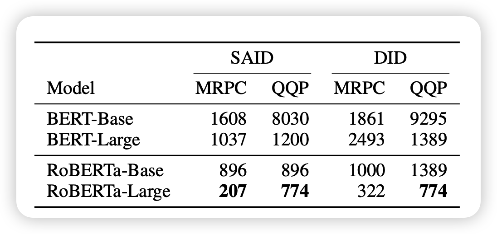
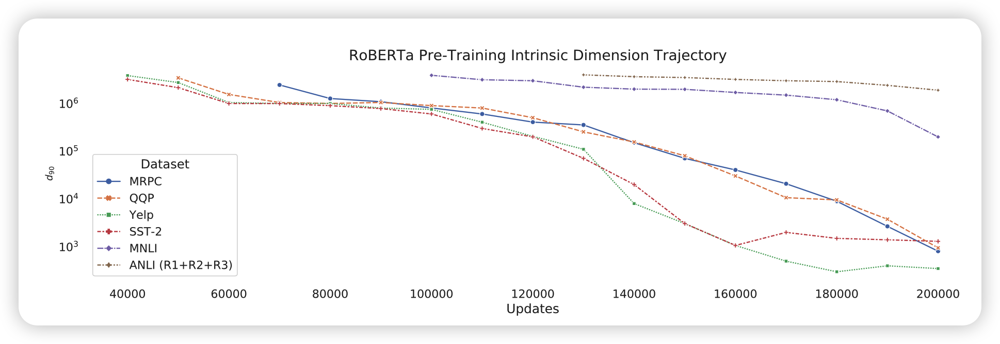
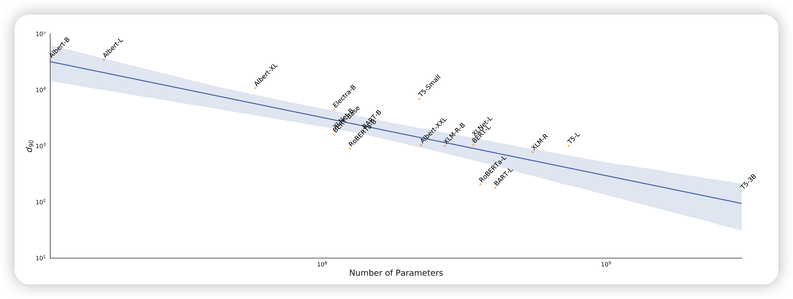
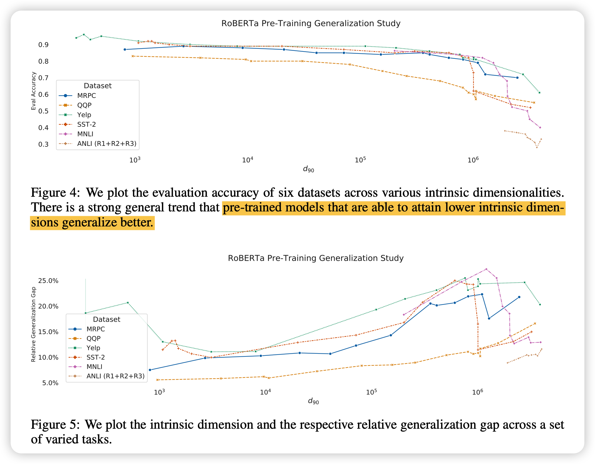

讲两篇分析性文章，都是在探索任务本征维度，可以指导模型压缩、知识表示工作。方法非常简单，但是结论都能引发很多思考。

<!-- more -->

> MEASURING THE INTRINSIC DIMENSION OF OBJECTIVE LANDSCAPES 2018 ICLR

> INTRINSIC DIMENSIONALITY EXPLAINS THE EFFEC- TIVENESS OF LANGUAGE MODEL FINE-TUNING 2021 ACL

## INTRINSIC DIMENSION

对于一个2参数的优化任务，常常会陷入局部最优，其中的山谷形状。但对于包含多个参数的模型，山谷的概率非常低（总不能所有参数的二阶导都恰好是正的吧），反倒是马蹄形的概率比较高(一些维度是不稳定平衡)。

这启示我们，随着参数的增大，也许模型+optimizer的训练模式的难度反而会降低。也就是说，大模型的参数也许是冗余的，为了帮助降低训练难度。

那么，一个任务究竟有多难？这就是本文探索的所谓intrinsic dimension。

举个例子，如果一个任务是优化一个1000参数的模型，要求是前100参数的和是100，101-200参数的和是200……，901-1000参数的和是1000

我们可以很快发现，如果每100个参数只有1个我们可以变，我们也可以凑出一个答案。这就代表着这个任务的本征维度 <= 10

## 如何获取任务的本征维度？

稍微想想，就觉得这其实是很难的,可能还涉及到另一个Minimum Description Length (MDL)理论。

我们对任务的表示常常是和模型在一起的，我们就找一个耦合的算法，这样只能求出任务本征维度的一个上限。

将一个D参数的模型表示成下列的形式
$$
\theta^{(D)} = \theta_0^{(D)} + P \theta^{(d)}
$$
原来的模型$\theta$含有D个参数，我们想要尝试d个参数能不能解决这个任务。用一个变换矩阵$P\in \mathbb{R}^{d\times D}$来将d变成D

注意$\theta_0^{(D)}, P$都是锁定的，只有$\theta^{(d)}$是可训练的。

然后用一个所谓$d_{int90}$作为评判标准，只要到了全参数训练的90%的score，就算是找到了。如果找不到，就扩大d直到找到

## 任务的Intrinsic Dimension与影响因素

作者在各种数据集合任务上都进行了实验，结论部分都差不多，下面主要讲一下MNIST上的一些结果：

发现dimension其实是远小于模型参数的（0.5%）。另外，本征维度是和模型结构挂钩的，对比之下，conv结构在MNIST任务上就比全连接要好很多,750 > 290。

### conv真的更好吗？

关于上面的FC和LeNet的差距，作者做了一个附实验。把数据集中的每一张图片都做了同样的一个线性变换。显然，FC对线性变换不敏感，本征维度还是290，但LeNet直接衰减到了1400

这告诉我们：conv对图片局部表征能力强是战胜fc的关键

### 模型大小影响本征维度吗？

作者用各种大小的FC都算了一遍，发现模型结构定下来以后，单纯的扩大规模对本征维度影响很小。这也许从侧面说明了本征维度可以很好的衡量一个结构对任务的表示能力高低。

## 预训练和预训练模型对Intrinsic Dimension的影响

这里开始是上面的后文了，主要在分析这两年的预训练模型新框架下Intrinsic Dimension的一些结论是否还有效、有没有新的结论

在方法上基本没有更新，就是换了个更符合transformer结构的改进，因为同一个transformer层内的元素很强的相关性，作者就做了一个共享的layer 参数 $\lambda$
$$
\theta_i^D = \theta_{i,0}^D + \lambda_i P (\theta_i^{d-m})_i
$$
这个公式的意思是把原来模型的m个层分开处理，然后先把d个参数中找出m个作为scale变量$\lambda_i$，接着每一层的参数看做每一层的矩阵变换剩下的d-m个参数再进行一个scale。这样可以更好的利用transformer结构本身的特点，找到更精确地Intrinsic Dimension的上界

### 预训练任务帮助下降下游任务本征维度？

作者在这里发现了不同的规律，BERT和RoBERTa基本只是扩大了size，为什么本征维度下降这么多呢？

作者认为是预训练任务本身可以帮助下游任务减小本征维度，或者说预训练阶段的“知识”获取可以更好的帮助下游任务

为此，作者从头预训练了RoBERTa，观察dimension变化：

可以发现，随着MLM预训练的进行，下游任务的本征维度真的在减小，模型在这个过程中是不能获取到下游数据集任何信息的

RoBERTa是不是个例呢?作者又找到了其他的很多预训练模型做实验:

可以发现，不管是什么结构，随着预训练模型参数的增多，下游任务的本征维度都是在下降的。这又是对上面猜想的有力证据

### 本征维度与泛化能力

作者认为本征维度越小，泛化能力就越强

作者通过实验证明了这个观点

总体而言，预训练任务和前一篇的随机初始化不同，模型本身就处于一个对下游任务本征维度低的位置，同时越大的预训练模型，这种表征能力就越强

## 我的思考

- 有没有人试过不用预训练，就单纯按上面论文的方法看看transformer的本征维度结果？
- 本征维度远小于模型参数，这是不是说明现在的训练瓶颈其实不是模型大小，瓶颈是小模型怎么训练出参数高效的形式(上面提到的高维模型训练难度低)
- 预训练模型所谓的“知识获取”，体现在Intrinsic Dimension中是降低，那么知识蒸馏方向是不是可以借鉴这个来衡量蒸馏的结果呢？
- Intrinsic Dimension可以支持delta tuning理论，但有没有试着把Intrinsic Dimension和数据集质量联系起来？我觉得这个可以其实衡量一个数据集的好坏

