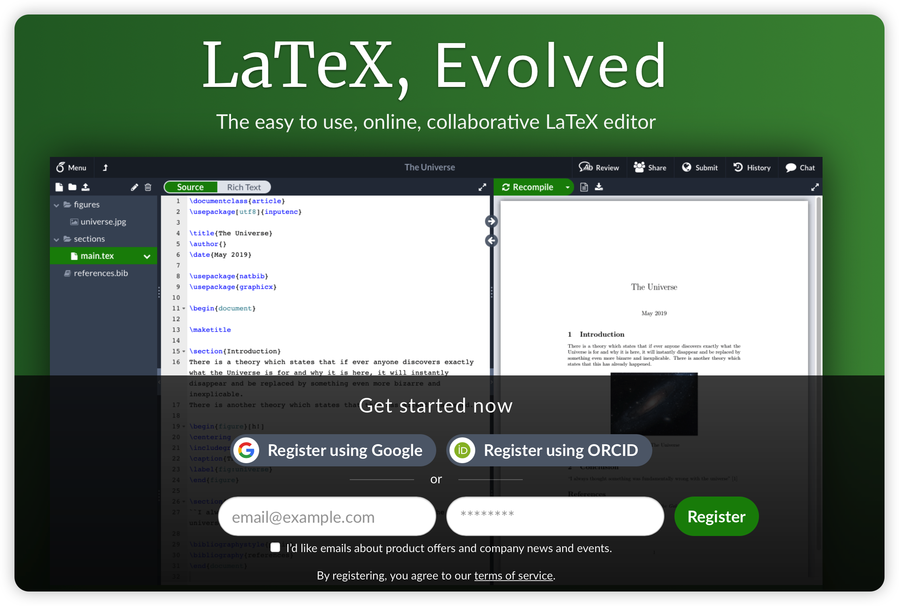
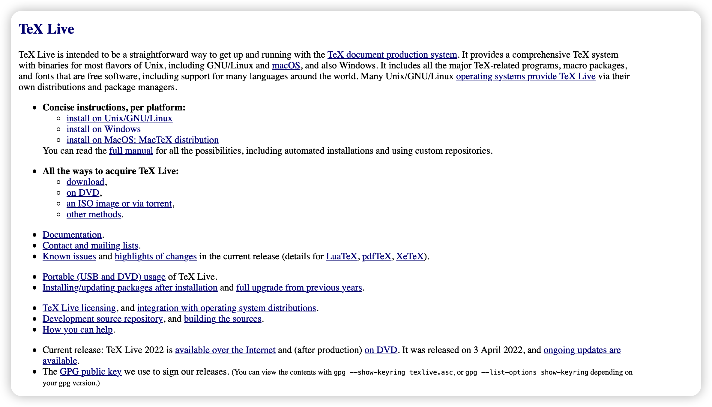
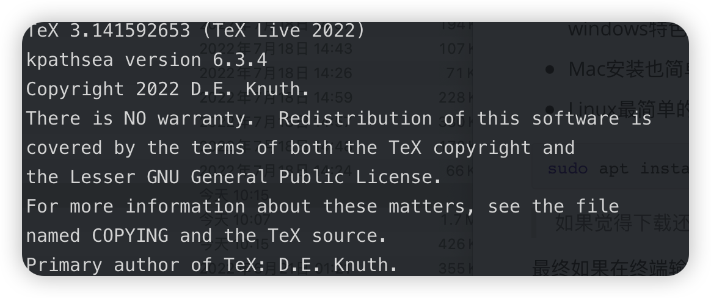
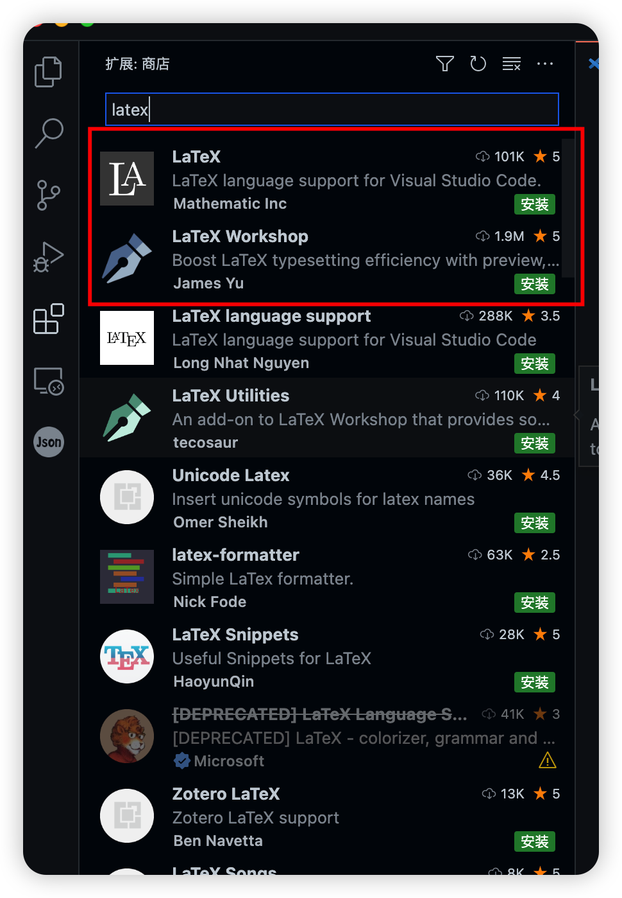
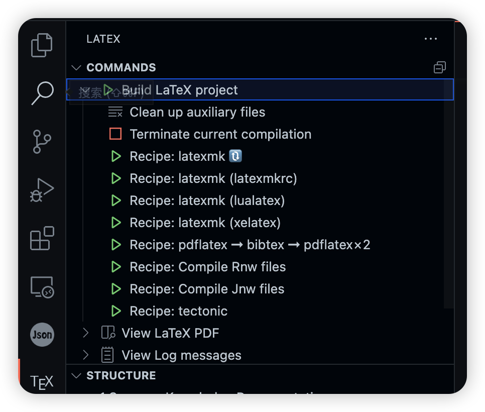

昨天需要改稿，因此需要编译大段LaTeX代码，因此重新配置了LaTeX环境，在Windows、Mac、WSL上都配了一遍，特此记录。

<!-- more -->

## Overleaf

首先，如果要写LaTeX，首推去远程[overleaf](https://www.overleaf.com)上在线编辑，支持多人合作、各种字体以及自带很多模板，比本地可以说是方便很多了。



不过，我由于需要编译的文本太长，超出overleaf普通用户的编译时长限制(需要大会员才能继续编译)，因此只能选择本地编译。

值得一提的是，Overleaf是个开源框架，我们系自己搭了个编译服务器，地址在[这里](stu.cs.tsinghua.edu.cn)，用酒井ID登录，应该是没有一大堆的限制，不多我昨天尝试是server error了，不知道现在是否还有人在维护……

## 在Windows, Mac, WSL上配置TeX Live

LaTeX是一套排版系统，而[TeX Live](https://tug.org/texlive/)可以视为是一个多平台的LaTeX编译器，帮你把LaTeX源码编译成pdf文档。



- Windows安装很简单，去官网直接选择 `install on Windows`，有GUI的，安装完好像需要重启电脑。windows特色？？？
- Mac安装也简单：点下面那个`install on MacOS`,也有GUI
- Linux最简单的方式是,不过由于有4.5GB，可能要考虑给apt换源。

```bash
sudo apt install texlive-full
```

> 如果觉得下载还是慢，可以先下载[ISO文件](https://mirrors.tuna.tsinghua.edu.cn/CTAN/systems/texlive/Images/)，然后本地安装。

最终如果在终端输入，有如下反应就是成功了:

```bash
tex -v
```



## Vscode配置LaTeX编译

vscode可以轻松配置链接TeX Live, 需要安装这两个插件扩展:`LaTeX, LaTeX Workshop`



需要注意的是，在拓展设置中：



默认是使用latexmk编译器，如果你的项目使用 例如XeTeX语法，则需要切换选用的编译器。(可以直接点下面的子按钮)
