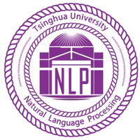
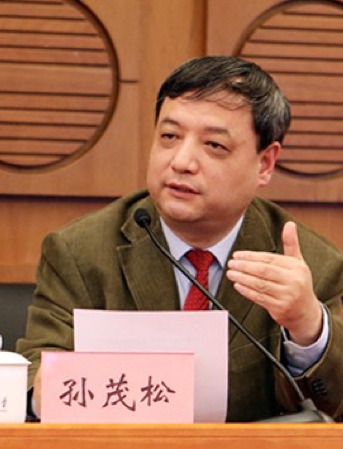

Hi, I am a First year master student at [THUNLP](http://nlp.csai.tsinghua.edu.cn) lab, Tsinghua University, advised by [Zhiyuan_Liu](http://lcg.tsinghua.edu.cn/info/1072/1191.htm).  working on computer science.

- Artificial Intelligence
-  Natural Language Processing
- Tool-Learning
- AI-Agent

## Recent News

- (02/2024) Teaching Assistant of NLP, Tsinghua
- (02/2024) Teaching Assistant of Program Design Basics, Tsinghua (utilize [DebugBench](https://arxiv.org/abs/2401.04621) techniques in education)
- (01/2024) Teaching Assistant of NLP Mooc, learnX
- (01/2024) reach 200 citations on Google-Scholar
- (11/2023) Give a talk at AITime about Tool learning techniques
- (10/2023) reach 100 citations on Google-Scholar

- (9/2023) Give a talk at OpenBMB about advanced reasoning technique

## Academic Background

| Name                                                         | Time      | Degree            | Icon                                                         |
| ------------------------------------------------------------ | --------- | ----------------- | ------------------------------------------------------------ |
| [Beijing National Day School](http://www.bnds.cn)            | 2016-2019 | High school       |  |
| [Tsinghua University](https://www.tsinghua.edu.cn), [Computer Science and Technology]() | 2019-2023 | Bachelor's Degree |  |
| [Tsinghua University](https://www.tsinghua.edu.cn), [Computer Science and Technology](https://www.cs.tsinghua.edu.cn), [THUNLP Lab](http://nlp.csai.tsinghua.edu.cn) | 2023-2026 | Master's Degree   |  |

## Selected Publications

- 2024/01: [DebugBench: Evaluating Debugging Capability of Large Language Models](https://arxiv.org/abs/2401.04621)

We have evaluated the debugging abilities of common LLMs, and we found that open-source LLM did poor on that task 

- 2023/11: [ProAgent: From Robotic Process Automation to Agentic Process Automation](https://arxiv.org/abs/2311.10751)

We explored using LLM to automatically generate RPA workflows, and how to use LLM as AI-data and AI-logic node in the workflow, which is called APA(Agentic Process Automation)

- 2023/8: [Large Language Model as Autonomous Decision Maker](https://arxiv.org/abs/2308.12519)

We Provided a novel Elo-based tree search method, connecting prior and posterior knowledge, and reaching the SOTA on the ToolBench Dataset

- 2023/7: [Toolllm: Facilitating large language models to master 16000+ real-world apis](https://arxiv.org/abs/2307.16789)

We aligned 16000+ real-world RapidAPI query, tested ChatGPT and GPT-4 to automaticaly handle real-world without human knowledge. Together, we trained Llama on the annotated data, making Llama the same function calling ability with ChatGPT

- 2023/4: [Tool Learning with Foundation Models](https://arxiv.org/abs/2304.08354)

We make the first step towards general tool learning settings, testing on about 30 tasks.

## Honors & Awards

- Outstanding-Graduate in Computer Science and Technology, Tsinghua University
- Outstanding-Graduate in Tsinghua University

## Collaborators

| Name        | Description | Photo                                                        |
| ----------- | ----------- | ------------------------------------------------------------ |
| Zhiyuan Liu |             |  |
| Maosong Sun |             |  |
| Yujia Qin   |             |  |
| Xin Cong    |             |  |
| Fanchao Qi  |             |  |

